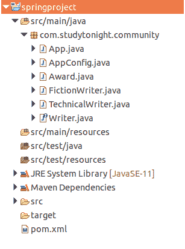

# Spring 字段注入

> 原文：<https://www.studytonight.com/spring-framework/spring-field-injection>

Spring 主要使用两种类型的依赖注入:构造器注入和设置器注入，但是我们也可以使用另一种称为字段注入的注入技术。场注入可以通过直接在场上使用`@Autowired`注解来完成。

在本主题中，我们将使用基于字段的 DI 技术。该项目是一个基于 [Maven 的 Spring 项目](https://www.studytonight.com/spring-framework/spring-maven-project)，包含以下文件。

*   App.java

*   AppConfig.java

*   Award.java

*   FictionWriter.java

*   TechnicalWriter.java

*   Writer.java

*   pom.xml 文件

**项目结构:**



## **//App.java**

该文件包含为我们的应用创建 IOC 容器的代码。AnnotationConfigApplicationContext 类用于为应用上下文创建对象。

```java
package com.studytonight.community;

import org.springframework.context.annotation.AnnotationConfigApplicationContext;

public class App {

	public static void main(String[] args) {

		AnnotationConfigApplicationContext context = new AnnotationConfigApplicationContext(AppConfig.class);
		Writer writer = context.getBean("fictionWriter", Writer.class);
		writer.write();
		writer.getAward();
		// Close the context
		context.close();
	}
}
```

//app config . Java

这是一个 Java 配置文件，它是我们为基于 xml 的配置示例创建的 **applicationContext.xml** 文件的替代文件。`@Configuration`注释表示这不是一个简单的类，而是一个配置类，`@ComponentScan` 注释用于表示我们 spring 项目中组件类的位置。

```java
package com.studytonight.community;

import org.springframework.context.annotation.ComponentScan;
import org.springframework.context.annotation.Configuration;

@Configuration
@ComponentScan("com.studytonight.community")
public class AppConfig {

} 
```

**//Award.java**

这是一个将由 Spring IOC 容器读取的组件类。

```java
package com.studytonight.community;

import org.springframework.stereotype.Component;

@Component
public class Award {

	public void award() {

		System.out.println("Your Writting got Award!");
	}
}
```

**//FictionWriter.java**

这是另一个组件类，它实现了 Writer 接口。这个类使用带有字段的@Autowired 注释来实现字段依赖注入，并且不创建设置器方法，只创建 getter 方法。

```java
package com.studytonight.community;

import org.springframework.beans.factory.annotation.Autowired;
import org.springframework.stereotype.Component;

@Component
public class FictionWriter implements Writer {

	@Autowired
	Award award;

	@Override
	public void write() {

		System.out.println("Write Fiction Novels...");
	}

	@Override
	public void getAward() {

		award.award();
	}

}
```

**//TechnicalWriter.java**

这是另一个组件类，它实现了 Writer 接口。这个类使用带有字段的@Autowired 注释来实现字段依赖注入，并且不创建设置器方法，只创建 getter 方法。

```java
package com.studytonight.community;

import org.springframework.beans.factory.annotation.Autowired;
import org.springframework.stereotype.Component;

@Component
public class TechnicalWriter implements Writer{

	@Autowired
	private Award award;

	@Override
	public void write() {

		System.out.println("Write technical stuffs...");
	}

	@Override
	public void getAward() {
		award.award();

	}
}
```

**//Writer.java**

它是一个包含两个方法的接口，实现它的每个类也必须实现它的方法。

```java
package com.studytonight.community;

public interface Writer {

	void write();
	void getAward();
}
```

//POM . XML

这个文件包含这个项目的所有依赖项，比如 spring jars、servlet jars 等。将这些依赖项放入项目中以运行应用。

```java
<project  xmlns:xsi="http://www.w3.org/2001/XMLSchema-instance" xsi:schemaLocation="http://maven.apache.org/POM/4.0.0 https://maven.apache.org/xsd/maven-4.0.0.xsd">
  <modelVersion>4.0.0</modelVersion>
  <groupId>com.studytonight</groupId>
  <artifactId>springproject</artifactId>
  <version>0.0.1-SNAPSHOT</version>
  <dependencies>
  <!-- https://mvnrepository.com/artifact/org.springframework/spring-web -->
  <dependency>
			<groupId>org.springframework</groupId>
			<artifactId>spring-core</artifactId>
			<version>${spring.version}</version>
		</dependency>
		<dependency>
			<groupId>org.springframework</groupId>
			<artifactId>spring-context</artifactId>
			<version>${spring.version}</version>
		</dependency>
	</dependencies>
	<properties>
		<spring.version>5.2.8.RELEASE</spring.version>
	</properties>
  <build>
    <sourceDirectory>src</sourceDirectory>
    <plugins>
      <plugin>
        <artifactId>maven-compiler-plugin</artifactId>
        <version>3.8.1</version>
        <configuration>
          <source>1.8</source>
          <target>1.8</target>
        </configuration>
      </plugin>
    </plugins>

  </build>
</project>
```

写小说...
你的写作获奖了！

* * *

* * *