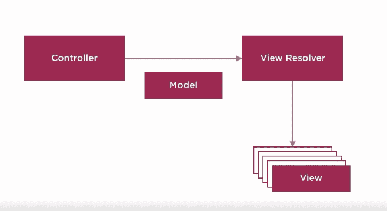

# Spring MVC 视图

> 原文：<https://www.studytonight.com/spring-framework/spring-mvc-view>

视图是 MVC 架构的一个组件，用于响应用户请求向用户返回用户界面输出。视图页面可以是任何 HTML 或 JSP 文件。

Spring MVC 在内部使用视图解析器将请求的视图提取给用户。在 Spring 应用中有几种配置视图的方法。我们可以使用 XML、Java 代码和属性文件来配置视图。

Spring MVC 定义了`ViewResolver`和`View`接口，允许您在浏览器中渲染模型，而无需将您与特定的视图技术联系起来。`ViewResolver`提供视图名称和实际视图之间的映射。`View`解决在移交给特定技术视图之前的数据准备。

## 视图解析器实现

以下是视图解析器接口的实现类。

| 

视图解析器

 | 

描述

 |
| --- | --- |
| 抽象视图解析器 | 此类用于缓存视图实例。缓存提高了某些视图技术的性能。虽然我们可以通过将 cache 属性设置为 false 来关闭缓存。 |
| XmlViewResolver | 这个类用于处理 XML 视图文件。它接受用 XML 编写的配置文件，与 Spring 的 XML bean 工厂具有相同的 DTD。 |
| ResourceBundleViewResolver | 它使用资源包中的 bean 定义，由包的基本名称指定。对于它应该解析的每个视图，它使用属性[viewname]的值。(类)作为视图类和属性[viewname]的值。url 作为视图 URL。 |
| UrlBasedViewResolver | 在没有显式映射定义的情况下，它会影响逻辑视图名称到 URL 的直接解析。 |
| InternalResourceViewResolver | 它是 UrlBasedViewResolver 的一个方便的子类，支持 InternalResourceView 和诸如 JstlView 和 TilesView 之类的子类。 |
| FreeMarkerViewResolver | 这个类是支持 FreeMarkerView 的 UrlBasedViewResolver 的子类。 |
| 内容协商视图解析器 | 它用于根据请求文件名解析视图。 |

## Spring 视图解析器是如何工作的？

当用户请求视图时，控制器与视图解析器交互。视图解析器将请求的视图返回给控制器，然后控制器返回给用户。



## 在 Spring 配置视图

在 Spring 应用中有三种配置视图的方法。我们可以使用以下任何方式来配置视图:

*   可扩展置标语言
*   Java 代码
*   属性文件

### 使用 XML 标记配置视图

我们可以使用`<bean>`标签来设置类`InternalResourceViewResolver`和`<property>`标签来设置视图页面的前缀和后缀。例如，前缀表示存储视图文件的包位置，后缀表示视图文件的扩展名。请参见下面的代码。

```java
<!-- Define Spring MVC view resolver -->
<bean
	class="org.springframework.web.servlet.view.InternalResourceViewResolver">
	<property name="prefix" value="/WEB-INF/views/" />
	<property name="suffix" value=".jsp" />
</bean>
```

### 使用 Java 代码配置视图

我们可以通过向配置类添加一些代码来配置 Java 中的视图处理。标有`@Configuration`注释的类被视为配置类。您可以看到，我们使用了`setPrefix()`和`setSuffix()`方法来代替 XML 文件的`<property>`标签。

```java
import org.springframework.context.annotation.Bean;
import org.springframework.context.annotation.Configuration;
import org.springframework.web.servlet.ViewResolver;
import org.springframework.web.servlet.view.InternalResourceViewResolver;

@Configuration
public class AppConfig {

	@Bean
	public ViewResolver viewResolver() {
		InternalResourceViewResolver irvr = new InternalResourceViewResolver();
		irvr.setPrefix("WEB-INF/views");
		irvr.setSuffix(".jsp");
		irvr.setOrder(0);
		return irvr;
	}
} 
```

### 使用属性文件配置视图

我们可以使用属性文件来设置视图配置，如前缀和后缀。

```java
spring.mvc.view.prefix = /WEB-INF/views
spring.mvc.view.suffix = .jsp
```

创建之后，我们可以使用`@PropertySource`注释将其读入我们的应用。例如，

```java
@PropertySource("classpath:views.properties")
```

在这里，视图是属性文件的名称。在下一个主题中，我们将看到一个简单的 Hello Spring 应用。

* * *

* * *