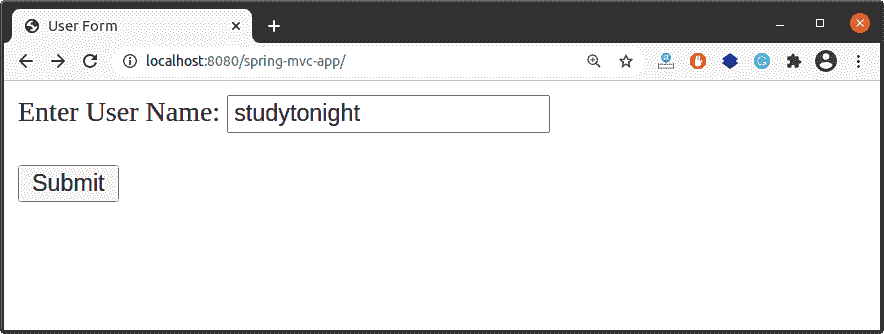
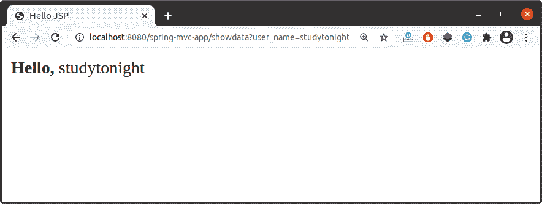

# Spring `@RequestParam`注解

> 原文：<https://www.studytonight.com/spring-framework/spring-requestparam-annotation>

Spring `@RequestParam`注解用于获取表单请求中某个参数的值。在 Spring MVC 中，“请求参数”映射到查询参数，形成数据。

例如，如果我们想从请求的网址获取参数(用户名)值，那么我们可以使用 `@RequestParam`注解。我们只需要提供一个参数名。

```java
http://localhost:8080/spring-mvc-app/showdata?user_name=studytonight
```

在上面的网址中，参数是:**用户名**值:**今晚学习**，我们可以在我们的应用中获取它，如下所示:

```java
@RequestMapping("showdata")
public String userForm(@RequestParam("user_name") String name, Model model)
{
	model.addAttribute("name", name);
	return "user-data";		
}
```

`@RequestParam`注解使用了**名称**、**必填**、**默认值**等多个属性。我们可以根据用例在我们的应用中使用它们。

### 默认值属性

为参数设置默认值，以避免空值。我们可以使用这个属性来处理缺失的值。如果参数不包含任何值，则将提供该默认值。

```java
@RequestMapping("showdata")
public String userForm(@RequestParam(defaultValue = "No_value") String name, Model model)
{
	model.addAttribute("name", name);
	return "user-data";		
}
```

### 必需属性

必要的属性用于在数据丢失的情况下处理异常。它抛出 **HTTP 状态 400–错误请求**(必需的字符串参数‘user _ name’不存在)。为了避免这种异常，我们可以使用必需的属性。

```java
@RequestMapping("showdata")
public String userForm(@RequestParam(required = false) String name, Model model)
{
	model.addAttribute("name", name);
	return "user-data";		
}
```

### Java 8 可选类

我们可以使用`Optional`类，通过提供一个值来避免数据丢失时的异常。它类似于默认属性，但如果您使用的是 java 8 或更高版本，则可以使用它。

```java
@RequestMapping("showdata")
public String userForm(@RequestParam Optional<String> name, Model model)
{
    String name1 = name.orElseGet(()->"no value found"); 
	model.addAttribute("name", name1);
	return "user-data";		
}
```

## @RequestParam 属性

以下是@RequestParam 注解的属性列表。

| 

类型和元素

 | 

描述

 |
| 字符串默认值 | 此元素用于为参数设置默认值。 |
| 字符串名称 | 它指示要绑定到的请求参数的名称。 |
| 布尔型必填 | 用于设置参数是否为必选项。 |
| 字符串值 | 它类似于 name 元素，可以用作别名。 |

## Spring @RequestParam 注解工作示例

让我们通过示例来理解，并创建一个基于 maven 的 Spring 应用并添加这些文件。之后，使用网络服务器(Apache Tomcat)运行这个示例。查看项目的源代码。

**// HelloController.java**

是一个使用`@Controller`注解的控制器类文件。它显示一个用户表单，并通过提交该表单显示用户输入的数据。

```java
package com.studytonight.controller;

import org.springframework.stereotype.Controller;
import org.springframework.ui.Model;
import org.springframework.web.bind.annotation.RequestMapping;
import org.springframework.web.bind.annotation.RequestParam;

@Controller
public class HelloController {

	@RequestMapping("/")
	public String showForm() {
		return "user-form";
	}

	@RequestMapping("showdata")
	public String userForm(@RequestParam("user_name") String name, Model model)
	{
			model.addAttribute("name", name);
			return "user-data";		
	}
}
```

**//user-form.jsp**

它是一个 JSP 页面，显示一个 HTML 表单来获取用户信息。

```java
<%@ page language="java" contentType="text/html; charset=ISO-8859-1"
    pageEncoding="ISO-8859-1"%>
<!DOCTYPE html>
<html>
<head>
<meta charset="ISO-8859-1">
<title>User Form</title>
</head>
<body>
<form action="showdata" method="Get">
	<label>Enter User Name: </label><input type="text" name="user_name"><br/><br/>
	<input type="submit" />
</form>
</body>
</html>
```

**//user-data.jsp**

这个 JSP 页面显示了用户提交的数据。

```java
<%@ page language="java" contentType="text/html; charset=ISO-8859-1"
    pageEncoding="ISO-8859-1"%>
<!DOCTYPE html>
<html>
<head>
<meta charset="ISO-8859-1">
<title>Hello JSP</title>
</head>
<body>
<strong>Hello,</strong>
${name}
</body>
</html>
```

**//spring-MVC-app-servlet . XML**

```java
<?xml version="1.0" encoding="UTF-8"?>
<beans 
	xmlns:xsi="http://www.w3.org/2001/XMLSchema-instance" 
	xmlns:context="http://www.springframework.org/schema/context"
	xmlns:mvc="http://www.springframework.org/schema/mvc"
	xsi:schemaLocation="
		http://www.springframework.org/schema/beans
    	http://www.springframework.org/schema/beans/spring-beans.xsd
    	http://www.springframework.org/schema/context
    	http://www.springframework.org/schema/context/spring-context.xsd
    	http://www.springframework.org/schema/mvc
        http://www.springframework.org/schema/mvc/spring-mvc.xsd">

	<!-- Step 3: Add support for component scanning -->
	<context:component-scan base-package="com.studytonight.controller" />

	<!-- Step 4: Add support for conversion, formatting and validation support -->
	<mvc:annotation-driven/>

	<!-- Step 5: Define Spring MVC view resolver -->
	<bean
		class="org.springframework.web.servlet.view.InternalResourceViewResolver">
		<property name="prefix" value="/WEB-INF/views/" />
		<property name="suffix" value=".jsp" />
	</bean>
</beans> 
```

**// web.xml**

```java
<?xml version="1.0" encoding="UTF-8"?>
<web-app xmlns:xsi="http://www.w3.org/2001/XMLSchema-instance"

	xsi:schemaLocation="http://xmlns.jcp.org/xml/ns/javaee http://xmlns.jcp.org/xml/ns/javaee/web-app_3_1.xsd"
	id="WebApp_ID" version="3.1">

	<display-name>spring-mvc-app</display-name>

	<absolute-ordering />

	<!-- Spring MVC Configs -->

	<!-- Step 1: Configure Spring MVC Dispatcher Servlet -->
	<servlet>
		<servlet-name>dispatcher</servlet-name>
		<servlet-class>org.springframework.web.servlet.DispatcherServlet</servlet-class>
		<init-param>
			<param-name>contextConfigLocation</param-name>
			<param-value>/WEB-INF/spring-mvc-app-servlet.xml</param-value>
		</init-param>
		<load-on-startup>1</load-on-startup>
	</servlet>

	<!-- Step 2: Set up URL mapping for Spring MVC Dispatcher Servlet -->
	<servlet-mapping>
		<servlet-name>dispatcher</servlet-name>
		<url-pattern>/</url-pattern>
	</servlet-mapping>

</web-app>
```

//POM . XML

这个文件包含这个项目的所有依赖项，比如 spring jars、servlet jars 等。将这些依赖项放入项目中以运行应用。

```java
<project 
	xmlns:xsi="http://www.w3.org/2001/XMLSchema-instance"
	xsi:schemaLocation="http://maven.apache.org/POM/4.0.0 https://maven.apache.org/xsd/maven-4.0.0.xsd">
	<modelVersion>4.0.0</modelVersion>
	<groupId>com.studytonight</groupId>
	<artifactId>spring-mvc-app</artifactId>
	<version>0.0.1-SNAPSHOT</version>
	<packaging>war</packaging>
	<dependencies>
		<dependency>
			<groupId>org.springframework</groupId>
			<artifactId>spring-core</artifactId>
			<version>${spring.version}</version>
		</dependency>
		<dependency>
			<groupId>org.springframework</groupId>
			<artifactId>spring-context</artifactId>
			<version>${spring.version}</version>
		</dependency>
		<dependency>
			<groupId>org.springframework</groupId>
			<artifactId>spring-webmvc</artifactId>
			<version>${spring.version}</version>
		</dependency>
		<!-- https://mvnrepository.com/artifact/javax.xml.bind/jaxb-api -->
		<dependency>
			<groupId>javax.xml.bind</groupId>
			<artifactId>jaxb-api</artifactId>
			<version>2.3.0</version>
		</dependency>
	</dependencies>
	<properties>
		<spring.version>5.2.8.RELEASE</spring.version>
	</properties>
	<build>
		<plugins>
			<plugin>
				<artifactId>maven-war-plugin</artifactId>
				<version>3.2.3</version>
				<configuration>
					<warSourceDirectory>WebContent</warSourceDirectory>
				</configuration>
			</plugin>
		</plugins>
	</build>
</project>
```

### 运行应用

成功完成项目并添加依赖项后，运行应用，您将获得如下输出。



这是显示上述用户名提交的用户名的第二个 JSP 页面。



* * *

* * *