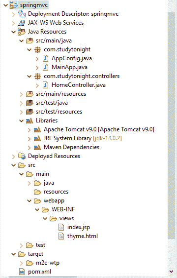
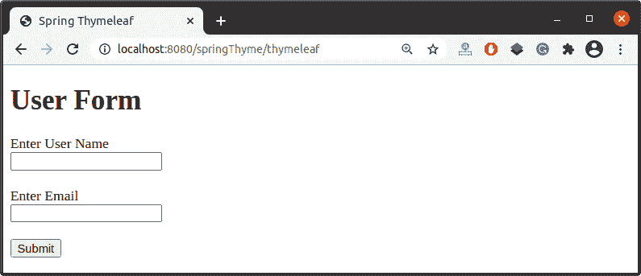

# 百里香叶的春天 MVC

> 原文：<https://www.studytonight.com/spring-framework/spring-mvc-with-thymeleaf>

在本文中，我们将学习在我们的 Spring 应用程序中使用百里香叶。百里香叶是一个模板引擎，用于在 Spring MVC 中创建视图页面。它提供了完整的 Spring 集成，旨在取代 JSP 成为 Spring MVC 中的视图页面。如果您正在使用网络应用程序，最好使用百里香叶。

它可以在网络和非网络应用程序中工作，甚至可以在离线环境中处理任何 XML 文件。要在您的项目中使用百里香叶，只需将这个依赖项添加到您的 **pom.xml** 文件中。

```java
<dependency>
	<groupId>org.thymeleaf</groupId>
	<artifactId>thymeleaf-spring5</artifactId>
	<version>3.0.11.RELEASE</version>
</dependency>
```

让我们通过一个创建基于 maven 的 spring 项目的例子来理解。我们的项目结构包含几个文件，如下所示。

**项目结构**



//app config . Java

这是一个 Java 配置文件，它是我们为基于 xml 的配置示例创建的 **applicationContext.xml** 文件的替代文件。`@Configuration`注释表示这不是一个简单的类，而是一个配置类，`@ComponentScan` 注释用于表示我们 spring 项目中组件类的位置。

```java
package com.studytonight;

import org.springframework.beans.factory.annotation.Autowired;
import org.springframework.context.ApplicationContext;
import org.springframework.context.annotation.Bean;
import org.springframework.context.annotation.ComponentScan;
import org.springframework.context.annotation.Configuration;
import org.springframework.web.servlet.ViewResolver;
import org.springframework.web.servlet.config.annotation.EnableWebMvc;
import org.springframework.web.servlet.config.annotation.WebMvcConfigurer;
import org.thymeleaf.spring5.SpringTemplateEngine;
import org.thymeleaf.spring5.templateresolver.SpringResourceTemplateResolver;
import org.thymeleaf.spring5.view.ThymeleafViewResolver;

import com.studytonight.models.User;

@EnableWebMvc
@Configuration
@ComponentScan("com.studytonight.controller")
public class AppConfig implements WebMvcConfigurer{

	@Autowired
	ApplicationContext applicationContext;

	@Bean
	public ViewResolver thymeleafResolver() {
		ThymeleafViewResolver ivr = new ThymeleafViewResolver();
		ivr.setTemplateEngine(templateEngine());
		ivr.setOrder(0);
		return ivr;
	}

	@Bean
	public SpringResourceTemplateResolver templateResolver() {
		SpringResourceTemplateResolver srtr = new SpringResourceTemplateResolver();
		srtr.setApplicationContext(applicationContext);
		srtr.setPrefix("/WEB-INF/views/");
		srtr.setSuffix(".html");
		return srtr;
	}

	@Bean
	public SpringTemplateEngine templateEngine() {
		SpringTemplateEngine templateEngine = new SpringTemplateEngine();
		templateEngine.setTemplateResolver(templateResolver());
		templateEngine.setEnableSpringELCompiler(true);
		return templateEngine;
	}

}
```

//main app . Java

该文件包含为我们的应用程序创建 IOC 容器的代码。`AnnotationConfigApplicationContext`类用于为应用程序上下文创建一个对象。

```java
package com.studytonight;

import javax.servlet.ServletContext;
import javax.servlet.ServletException;
import javax.servlet.ServletRegistration;
import org.springframework.web.WebApplicationInitializer;
import org.springframework.web.context.support.AnnotationConfigWebApplicationContext;
import org.springframework.web.servlet.DispatcherServlet;
public class MainApp implements WebApplicationInitializer {

	@Override
	public void onStartup(ServletContext servletContext) throws ServletException { 
		AnnotationConfigWebApplicationContext context = new AnnotationConfigWebApplicationContext();
		context.register(AppConfig.class);
		context.setServletContext(servletContext);
		ServletRegistration.Dynamic servlet = servletContext.addServlet("dispatcher", new DispatcherServlet(context));
		servlet.setLoadOnStartup(1);
		servlet.addMapping("/");
		context.close();	
	}
} 
```

**//HomeController.java**

这是一个控制器类，包含两种方法`showForm()`和`showdata()`。`showForm()`方法与用户表单请求映射，用于返回用户表单。这里，我们使用 Spring Model 将 user_name 传递给 view(user-data.jsp)。

```java
package com.studytonight.controller;
import org.springframework.stereotype.Controller;
import org.springframework.ui.Model;
import org.springframework.web.bind.annotation.RequestMapping;
import com.studytonight.models.User;

@Controller
public class HomeController {

	@RequestMapping("/index")
	public String hello() {		
		return "index";
	}

	@RequestMapping("/thymeleaf")
	public String thyme(Model model) {
		model.addAttribute("user", new User());
		return "thyme";
	}
}
```

**//User.java**

它是我们的用户 bean 类，包含 getters 和 setters 方法。

```java
package com.studytonight.models;
public class User {

	int id;
	String user_name;
	String email;

	public String getUser_name() {
		return user_name;
	}
	public void setUser_name(String user_name) {
		this.user_name = user_name;
	}

	public int getId() {
		return id;
	}
	public void setId(int id) {
		this.id = id;
	}
	public String getEmail() {
		return email;
	}
	public void setEmail(String email) {
		this.email = email;
	}
}
```

**//thyme.html**

这是一个使用百里香叶库显示表单的 HTML 文件。这里，我们使用`<html xmlns:th="http://www.thymeleaf.org">`标签在我们的 HTML 页面中包含百里香叶。

```java
<!DOCTYPE html>
<html xmlns:th="http://www.thymeleaf.org">
<head>
<meta charset="ISO-8859-1">
<title>Spring Thymeleaf</title>
</head>
<body>
<h2>User Form</h2>
<label>Enter User Name</label><br>
<input type="text" th:field="*{user.user_name}" /><br><br>
<label>Enter Email</label><br>
<input type="email" th:field="*{user.email}" /><br><br>
<input type="submit">
</body>
</html>
```

//POM . XML

这个文件包含这个项目的所有依赖项，比如 spring jars、servlet jars 等。将这些依赖项放入项目中以运行应用程序。

```java
<project 
	xmlns:xsi="http://www.w3.org/2001/XMLSchema-instance"
	xsi:schemaLocation="http://maven.apache.org/POM/4.0.0 https://maven.apache.org/xsd/maven-4.0.0.xsd">
	<modelVersion>4.0.0</modelVersion>
	<groupId>com.studytonight</groupId>
	<artifactId>springmvc</artifactId>
	<version>0.0.1-SNAPSHOT</version>
	<packaging>war</packaging>
	<dependencies>
		<dependency>
			<groupId>org.springframework</groupId>
			<artifactId>spring-core</artifactId>
			<version>${spring.version}</version>
		</dependency>
		<dependency>
			<groupId>org.springframework</groupId>
			<artifactId>spring-context</artifactId>
			<version>${spring.version}</version>
		</dependency>
		<dependency>
			<groupId>org.springframework</groupId>
			<artifactId>spring-webmvc</artifactId>
			<version>${spring.version}</version>
		</dependency>
		<!-- https://mvnrepository.com/artifact/org.thymeleaf/thymeleaf -->
		<dependency>
			<groupId>org.thymeleaf</groupId>
			<artifactId>thymeleaf-spring5</artifactId>
			<version>3.0.11.RELEASE</version>
		</dependency>

	</dependencies>
	<properties>
		<spring.version>5.2.8.RELEASE</spring.version>
	</properties>
	<build>
		<sourceDirectory>src</sourceDirectory>
		<plugins>
			<plugin>
				<artifactId>maven-compiler-plugin</artifactId>
				<version>3.8.1</version>
				<configuration>
					<source>1.8</source>
					<target>1.8</target>
				</configuration>
			</plugin>
			<plugin>
				<artifactId>maven-war-plugin</artifactId>
				<version>3.2.3</version>
				<configuration>
					<warSourceDirectory>WebContent</warSourceDirectory>
				</configuration>
			</plugin>
		</plugins>
	</build>
</project>
```

### 运行应用程序

成功完成项目并添加依赖项后，运行应用程序，您将获得如下输出。



* * *

* * *