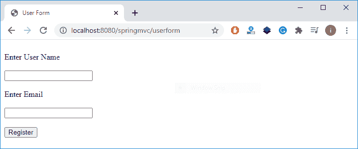
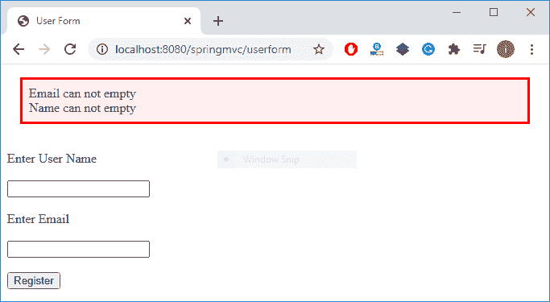
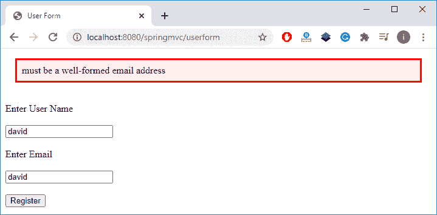
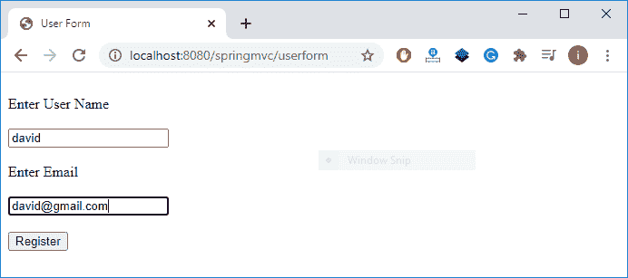
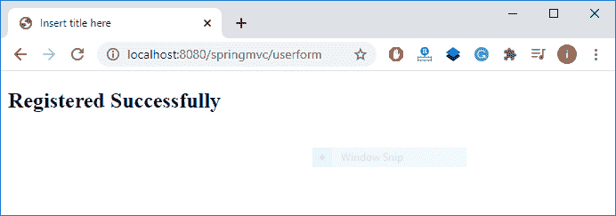

# Spring MVC 表单验证

> 原文：<https://www.studytonight.com/spring-framework/spring-mvc-form-validation>

在本文中，我们将学习如何在服务器端验证用户数据。这是我们在创建 web 应用时需要执行的基本任务之一。

为了以有效的形式获取用户数据，我们需要在客户端或服务器端或者两者都验证它。Spring 提供了一个`@Valid`注释来获取有效的表单数据，并使用 **Hibernate Validator API** 来验证数据。

Hibernate Validator 是 Spring 框架中用于 Bean 验证的实现 API。它提供了几个注释，以便与 Java 代码进行简单明了的验证集成。它适用于服务器和客户端应用编程。

## Hibernate 验证器注释

以下是 Spring 应用中用于数据验证的常用注释。

| 

注释

 | 

描述

 |
| @NotNull | 它确定该值不能为空。 |
| @Min | 它确定该数字必须等于或大于指定值。 |
| @Max | 它确定该数字必须等于或小于指定值。 |
| @大小 | 它确定大小必须等于指定的值。 |
| @模式 | 它确定序列遵循指定的正则表达式。 |
| @电子邮件 | 它检查指定的字符序列是否是有效的电子邮件地址。 |
| @NotEmpty | 它检查带注释的元素是否不为空。 |
| @Null | 它检查带注释的值是否为空。 |
| @否定 | 它检查元素是否严格为负。零值被视为无效。 |
| @否定零 | 它检查元素是负的还是零。 |

如果您正在使用 maven 项目，那么将以下依赖项添加到 **pom.xml** 文件中。关于最新的 hibernate 验证器依赖，你可以访问它的[官方网站](https://hibernate.org/validator/documentation/getting-started/)。

```java
<dependency>
	<groupId>org.hibernate.validator</groupId>
	<artifactId>hibernate-validator</artifactId>
	<version>6.1.1.Final</version>
</dependency>
```

## Spring MVC 表单验证示例

让我们通过示例来理解，并创建一个基于 maven 的 Spring 项目并添加这些文件。之后，使用网络服务器(Apache Tomcat)运行这个例子。见下面项目的源代码。

**//HomeController.java**

是一个使用`@Controller`注解的控制器类文件。它有两种方法，一种用于显示用户表单，另一种用于验证提交的用户表单。

```java
package com.studytonight.controllers;
import javax.validation.Valid;
import org.springframework.stereotype.Controller;
import org.springframework.validation.BindingResult;
import org.springframework.web.bind.annotation.ModelAttribute;
import org.springframework.web.bind.annotation.PostMapping;
import org.springframework.web.bind.annotation.RequestMapping;
import com.studytonight.models.UserForm;

@Controller
public class HomeController {

	@GetMapping("/userform")
	public String index(@ModelAttribute("registration") UserForm registration) {		
		return "index";
	}

	@PostMapping("/userform")
	public String register(@Valid @ModelAttribute("registration") UserForm registration, BindingResult result) {
		if (result.hasErrors()) {
			System.out.println("error");
			return "index";
		}
		return "success";
	}
}
```

//main app . Java

该文件包含为我们的应用创建 IOC 容器的代码。`AnnotationConfigWebApplicationContext`类用于为应用上下文创建一个对象。

```java
package com.studytonight;

import javax.servlet.ServletContext;
import javax.servlet.ServletException;
import javax.servlet.ServletRegistration;
import org.springframework.web.WebApplicationInitializer;
import org.springframework.web.context.support.AnnotationConfigWebApplicationContext;
import org.springframework.web.servlet.DispatcherServlet;
public class MainApp implements WebApplicationInitializer {

	@Override
	public void onStartup(ServletContext servletContext) throws ServletException { 
		AnnotationConfigWebApplicationContext context = new AnnotationConfigWebApplicationContext();
		context.register(AppConfig.class);
		context.setServletContext(servletContext);
		ServletRegistration.Dynamic servlet = servletContext.addServlet("dispatcher", new DispatcherServlet(context));
		servlet.setLoadOnStartup(1);
		servlet.addMapping("/");
		context.close();	
	}
} 
```

//app config . Java

这是一个配置文件，它是我们为基于 xml 的配置示例创建的 **applicationContext.xml** 文件的替代文件。`@Configuration`注释表示这不是一个简单的类，而是一个配置类，`@ComponentScan` 注释用于表示我们 spring 项目中组件类的位置。

```java
package com.studytonight;

import org.springframework.beans.factory.annotation.Autowired;
import org.springframework.context.ApplicationContext;
import org.springframework.context.annotation.Bean;
import org.springframework.context.annotation.ComponentScan;
import org.springframework.context.annotation.Configuration;
import org.springframework.web.servlet.ViewResolver;
import org.springframework.web.servlet.config.annotation.EnableWebMvc;
import org.springframework.web.servlet.config.annotation.WebMvcConfigurer;
import org.springframework.web.servlet.view.InternalResourceViewResolver;
@EnableWebMvc
@Configuration
@ComponentScan("com.studytonight.controllers")
public class AppConfig implements WebMvcConfigurer{

	@Autowired
	ApplicationContext applicationContext;

	@Bean
	public ViewResolver viewResolver() {
		InternalResourceViewResolver ivr = new InternalResourceViewResolver();
		ivr.setPrefix("/WEB-INF/views/");
		ivr.setSuffix(".jsp");
		ivr.setOrder(0);
		return ivr;
	}
}
```

**//index.jsp**

这是一个 JSP 文件，包含一个在应用运行时显示的 HTML 表单。

```java
<%@ page language="java" contentType="text/html; charset=ISO-8859-1"
	pageEncoding="ISO-8859-1"%>
<%@ taglib prefix="form" uri="http://www.springframework.org/tags/form"%>
<%@ taglib prefix="spring" uri="http://www.springframework.org/tags"%>

<!DOCTYPE html>
<html>
<head>
<meta charset="ISO-8859-1">
<title>User Form</title>
<style type="text/css">
.error {
	color: #ff0000;
}

.errorblock {
	color: #000;
	background-color: #ffEEEE;
	border: 3px solid #ff0000;
	padding: 8px;
	margin: 16px;
}
</style>
</head>
<body>
	<form:form modelAttribute="registration">
		<form:errors path="*" cssClass="errorblock" element="div" />
		<br>
		<label>Enter User Name </label>
		<br>
		<br>
		<form:input path="name" />
		<br>
		<br>
		<label>Enter Email </label>
		<br>
		<br>
		<form:input path="email" />
		<br>
		<br>
		<input type="submit" value="Register">
		<br>
	</form:form>
</body>
</html>
```

**//success.jsp**

如果用户表单验证成功，这个 JSP 文件将显示为一个响应。

```java
<%@ page language="java" contentType="text/html; charset=ISO-8859-1"
    pageEncoding="ISO-8859-1"%>
<!DOCTYPE html>
<html>
<head>
<meta charset="ISO-8859-1">
<title>Insert title here</title>
</head>
<body>
<h2>Registered Successfully</h2>
</body>
</html>
```

//POM . XML

这个文件包含这个项目的所有依赖项，比如 spring jars、servlet jars 等。将这些依赖项放入项目中以运行应用。

```java
<project 
	xmlns:xsi="http://www.w3.org/2001/XMLSchema-instance"
	xsi:schemaLocation="http://maven.apache.org/POM/4.0.0 https://maven.apache.org/xsd/maven-4.0.0.xsd">
	<modelVersion>4.0.0</modelVersion>
	<groupId>com.studytonight</groupId>
	<artifactId>springmvc</artifactId>
	<version>0.0.1-SNAPSHOT</version>
	<packaging>war</packaging>
	<dependencies>
		<dependency>
			<groupId>org.springframework</groupId>
			<artifactId>spring-core</artifactId>
			<version>${spring.version}</version>
		</dependency>
		<dependency>
			<groupId>org.springframework</groupId>
			<artifactId>spring-context</artifactId>
			<version>${spring.version}</version>
		</dependency>
		<dependency>
			<groupId>org.springframework</groupId>
			<artifactId>spring-webmvc</artifactId>
			<version>${spring.version}</version>
		</dependency>
		<dependency>
		<groupId>org.hibernate.validator</groupId>
		<artifactId>hibernate-validator</artifactId>
		<version>6.1.1.Final</version>
		</dependency>
	</dependencies>
	<properties>
		<spring.version>5.2.8.RELEASE</spring.version>
	</properties>
	<build>
		<sourceDirectory>src</sourceDirectory>
		<plugins>
			<plugin>
				<artifactId>maven-compiler-plugin</artifactId>
				<version>3.8.1</version>
				<configuration>
					<source>1.8</source>
					<target>1.8</target>
				</configuration>
			</plugin>
			<plugin>
				<artifactId>maven-war-plugin</artifactId>
				<version>3.2.3</version>
				<configuration>
					<warSourceDirectory>WebContent</warSourceDirectory>
				</configuration>
			</plugin>
		</plugins>
	</build>
</project>
```

//user form . Java

```java
package com.studytonight.models;
import javax.validation.constraints.Email;
import javax.validation.constraints.NotEmpty;
public class UserForm {

	@NotEmpty(message = "Name can not empty")
	String name;
	String lastName;
	@NotEmpty(message = "Email can not empty")
	@Email
	String email;

	public UserForm(String name, String lastName, String email) {
		this.name = name;
		this.lastName = lastName;
		this.email = email;
	}
	public String getEmail() {
		return email;
	}
	public void setEmail(String email) {
		this.email = email;
	}
	public String getName() {
		return name;
	}
	public void setName(String name) {
		this.name = name;
	}
	public String getLastName() {
		return lastName;
	}
	public void setLastName(String lastName) {
		this.lastName = lastName;
	}
}
```

### 运行应用

成功完成项目并添加依赖项后，使用服务器运行应用，您将获得如下输出。



### 提交空表单:空表单验证



### 电子邮件错误:电子邮件验证

### 

### 提供正确的信息

### 

### 表单提交成功

### 

* * *

* * *