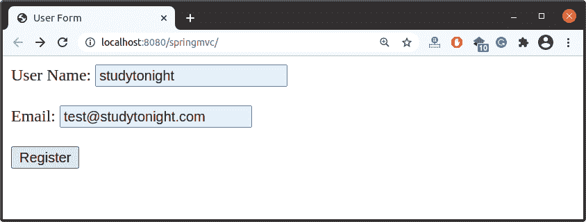
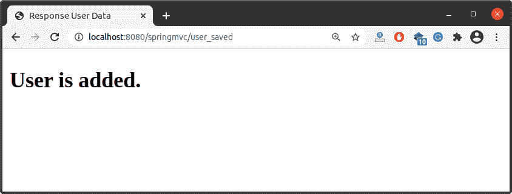

# Spring MVC 重定向

> 原文：<https://www.studytonight.com/spring-framework/spring-mvc-redirect>

在本文中，我们将学习通过在控制器类中使用前缀**重定向:**来将请求从一个动作重定向到另一个动作。这取决于应用流和重定向请求的场景。在这里，我们将在保存记录后将表单请求重定向到另一个操作。我们可以这样使用:`redirect:action_name.`

它是我们控制器的一部分，所以将在我们的控制器类中执行。让我们通过一个例子来理解，创建一个基于 maven 的 spring 项目，并在其中添加这些文件。

我们提供源代码文件，因此您可以在项目中使用它们来理解这个概念。请参见以下源代码文件。

//user controller . Java

这是我们的控制器类，包含三个方法 index()、save()和 userSaved()。这里，第一个方法返回一个用户表单，第二个方法保存并重定向到第三个方法，第三个方法简单返回一个响应视图页面。

```java
package com.studytonight.controller;

import org.springframework.stereotype.Controller;
import org.springframework.web.bind.annotation.GetMapping;
import org.springframework.web.bind.annotation.PostMapping;

@Controller
public class UserController {

	@GetMapping("/")
	public String index() {
		return "index";
	}

	@PostMapping("save")
	public String save( ) {
        // data saving stuffs
		return "redirect:user_saved"; // it redirects to other action
	}

	@GetMapping("user_saved")
	public String userSaved() {
		return "response";
	}
}
```

//app config . Java

这是一个配置文件，它是我们为基于 xml 的配置示例创建的 **applicationContext.xml** 文件的替代文件。`@Configuration`注释表示这不是一个简单的类，而是一个配置类，`@ComponentScan` 注释用于表示我们 spring 项目中组件类的位置。

```java
package com.studytonight;
import org.springframework.context.annotation.Bean;
import org.springframework.context.annotation.ComponentScan;
import org.springframework.context.annotation.Configuration;
import org.springframework.web.servlet.ViewResolver;
import org.springframework.web.servlet.config.annotation.WebMvcConfigurer;
import org.springframework.web.servlet.view.InternalResourceViewResolver;

@Configuration
@ComponentScan("com.studytonight")
public class AppConfig implements WebMvcConfigurer{
	@Bean
	public ViewResolver viewResolver() {
		InternalResourceViewResolver irvr = new InternalResourceViewResolver();
		irvr.setPrefix("WEB-INF/views/");
		irvr.setSuffix(".jsp");
		irvr.setOrder(0);
		return irvr;
	}
}
```

//main app . Java

该文件包含为我们的应用创建 IOC 容器的代码。`AnnotationConfigWebApplicationContext`类用于为应用上下文创建一个对象。

```java
package com.studytonight;

import javax.servlet.ServletContext;
import javax.servlet.ServletException;
import javax.servlet.ServletRegistration;
import org.springframework.web.WebApplicationInitializer;
import org.springframework.web.context.support.AnnotationConfigWebApplicationContext;
import org.springframework.web.servlet.DispatcherServlet;

public class MainApp implements WebApplicationInitializer {

	@Override
	public void onStartup(ServletContext servletContext) throws ServletException { 
		AnnotationConfigWebApplicationContext context = new AnnotationConfigWebApplicationContext();
		context.register(AppConfig.class);
		context.setServletContext(servletContext);
		ServletRegistration.Dynamic servlet = servletContext.addServlet("dispatcher", new DispatcherServlet(context));
		servlet.setLoadOnStartup(1);
		servlet.addMapping("/");
		context.close();	

	}
}
```

**查看页面**

**//index.jsp**

```java
<%@ page language="java" contentType="text/html; charset=UTF-8"
	pageEncoding="UTF-8"%>
<!DOCTYPE html>
<html>
<head>
<meta charset="UTF-8">
<title>User Form</title>
</head>
<body>
	<form action="save" method="post">
		User Name: <input type="text" name="user_name"><br><br>
		 Email: <input type="email" name="email"><br> <br>
		 <input type="submit" value="Register">
	</form>
</body>
</html>
```

**//response.jsp**

```java
<%@ page language="java" contentType="text/html; charset=UTF-8"
    pageEncoding="UTF-8"%>
<!DOCTYPE html>
<html>
<head>
<meta charset="UTF-8">
<title>Response User Data</title>
</head>
<body>
    <h2>User is added.</h2>
</body>
</html>
```

//POM . XML

这个文件包含这个项目的所有依赖项，比如 spring jars、servlet jars 等。将这些依赖项放入项目中以运行应用。

```java
<project 
	xmlns:xsi="http://www.w3.org/2001/XMLSchema-instance"
	xsi:schemaLocation="http://maven.apache.org/POM/4.0.0 https://maven.apache.org/xsd/maven-4.0.0.xsd">
	<modelVersion>4.0.0</modelVersion>
	<groupId>com.studytonight</groupId>
	<artifactId>springmvc</artifactId>
	<version>0.0.1-SNAPSHOT</version>
	<packaging>war</packaging>
	<dependencies>
		<dependency>
			<groupId>org.springframework</groupId>
			<artifactId>spring-core</artifactId>
			<version>${spring.version}</version>
		</dependency>
		<dependency>
			<groupId>org.springframework</groupId>
			<artifactId>spring-context</artifactId>
			<version>${spring.version}</version>
		</dependency>
		<dependency>
			<groupId>org.springframework</groupId>
			<artifactId>spring-webmvc</artifactId>
			<version>${spring.version}</version>
		</dependency>
		<!-- https://mvnrepository.com/artifact/javax.xml.bind/jaxb-api -->
		<dependency>
			<groupId>javax.xml.bind</groupId>
			<artifactId>jaxb-api</artifactId>
			<version>2.3.0</version>
		</dependency>
	</dependencies>
	<properties>
		<spring.version>5.2.8.RELEASE</spring.version>
	</properties>
	<build>
		<plugins>
			<plugin>
				<artifactId>maven-war-plugin</artifactId>
				<version>3.2.3</version>
				<configuration>
                    <source>11</source>
                    <target>11</target>
                </configuration>
			</plugin>
		</plugins>
	</build>
</project>
```

### 运行应用

成功完成项目并添加依赖项后，运行应用，您将获得如下输出。





* * *

* * *