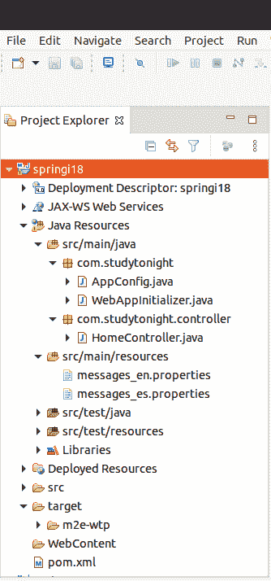
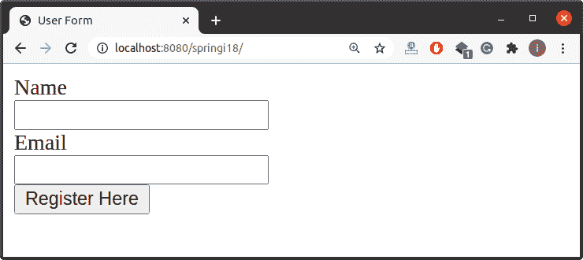
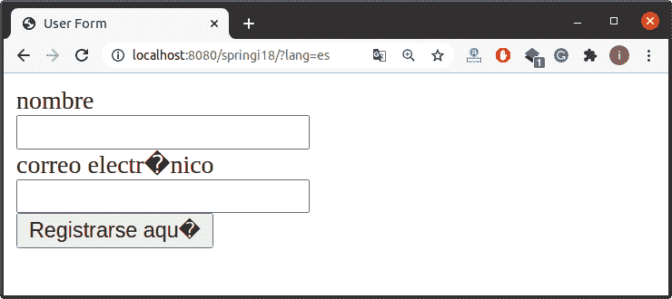

# Spring I18N(国际化)

> 原文：<https://www.studytonight.com/spring-framework/spring-i18n-internationalization>

I18N 是国际化的首字母缩略词，Spring framework 用它来做一个面向国际层面的应用。这意味着我们可以创建一个针对多个地区的应用程序，就像一个可以在美国、中国、俄罗斯和世界上任何其他国家使用的应用程序一样，只需实现 i18N。

Spring 框架也使用**localersolver**来支持国际化和本地化。在本教程中，我们将学习在我们的 spring MVC 应用程序中实现**国际化。**

让我们创建一个基于 maven 的 spring 项目，我们的项目如下所示，包含几个源代码文件。

### 项目结构



//app config . Java

这是一个配置文件，它是我们为基于 xml 的配置示例创建的 **applicationContext.xml** 文件的替代文件。`@Configuration`注释表示这不是一个简单的类，而是一个配置类，`@ComponentScan` 注释用于表示我们 spring 项目中组件类的位置。

这里，我们为 **i18n** 支持配置了我们的应用程序。您可以注意到，除了**视图解析器**之外，我们还添加了一些获取阿郎参数的方法。

```java
package com.studytonight;

import java.util.Locale;
import org.springframework.context.annotation.Bean;
import org.springframework.context.annotation.ComponentScan;
import org.springframework.context.annotation.Configuration;
import org.springframework.context.support.ReloadableResourceBundleMessageSource;
import org.springframework.web.servlet.LocaleResolver;
import org.springframework.web.servlet.ViewResolver;
import org.springframework.web.servlet.config.annotation.EnableWebMvc;
import org.springframework.web.servlet.config.annotation.InterceptorRegistry;
import org.springframework.web.servlet.config.annotation.WebMvcConfigurer;
import org.springframework.web.servlet.i18n.LocaleChangeInterceptor;
import org.springframework.web.servlet.i18n.SessionLocaleResolver;
import org.springframework.web.servlet.view.InternalResourceViewResolver;

@EnableWebMvc
@Configuration
@ComponentScan("com.studytonight.controller")
public class AppConfig implements WebMvcConfigurer{

	@Bean(name = "messageSource")
    public ReloadableResourceBundleMessageSource reloadableResourceBundleMessageSource() {
        ReloadableResourceBundleMessageSource messageSource = new ReloadableResourceBundleMessageSource();
        messageSource.setBasenames("classpath:messages");
        messageSource.setDefaultEncoding("UTF-8");
        return messageSource;
    }

	@Bean
	public ViewResolver viewResolver() {
		InternalResourceViewResolver irvr = new InternalResourceViewResolver();
		irvr.setPrefix("WEB-INF/views/");
		irvr.setSuffix(".jsp");
		irvr.setOrder(0);
		return irvr;
	}

	@Bean(name="localeResolver")
	public LocaleResolver localeResolver() {
		SessionLocaleResolver slr = new SessionLocaleResolver();
		slr.setDefaultLocale(Locale.US);
		return slr;
	}

	@Bean
	public LocaleChangeInterceptor localeChangeInterceptor() {
		LocaleChangeInterceptor localeChangeInterceptor =  new LocaleChangeInterceptor();
		localeChangeInterceptor.setParamName("lang");
		return localeChangeInterceptor;
	}

	public void addInterceptors(InterceptorRegistry registry) {
		registry.addInterceptor(localeChangeInterceptor());
	}
}
```

**//WebAppInitializer.java**

该文件包含为我们的应用程序创建 IOC 容器的代码。`AnnotationConfigWebApplicationContext`类用于为应用程序上下文创建一个对象。

```java
package com.studytonight;

import javax.servlet.ServletContext;
import javax.servlet.ServletException;
import javax.servlet.ServletRegistration;
import org.springframework.web.WebApplicationInitializer;
import org.springframework.web.context.support.AnnotationConfigWebApplicationContext;
import org.springframework.web.servlet.DispatcherServlet;
public class WebAppInitializer implements WebApplicationInitializer {

	@Override
	public void onStartup(ServletContext servletContext) throws ServletException { 
		AnnotationConfigWebApplicationContext context = new AnnotationConfigWebApplicationContext();
		context.register(AppConfig.class);
		context.setServletContext(servletContext);
		ServletRegistration.Dynamic servlet = servletContext.addServlet("dispatcher", new DispatcherServlet(context));
		servlet.setLoadOnStartup(1);
		servlet.addMapping("/");
		context.close();	
	}
}
```

**//HomeController.java**

这是我们的控制器类，它在应用程序启动时向浏览器返回一个索引 JSP 页面。

```java
package com.studytonight.controller;

import org.springframework.stereotype.Controller;
import org.springframework.web.bind.annotation.GetMapping;

@Controller
public class HomeController {

	@GetMapping("/")
	public String index() {
		return "index";
	} 
}
```

这些是我们的属性文件，第一个包含**英语**的值，第二个包含**西班牙语**的值。

**// messages_en.properties**

```java
#labels
label.name=Name
label.email=Email

#buttons
label.register=Register Here
```

**// messages_es.properties**

```java
#labels
label.name=nombre
label.email=correo electrónico

#buttons
label.register = Registrarse aquí
```

**//index.jsp**

这个 JSP 文件使用 **< spring:message >** 标签从属性文件中获取值并相应地显示它们。

```java
<%@ page language="java" contentType="text/html; charset=UTF-8"
	pageEncoding="UTF-8"%>
<%@ taglib prefix="form" uri="http://www.springframework.org/tags/form"%>
<%@ taglib prefix="spring" uri="http://www.springframework.org/tags"%>
<!DOCTYPE html>
<html>
<head>
<meta charset="UTF-8">
<title>User Form</title>
</head>
<body>
	<form action="register" method="post">
		<spring:message code="label.name"/>
		<br>
		<input type="text" name="name"/>
		<br>
		<spring:message code="label.email"/>
		<br>
		<input type="email" name="email" />
		<br>
		<input type="submit" value="<spring:message code="label.register"/>">
	</form>
</body>
</html>
```

//POM . XML

这个文件包含这个项目的所有依赖项，比如 spring jars、servlet jars 等。将这些依赖项放入项目中以运行应用程序。

```java
<project  xmlns:xsi="http://www.w3.org/2001/XMLSchema-instance" xsi:schemaLocation="http://maven.apache.org/POM/4.0.0 https://maven.apache.org/xsd/maven-4.0.0.xsd">
  <modelVersion>4.0.0</modelVersion>
  <groupId>com.studytonight</groupId>
  <artifactId>springi18</artifactId>
  <version>0.0.1-SNAPSHOT</version>
  <packaging>war</packaging>
  <dependencies>
		<dependency>
			<groupId>org.springframework</groupId>
			<artifactId>spring-core</artifactId>
			<version>${spring.version}</version>
		</dependency>
		<dependency>
			<groupId>org.springframework</groupId>
			<artifactId>spring-context</artifactId>
			<version>${spring.version}</version>
		</dependency>
		<dependency>
			<groupId>org.springframework</groupId>
			<artifactId>spring-webmvc</artifactId>
			<version>${spring.version}</version>
		</dependency>
		<!-- https://mvnrepository.com/artifact/javax.xml.bind/jaxb-api -->
		<dependency>
			<groupId>javax.xml.bind</groupId>
			<artifactId>jaxb-api</artifactId>
			<version>2.3.0</version>
		</dependency>
	</dependencies>
	<properties>
		<spring.version>5.2.8.RELEASE</spring.version>
	</properties>
	<build>
		<plugins>
			<plugin>
				<artifactId>maven-war-plugin</artifactId>
				<version>3.2.3</version>
				<configuration>
					<warSourceDirectory>WebContent</warSourceDirectory>
				</configuration>
			</plugin>
			<plugin>
                <groupId>org.apache.maven.plugins</groupId>
                <artifactId>maven-compiler-plugin</artifactId>
                <version>3.5.1</version>
                <configuration>
                    <source>11</source>
                    <target>11</target>
                </configuration>
            </plugin>
		</plugins>
	</build>
</project>
```

### 运行应用程序

成功完成项目并添加依赖项后，使用服务器运行应用程序，您将获得如下输出。



以上表单页面以美国英语显示(默认)。但是，如果我们想用任何其他语言显示它，那么我们可以通过将阿郎参数设置为 URL 来实现。见下面的输出，我们通过 **lang=es** 以**西班牙语**显示网页。



* * *

* * *