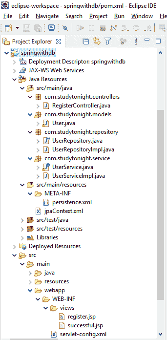
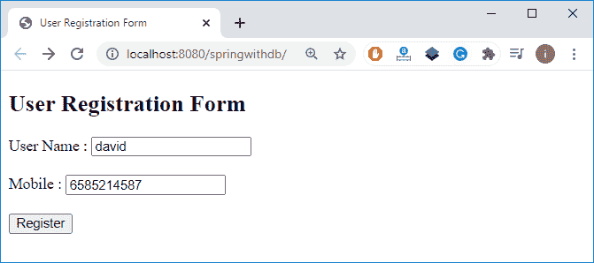
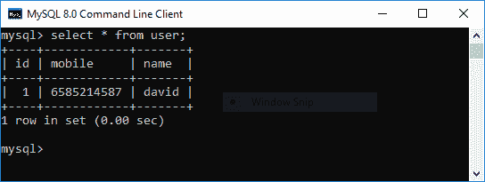

# pring MVC 和 JPA

> 原文：<https://www.studytonight.com/spring-framework/spring-mvc-with-jpa>

JPA (Java Persistence API)是一个在 Java 应用和关系数据库之间充当桥梁的 API。它是一组用于高效执行数据库操作的类和接口。它减少了 Java 应用中的数据库配置工作，并且得到了所有主要数据库 MySQL、Oracle、Redhat 等的支持。

最初 JPA 是结合 EJB 作为业务逻辑层发布的，可以使用`javax.ejb.EntityBean`接口访问。但是现在各种有 JPA 持久味道的产品，比如 Hibernate、Spring Data JPA 等。

在本文中，我们将学习在 Spring 应用中使用 JPA 并连接数据库(MySQL)。下图显示了我们基于 Maven 的 Spring 项目的结构和文件层次。

### **项目结构**



//寄存器控制器. java

这是我们的控制器类，它有两个方法 index()和 save()。第一个用于将 JSP 页面作为用户表单返回，第二个用于将用户详细信息保存到数据库中。

```java
package com.studytonight.controllers; 

import javax.validation.Valid;
import org.springframework.beans.factory.annotation.Autowired;
import org.springframework.stereotype.Controller;
import org.springframework.validation.BindingResult;
import org.springframework.web.bind.annotation.GetMapping;
import org.springframework.web.bind.annotation.ModelAttribute;
import org.springframework.web.bind.annotation.PostMapping;
import com.studytonight.models.User;
import com.studytonight.service.UserService;

@Controller
public class RegisterController{

	@Autowired 
	private UserService userService;

	@GetMapping("/")
	public String index() {
		return "register";
	}

	@PostMapping("save")
	public String save(@Valid @ModelAttribute User user, BindingResult result) {
		if(result.hasErrors()) {
			return "register";
		}else {
			 userService.register(user);
			 return "successful";
		}	
	}	
}
```

**//user.java**

这是我们的实体类，表示数据库中的用户表结构。我们使用@Entity 注释将其标记为实体。Spring 将在 MySQL 数据库中创建一个用户表。

```java
package com.studytonight.models;

import javax.persistence.Entity;
import javax.persistence.GeneratedValue;
import javax.persistence.Id;

@Entity
public class User {

	@Id
	@GeneratedValue
	private Long id;
	private String name;
	private Long mobile;
	public Long getId() {
		return id;
	}
	public void setId(Long id) {
		this.id = id;
	}
	public String getName() {
		return name;
	}
	public void setName(String name) {
		this.name = name;
	}
	public Long getMobile() {
		return mobile;
	}
	public void setMobile(Long mobile) {
		this.mobile = mobile;
	}
} 
```

**//UserRepository.java**

它是 DAO 实现的接口。它包含一个 save()方法。

```java
package com.studytonight.repository;
import com.studytonight.models.User;
public interface UserRepository {
	User save(User user);
} 
```

**//user repository impl . Java**

执行数据库操作的是我们的 DAO(数据访问对象)实现类。在我们的例子中，我们将用户数据插入到表中，因此使用了 EntityManager 的`persist()`方法。

```java
package com.studytonight.repository;
import javax.persistence.EntityManager;
import javax.persistence.PersistenceContext;
import org.springframework.stereotype.Component;
import org.springframework.stereotype.Repository;
import org.springframework.transaction.annotation.Transactional;
import com.studytonight.models.User;

@Component
@Repository
public class UserRepositoryImpl implements UserRepository{

	@PersistenceContext
	private EntityManager em;

	@Override
	@Transactional
	public User save(User user) {
		em.persist(user);
		em.flush();
		return  user;
	}
} 
```

//user service . Java

它是服务类实现的接口。它包含一个方法寄存器()。

```java
package com.studytonight.service;
import org.springframework.stereotype.Service;
import com.studytonight.models.User;
public interface UserService {
	User register(User user);
} 
```

//user service impl . Java

正是我们的服务实现类调用了 DAO 的 save()方法来保存用户数据。

```java
package com.studytonight.service;

import org.springframework.beans.factory.annotation.Autowired;
import org.springframework.stereotype.Component;
import org.springframework.stereotype.Service;
import org.springframework.transaction.annotation.Transactional;
import com.studytonight.models.User;
import com.studytonight.repository.UserRepository;

@Component
@Service
public class UserServiceImpl implements UserService {

	@Autowired
	UserRepository userRepository;

	@Override
	@Transactional
	public User register(User user) {
		// TODO Auto-generated method stub
		return userRepository.save(user);
	}
} 
```

这些 XML 文件是 Java 持久性 API 配置文件，包含连接细节、数据库方言和 EntityManagerFactory 配置。

//持久性. xml

```java
<persistence 
	xmlns:xsi="http://www.w3.org/2001/XMLSchema-instance"
	xsi:schemaLocation="http://java.sun.com/xml/ns/persistence http://java.sun.com/xml/ns/persistence/persistence_2_0.xsd"
	version="2.0">
	<persistence-unit name="punit"></persistence-unit>
</persistence>
```

/jpacontext . XML

```java
<beans 
	xmlns:xsi="http://www.w3.org/2001/XMLSchema-instance"
	xmlns:context="http://www.springframework.org/schema/context"
	xmlns:tx="http://www.springframework.org/schema/tx"
	xsi:schemaLocation="http://www.springframework.org/schema/beans http://www.springframework.org/schema/beans/spring-beans.xsd
        http://www.springframework.org/schema/tx http://www.springframework.org/schema/tx/spring-tx-3.2.xsd
        http://www.springframework.org/schema/context http://www.springframework.org/schema/context/spring-context-3.2.xsd">

	<context:annotation-config />
	<context:component-scan
		base-package="com.studytonight"></context:component-scan>

	<bean
		class="org.springframework.orm.jpa.support.PersistenceAnnotationBeanPostProcessor" />

	<bean id="datasource"
		class="org.springframework.jdbc.datasource.DriverManagerDataSource">
		<property name="driverClassName"
			value="com.mysql.jdbc.Driver"></property>
		<property name="url"
			value="jdbc:mysql://localhost:3306/springwithdb?autoReconnect=true"></property>
		<property name="username" value="root_user" />
		<property name="password" value="root_password" />
	</bean>

	<bean id="entityManagerFactory"
		class="org.springframework.orm.jpa.LocalContainerEntityManagerFactoryBean">
		<property name="persistenceUnitName" value="punit" />
		<property name="dataSource" ref="datasource" />
		<property name="jpaVendorAdapter">
			<bean
				class="org.springframework.orm.jpa.vendor.HibernateJpaVendorAdapter">
				<property name="showSql" value="true" />
			</bean>
		</property>
		<!-- JPA vendor properties: specific to Hibernate, in our case -->
		<property name="jpaPropertyMap">
			<map>
				<entry key="hibernate.dialect"
					value="org.hibernate.dialect.MySQLDialect" />

				<entry key="hibernate.hbm2ddl.auto" value="create"></entry>
				<entry key="hibernate.format_sql" value="true"></entry>
			</map>
		</property>

	</bean>

	<bean id="transactionManager"
		class="org.springframework.orm.jpa.JpaTransactionManager">
		<property name="entityManagerFactory" ref="entityManagerFactory" />
	</bean>
	<tx:annotation-driven />

	<bean id="persistenceExceptionTranslationPostProcessor"
		class="org.springframework.dao.annotation.PersistenceExceptionTranslationPostProcessor" />

</beans>
```

//**register.jsp**

这是一个 JSP 页面，包含一个 HTML 表单，并在应用启动时呈现。

```java
<%@ page language="java" contentType="text/html; charset=ISO-8859-1"
	pageEncoding="ISO-8859-1"%>
<!DOCTYPE html>
<html>
<head>
<meta charset="ISO-8859-1">
<title>User Registration Form</title>
</head>
<body>
	<h2>User Registration Form</h2>
	<form action="save" method="post">
		<label>User Name : </label> <input type="text" name="name"><br>
		<br> <label>Mobile : </label> <input type="text" name="mobile"><br>
		<br> <input type="submit" value="Register">
	</form>
</body>
</html>
```

//**successful.jsp**

当用户注册成功时，这个 JSP 页面显示一个成功页面。

```java
<%@ page language="java" contentType="text/html; charset=ISO-8859-1"
	pageEncoding="ISO-8859-1"%>
<!DOCTYPE html>
<html>
<head>
<meta charset="ISO-8859-1">
<title></title>
</head>
<body>
	<h2>Registered Successfully!</h2>
</body>
</html>
```

//servletconfig . XML

```java
<?xml version="1.0" encoding="UTF-8"?>
<beans 
	xmlns:xsi="http://www.w3.org/2001/XMLSchema-instance" 
	xmlns:context="http://www.springframework.org/schema/context"
	xmlns:mvc="http://www.springframework.org/schema/mvc"
	xsi:schemaLocation="
		http://www.springframework.org/schema/beans
    	http://www.springframework.org/schema/beans/spring-beans.xsd
    	http://www.springframework.org/schema/context
    	http://www.springframework.org/schema/context/spring-context.xsd
    	http://www.springframework.org/schema/mvc
        http://www.springframework.org/schema/mvc/spring-mvc.xsd">

	<!-- Step 3: Add support for component scanning -->
	<context:component-scan base-package="com.studytonight.controllers" />

	<!-- Step 4: Add support for conversion, formatting and validation support -->
	<mvc:annotation-driven/>

	<!-- Step 5: Define Spring MVC view resolver -->
	<bean
		class="org.springframework.web.servlet.view.InternalResourceViewResolver">
		<property name="prefix" value="/WEB-INF/views/" />
		<property name="suffix" value=".jsp" />
	</bean>
</beans>
```

**// web.xml**

```java
<?xml version="1.0" encoding="UTF-8"?>
<web-app xmlns:xsi="http://www.w3.org/2001/XMLSchema-instance"

	xsi:schemaLocation="http://java.sun.com/xml/ns/javaee http://java.sun.com/xml/ns/javaee/web-app_2_5.xsd"
	version="2.5">
	<display-name>springwithdb</display-name>

	<context-param>
		<param-name>contextConfigLocation</param-name>
		<param-value>classPath:/jpaContext.xml</param-value>
	</context-param>

	<listener>
		<listener-class>org.springframework.web.context.ContextLoaderListener</listener-class>
	</listener>

	<!-- Spring MVC Configs -->

	<!-- Step 1: Configure Spring MVC Dispatcher Servlet -->
	<servlet>
		<servlet-name>dispatcher</servlet-name>
		<servlet-class>org.springframework.web.servlet.DispatcherServlet</servlet-class>
		<init-param>
			<param-name>contextConfigLocation</param-name>
			<param-value>/WEB-INF/servlet-config.xml</param-value>
		</init-param>
		<load-on-startup>1</load-on-startup>
	</servlet>

	<!-- Step 2: Set up URL mapping for Spring MVC Dispatcher Servlet -->
	<servlet-mapping>
		<servlet-name>dispatcher</servlet-name>
		<url-pattern>/</url-pattern>
	</servlet-mapping>

</web-app>
```

POM . XML

这个文件包含这个项目的所有依赖项，比如 spring jars、servlet jars 等。将这些依赖项放入项目中以运行应用。

```java
<project 
	xmlns:xsi="http://www.w3.org/2001/XMLSchema-instance"
	xsi:schemaLocation="http://maven.apache.org/POM/4.0.0 https://maven.apache.org/xsd/maven-4.0.0.xsd">
	<modelVersion>4.0.0</modelVersion>
	<groupId>com.studytonight</groupId>
	<artifactId>springwithdb</artifactId>
	<version>0.0.1-SNAPSHOT</version>
	<packaging>war</packaging>
	<dependencies>
		<dependency>
			<groupId>org.springframework</groupId>
			<artifactId>spring-core</artifactId>
			<version>${spring.version}</version>
		</dependency>
		<dependency>
			<groupId>org.springframework</groupId>
			<artifactId>spring-context</artifactId>
			<version>${spring.version}</version>
		</dependency>
		<dependency>
			<groupId>org.springframework</groupId>
			<artifactId>spring-webmvc</artifactId>
			<version>${spring.version}</version>
		</dependency>
		<dependency>
			<groupId>org.hibernate.validator</groupId>
			<artifactId>hibernate-validator</artifactId>
			<version>6.1.1.Final</version>
		</dependency>
		<dependency>
			<groupId>com.fasterxml.jackson.core</groupId>
			<artifactId>jackson-databind</artifactId>
			<version>2.10.0.pr3</version>
		</dependency>
		<!-- https://mvnrepository.com/artifact/mysql/mysql-connector-java -->
		<dependency>
			<groupId>mysql</groupId>
			<artifactId>mysql-connector-java</artifactId>
			<version>8.0.13</version>
		</dependency>
		<dependency>
			<groupId>org.hibernate</groupId>
			<artifactId>hibernate-core</artifactId>
			<version>4.1.4.Final</version>
		</dependency>
		<dependency>
			<groupId>org.springframework</groupId>
			<artifactId>spring-jdbc</artifactId>
			<version>3.2.0.RELEASE</version>
		</dependency>
		<dependency>
			<groupId>org.springframework</groupId>
			<artifactId>spring-orm</artifactId>
			<version>3.2.0.RELEASE</version>
		</dependency>
		<dependency>
			<groupId>javax.xml.bind</groupId>
			<artifactId>jaxb-api</artifactId>
			<version>2.3.0</version>
		</dependency>
		<dependency> 
			<groupId>org.hibernate</groupId>
			<artifactId>hibernate-entitymanager</artifactId>
			<version>4.1.9.Final</version>
		</dependency>

		<!-- https://mvnrepository.com/artifact/javax.transaction/jta -->
		<dependency>
			<groupId>javax.transaction</groupId>
			<artifactId>jta</artifactId>
			<version>1.1</version>
		</dependency>
	</dependencies>
	<properties>
		<spring.version>5.2.8.RELEASE</spring.version>
	</properties>
	<build>
		<sourceDirectory>src</sourceDirectory>
		<plugins>
			<plugin>
				<artifactId>maven-compiler-plugin</artifactId>
				<version>3.8.1</version>
				<configuration>
					<source>1.8</source>
					<target>1.8</target>
				</configuration>
			</plugin>
			<plugin>
				<artifactId>maven-war-plugin</artifactId>
				<version>3.2.3</version>
				<configuration>
					<warSourceDirectory>WebContent</warSourceDirectory>
				</configuration>
			</plugin>
		</plugins>
	</build>
</project>
```

### 运行应用

成功完成项目并添加依赖项后，运行应用，您将获得如下输出。



当用户成功注册后，数据将存储在用户表中，您可以通过访问数据库进行验证。



* * *

* * *