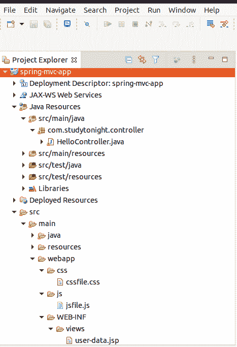
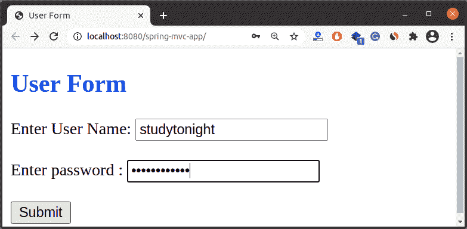
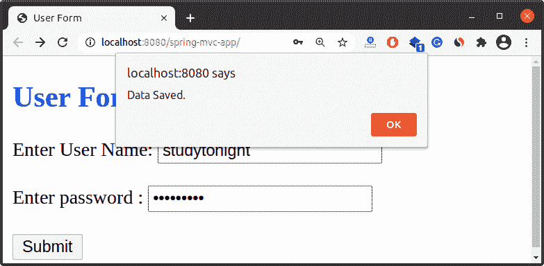

# Spring 的 CSS 和 JS 处理

> 原文：<https://www.studytonight.com/spring-framework/css-and-js-handling-in-spring>

在本文中，我们将学习 Spring 框架中的 [CSS](https://www.studytonight.com/cascading-style-sheet/) 和 [JavaScript](https://www.studytonight.com/javascript/) 文件处理。当创建一个网络应用时，我们需要在我们的应用中添加网络技术，比如 CSS、JavaScript 等。

Spring 提供了`<mvc:resource>`标签来映射我们应用项目中文件的位置。这个标签使用映射属性来映射资源，使用位置属性来定位资源。我们可以简单地将这个标签放入我们的 servlet 上下文文件，如下所示。

```java
<mvc:resources mapping="/js/**" location="/js/" />
<mvc:resources mapping="/css/**" location="/css/" />
```

然后将这个 **taglib** 库添加到 JSP 文件中，为 CSS 和 JS 文件添加标签。

```java
<%@taglib prefix="c" uri="http://java.sun.com/jsp/jstl/core" %>
```

添加这个 JSTL 库后，将这些标签添加到 JSP 页面的头部。

```java
<script src="<c:url value="/js/jsfile.js" />"></script>
<link href="<c:url value="/css/cssfile.css" />" rel="stylesheet"></link>
```

**注意:**将所有 CSS 文件放入 **webapp/css** 文件夹，JavaScript 文件放入项目中 **webapp/js** 文件夹。您可以参考我们的项目结构来了解文件位置和目录层次结构。

## 举个例子

让我们创建一个例子来理解 Spring 框架中的 CSS 和 JavaScript 文件处理。以下是我们项目的源文件。你可以让他们参考你的项目。

**JSP 文件//user-form.jsp**

在这个文件中，我们创建了一个 HTML 表单，并添加了 CSS 和 JS 文件。

```java
<%@ page language="java" contentType="text/html; charset=ISO-8859-1" pageEncoding="ISO-8859-1"%>
<%@taglib prefix="c" uri="http://java.sun.com/jsp/jstl/core" %>  
<!DOCTYPE html>
<html>
<head>
<meta charset="ISO-8859-1">
<title>User Form</title>
<script src="<c:url value="/js/jsfile.js" />"></script>
<link href="<c:url value="/css/cssfile.css" />" rel="stylesheet"></link>
</head>
<body>
<h2>User Form</h2>
<form action="showdata" method="Get">
	<label>Enter User Name: </label><input type="text" name="user_name"><br/><br/>
	<label>Enter password : </label><input type="password" name="password"><br/><br/>
	<input type="submit" onclick="save()" />
</form>
</body>
</html>
```

**//控制器 HelloController.java**

这是我们的控制器类，包含两种显示 JSP 页面的方法。

```java
package com.studytonight.controller;
import org.springframework.stereotype.Controller;
import org.springframework.ui.Model;
import org.springframework.web.bind.annotation.ModelAttribute;
import org.springframework.web.bind.annotation.RequestMapping;

@Controller
public class HelloController {

	@RequestMapping("/")
	public String showForm() {
		return "user-form";
	}

	@RequestMapping("showdata")
	public String userForm(@ModelAttribute("user_name") String user, Model model)
	{
			model.addAttribute("name", user);
			return "user-data";		
	}
}
```

**//spring-MVC-app-servlet . XML**

在这个文件中，我们使用`<mvc:resources>`标签来配置 CSS 和 JS 文件。

```java
<?xml version="1.0" encoding="UTF-8"?>
<beans 
	xmlns:xsi="http://www.w3.org/2001/XMLSchema-instance"
	xmlns:context="http://www.springframework.org/schema/context"
	xmlns:mvc="http://www.springframework.org/schema/mvc"
	xsi:schemaLocation="
		http://www.springframework.org/schema/beans
    	http://www.springframework.org/schema/beans/spring-beans.xsd
    	http://www.springframework.org/schema/context
    	http://www.springframework.org/schema/context/spring-context.xsd
    	http://www.springframework.org/schema/mvc
        http://www.springframework.org/schema/mvc/spring-mvc.xsd">

	<!-- Step 3: Add support for component scanning -->
	<context:component-scan
		base-package="com.studytonight.controller" />

	<!-- Step 4: Add support for conversion, formatting and validation support -->
	<mvc:annotation-driven />

	<mvc:resources mapping="/js/**" location="/js/" />
	<mvc:resources mapping="/css/**" location="/css/" />

	<!-- Step 5: Define Spring MVC view resolver -->
	<bean
		class="org.springframework.web.servlet.view.InternalResourceViewResolver">
		<property name="prefix" value="/WEB-INF/views/" />
		<property name="suffix" value=".jsp" />
	</bean>
</beans> 
```

**// web.xml**

```java
<?xml version="1.0" encoding="UTF-8"?>
<web-app xmlns:xsi="http://www.w3.org/2001/XMLSchema-instance"

	xsi:schemaLocation="http://xmlns.jcp.org/xml/ns/javaee http://xmlns.jcp.org/xml/ns/javaee/web-app_3_1.xsd"
	id="WebApp_ID" version="3.1">

	<display-name>spring-mvc-app</display-name>

	<absolute-ordering />

	<!-- Spring MVC Configs -->

	<!-- Step 1: Configure Spring MVC Dispatcher Servlet -->
	<servlet>
		<servlet-name>dispatcher</servlet-name>
		<servlet-class>org.springframework.web.servlet.DispatcherServlet</servlet-class>
		<init-param>
			<param-name>contextConfigLocation</param-name>
			<param-value>/WEB-INF/spring-mvc-app-servlet.xml</param-value>
		</init-param>
		<load-on-startup>1</load-on-startup>
	</servlet>

	<!-- Step 2: Set up URL mapping for Spring MVC Dispatcher Servlet -->
	<servlet-mapping>
		<servlet-name>dispatcher</servlet-name>
		<url-pattern>/</url-pattern>
	</servlet-mapping>

</web-app>
```

**//user-form.jsp**

```java
<%@ page language="java" contentType="text/html; charset=ISO-8859-1"
    pageEncoding="ISO-8859-1"%>
<!DOCTYPE html>
<html>
<head>
<meta charset="ISO-8859-1">
<title>Hello JSP</title>
</head>
<body>
<strong>Hello,</strong>
${name}
</body>
</html>
```

//cssfile . CSS

```java
h2{
	color:blue;
}
```

//jsfile . js

```java
function save(){
	alert("Data Saved.");
}
```

//POM . XML

这个文件包含这个项目的所有依赖项，比如 spring jars、servlet jars 等。将这些依赖项放入项目中以运行应用。

```java
<project 
	xmlns:xsi="http://www.w3.org/2001/XMLSchema-instance"
	xsi:schemaLocation="http://maven.apache.org/POM/4.0.0 https://maven.apache.org/xsd/maven-4.0.0.xsd">
	<modelVersion>4.0.0</modelVersion>
	<groupId>com.studytonight</groupId>
	<artifactId>spring-mvc-app</artifactId>
	<version>0.0.1-SNAPSHOT</version>
	<packaging>war</packaging>
	<dependencies>
		<dependency>
			<groupId>org.springframework</groupId>
			<artifactId>spring-core</artifactId>
			<version>${spring.version}</version>
		</dependency>
		<dependency>
			<groupId>org.springframework</groupId>
			<artifactId>spring-context</artifactId>
			<version>${spring.version}</version>
		</dependency>
		<dependency>
			<groupId>org.springframework</groupId>
			<artifactId>spring-webmvc</artifactId>
			<version>${spring.version}</version>
		</dependency>
		<!-- https://mvnrepository.com/artifact/javax.xml.bind/jaxb-api -->
		<dependency>
			<groupId>javax.xml.bind</groupId>
			<artifactId>jaxb-api</artifactId>
			<version>2.3.0</version>
		</dependency>
		<!-- https://mvnrepository.com/artifact/javax.servlet/jstl -->
		<dependency>
			<groupId>javax.servlet</groupId>
			<artifactId>jstl</artifactId>
			<version>1.2</version>
		</dependency>
	</dependencies>
	<properties>
		<spring.version>5.2.8.RELEASE</spring.version>
	</properties>
	<build>
		<plugins>
			<plugin>
				<artifactId>maven-war-plugin</artifactId>
				<version>3.2.3</version>
				<configuration>
					<warSourceDirectory>WebContent</warSourceDirectory>
				</configuration>
			</plugin>
		</plugins>
	</build>
</project>
```

## 项目结构



### 运行应用

成功完成项目并添加依赖项后，运行应用，您将获得如下输出。



请注意，在 CSS 文件中，我们对 H2 标签应用了 CSS color 属性，这很有效，在 JS 文件中，我们创建了一个方法，在单击提交按钮时显示一条警告消息。



* * *

* * *