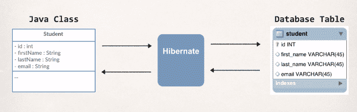
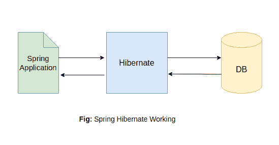

# Spring Hibernate配置

> 原文：<https://www.studytonight.com/spring-framework/hibernate-configuration>

Hibernate 是一个基于 ORM 的框架，用于在 Java 应用中将 Java 对象映射到关系数据库。它主要用于在数据库中存储数据。Hibernate 主要用于通过使用 Java 代码来管理数据库。它将 Java 类映射到数据库表，将 Java 类型映射到数据库类型。它由红帽设计和开发，最初于 2001 年 5 月 23 日发布。

我们可以通过看到下图来理解，该图显示了 hibernate 框架如何将 java 类字段映射到表列及其类型。



在本教程中，我们将看到如何在 spring web 应用中配置 hibernate。我们可以通过使用 **XML 文件或 Java 注释**来配置Hibernate。XML 方法比较古老，注释是一种新的现代方法。因此，我们将使用注释来配置 hibernate，但是您可以自由使用任何方法。

hibernate 使用 SessionFactory 类来处理数据表，并提供读取、保存和获取数据的方法。



### 使用 Java 注释和代码的Hibernate配置

该文件显示了在 Spring 应用中使用 Java 注释和代码的基本 hibernate 配置。

```java
package com.studytonight;

import org.apache.tomcat.dbcp.dbcp2.BasicDataSource;
import org.springframework.context.annotation.Bean;
import org.springframework.context.annotation.ComponentScan;
import org.springframework.context.annotation.Configuration;
import org.springframework.orm.hibernate5.HibernateTransactionManager;
import org.springframework.orm.hibernate5.LocalSessionFactoryBean;
import org.springframework.transaction.PlatformTransactionManager;
import org.springframework.transaction.annotation.EnableTransactionManagement;
import java.util.Properties;
import javax.sql.DataSource;

@Configuration
@EnableTransactionManagement
@ComponentScan("com.studytonight") 
public class HibernateConf {

	@Bean
	public LocalSessionFactoryBean sessionFactory() {
		LocalSessionFactoryBean sessionFactory = new LocalSessionFactoryBean();
		sessionFactory.setDataSource(dataSource());
		sessionFactory.setPackagesToScan("com.studytonight.models");
		sessionFactory.setHibernateProperties(hibernateProperties());
		return sessionFactory;
	}

	@Bean
	public DataSource dataSource() {
		BasicDataSource dataSource = new BasicDataSource();
		dataSource.setDriverClassName("com.mysql.jdbc.Driver");
		dataSource.setUrl("jdbc:mysql://localhost:3306/springwithdb?useSSL=false");
		dataSource.setUsername("user-name");
		dataSource.setPassword("password");
		return dataSource;
	}

	@Bean
	public PlatformTransactionManager hibernateTransactionManager() {
		HibernateTransactionManager transactionManager
		= new HibernateTransactionManager();
		transactionManager.setSessionFactory(sessionFactory().getObject());
		return transactionManager;
	}

	private final Properties hibernateProperties() {
		Properties hibernateProperties = new Properties();
		hibernateProperties.setProperty("hibernate.show_sql","true");
		return hibernateProperties;
	}
}
```

### 使用可扩展标记语言的Hibernate配置

如果您想使用一个 XML 文件，那么使用这个 XML 代码来配置 Spring 应用的 hibernate。

```java
<?xml version="1.0" encoding="UTF-8"?>
<beans >

    <bean id="sessionFactory" 
      class="org.springframework.orm.hibernate5.LocalSessionFactoryBean">
        <property name="dataSource" 
          ref="dataSource"/>
        <property name="packagesToScan" 
          value="com.studytonight.models"/>
        <property name="hibernateProperties">
            <props>
                <prop key="hibernate.hbm2ddl.auto">
                    create-drop
                </prop>
                <prop key="hibernate.dialect">
                    org.hibernate.dialect.MySQL5Dialect
                </prop>
            </props>
        </property>
    </bean>

    <bean id="dataSource" 
      class="org.apache.tomcat.dbcp.dbcp2.BasicDataSource">
        <property name="driverClassName" value="com.mysql.cj.jdbc.Driver"/>
        <property name="url" value="jdbc:mysql://localhost:3306/db_name?useSSL=false"/>
        <property name="username" value="db_user"/>
        <property name="password" value="db_password"/>
    </bean>

    <bean id="txManager" 
      class="org.springframework.orm.hibernate5.HibernateTransactionManager">
        <property name="sessionFactory" ref="sessionFactory"/>
    </bean>
</beans>
```

配置之后，现在我们可以通过添加下面的行在应用的任何地方使用它。我们主要将其与 DAO 实现类一起使用。

```java
@Autowired
private SessionFactory sessionFactory;
```

会话工厂是 Hibernate 的一个组件，用于为应用创建会话对象。然而`SessionFactory`是一个提供多种方法处理会话的界面。

### 数据库方言

以下是 Mysql、Oracle 等各种数据库的方言。

| **数据库** | **方言名称** |
| 微软 SQL Server 2008 | org . hibernate . quality . SQLServer 2008 quality |
| 关系型数据库 | org . hibernate . flavoice . MySQL flavoice |
| 神谕 | org . hibernate . flavoice . Oracle flavoice |
| 一种数据库系统 | org . hibernate . quality . PostgreSqldialect |
| DB2 | org . hibernate . flavoice . db 2 dialect |

在下一个主题中，我们将学习使用 hibernate 将数据连接并保存到 Mysql 数据库中。

* * *

* * *