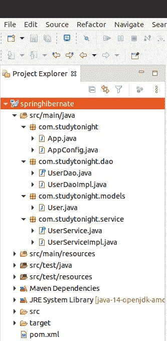

# Spring冬眠集成

> 原文：<https://www.studytonight.com/spring-framework/spring-hibernate-integration>

在我们的[上一篇文章](https://www.studytonight.com/tutorials/preview?subject=spring-framework&url=hibernate-configuration)中，我们已经了解了 hibernate 框架和配置方法。现在，我们将学习配置和实现 hibernate 并执行操作。

这里，我们使用 **Java 代码和注释**来配置 Spring 应用的 hibernate。我们创建了一个 maven 项目，如下图所示。

## 项目结构

该项目包含多个包，如**com study night**、**com study night . Dao**、**com study night . models**、**com study night . service**等，对 Java 文件进行分类。



该项目包含以下源文件。

**//App.java**

该文件包含为我们的应用创建 IOC 容器的代码。AnnotationConfigApplicationContext 类用于为应用上下文创建对象。

```java
package com.studytonight;

import org.springframework.context.annotation.AnnotationConfigApplicationContext;
import com.studytonight.service.UserService;
import com.studytonight.service.UserServiceImpl;

public class App {

	public static void main(String[] args) {

		AnnotationConfigApplicationContext context = new AnnotationConfigApplicationContext(AppConfig.class);
		UserService userService = context.getBean("userServiceImpl",UserServiceImpl.class);
		userService.save();
		// Close the context
		context.close();
	}
}
```

//app config . Java

这是一个 Java 配置文件，它是我们为基于 xml 的配置示例创建的 **applicationContext.xml** 文件的替代文件。`@Configuration`注释表示这不是一个简单的类，而是一个配置类，`@ComponentScan` 注释用于表示我们 spring 项目中组件类的位置。

```java
package com.studytonight;

import java.util.Properties;
import javax.sql.DataSource;
import org.apache.tomcat.dbcp.dbcp2.BasicDataSource;
import org.springframework.context.annotation.Bean;
import org.springframework.context.annotation.ComponentScan;
import org.springframework.context.annotation.Configuration;
import org.springframework.orm.hibernate5.HibernateTransactionManager;
import org.springframework.orm.hibernate5.LocalSessionFactoryBean;
import org.springframework.transaction.PlatformTransactionManager;
import org.springframework.transaction.annotation.EnableTransactionManagement;

@Configuration
@ComponentScan("com.studytonight")
@EnableTransactionManagement
public class AppConfig {

	@Bean
	public LocalSessionFactoryBean sessionFactory() {
		LocalSessionFactoryBean sessionFactory = new LocalSessionFactoryBean();
		sessionFactory.setDataSource(dataSource());
		sessionFactory.setPackagesToScan("com.studytonight.models");
		sessionFactory.setHibernateProperties(hibernateProperties());
		return sessionFactory;
	}

	@Bean
	public DataSource dataSource() {
		BasicDataSource dataSource = new BasicDataSource();
		dataSource.setDriverClassName("com.mysql.jdbc.Driver");
		dataSource.setUrl("jdbc:mysql://localhost:3306/springwithdb?useSSL=false");
		dataSource.setUsername("user-name");
		dataSource.setPassword("password");
		return dataSource;
	}

	@Bean
	public PlatformTransactionManager hibernateTransactionManager() {
		HibernateTransactionManager transactionManager
		= new HibernateTransactionManager();
		transactionManager.setSessionFactory(sessionFactory().getObject());
		return transactionManager;
	}

	private final Properties hibernateProperties() {
		Properties hibernateProperties = new Properties();
		hibernateProperties.setProperty("hibernate.show_sql","true");
		return hibernateProperties;
	}
}
```

//user Dao . Java

这是一个为数据访问对象(DAO)声明方法的接口。

```java
package com.studytonight.dao;

public interface UserDao {
	void save();
}
```

**//user daimple . Java**

这是一个 DAO 实现类，它实现了 UserDao 接口，并用于执行数据库操作。这里，我们将用户数据保存到用户表中。

```java
package com.studytonight.dao;

import javax.transaction.Transactional;
import org.hibernate.Session;
import org.hibernate.SessionFactory;
import org.springframework.beans.factory.annotation.Autowired;
import org.springframework.stereotype.Repository;
import com.studytonight.models.User;

@Repository
public class UserDaoImpl implements UserDao{

	@Autowired
	private SessionFactory sessionFactory;

	@Transactional
	public void save() {
		Session session = sessionFactory.getCurrentSession();
		User user = new User(101,"Sam","Jacob","sam@studytonight.com");
		session.save(user);
	}
}
```

**//User.java**

这是一个实体类，表示数据库中的**用户**表。它使用**@实体**和**@表**注解将一个类作为一个实体类。它包含设置器和 getter 方法来设置和获取数据库中的数据。

```java
package com.studytonight.models;

import javax.persistence.Entity;
import javax.persistence.GeneratedValue;
import javax.persistence.GenerationType;
import javax.persistence.Id;
import javax.persistence.Table;

@Entity
@Table(name = "user")
public class User {
	@Id 
	@GeneratedValue(strategy = GenerationType.IDENTITY)
	int id;
	String name;
	String lastName;
	String email;

	public User(int id, String name, String lastName, String email) {
		//super();
		this.id = id;
		this.name = name;
		this.lastName = lastName;
		this.email = email;
	}
	public int getId() {
		return id;
	}
	public void setId(int id) {
		this.id = id;
	}
	public String getName() {
		return name;
	}
	public void setName(String name) {
		this.name = name;
	}
	public String getLastName() {
		return lastName;
	}
	public void setLastName(String lastName) {
		this.lastName = lastName;
	}
	public String getEmail() {
		return email;
	}
	public void setEmail(String email) {
		this.email = email;
	}
}
```

//user service . Java

```java
package com.studytonight.service;

public interface UserService {

	void save();
}
```

//user service impl . Java

它是一个调用 DAO 类方法的服务类。

```java
package com.studytonight.service;

import org.springframework.beans.factory.annotation.Autowired;
import org.springframework.stereotype.Service;
import com.studytonight.dao.UserDao;

@Service
public class UserServiceImpl implements UserService{

	@Autowired
	private UserDao userDao;

	public void save() {
		userDao.save();
	}
}
```

//POM . XML

这个文件包含这个项目的所有依赖项，比如 spring jars、servlet jars 等。将这些依赖项放入项目中以运行应用。

```java
<project 
	xmlns:xsi="http://www.w3.org/2001/XMLSchema-instance"
	xsi:schemaLocation="http://maven.apache.org/POM/4.0.0 https://maven.apache.org/xsd/maven-4.0.0.xsd">
	<modelVersion>4.0.0</modelVersion>
	<groupId>com.studytonight</groupId>
	<artifactId>springhibernate</artifactId>
	<version>0.0.1-SNAPSHOT</version>
	<dependencies>
		<!-- https://mvnrepository.com/artifact/org.springframework/spring-web -->
		<dependency>
			<groupId>org.springframework</groupId>
			<artifactId>spring-core</artifactId>
			<version>${spring.version}</version>
		</dependency>
		<dependency>
			<groupId>org.springframework</groupId>
			<artifactId>spring-context</artifactId>
			<version>${spring.version}</version>
		</dependency>
		<!-- Hibernate -->
		<dependency>
			<groupId>org.hibernate</groupId>
			<artifactId>hibernate-core</artifactId>
			<version>${hibernate.version}</version>
		</dependency>

		<!-- MySQL -->
		<dependency>
			<groupId>mysql</groupId>
			<artifactId>mysql-connector-java</artifactId>
			<version>${mysql.connector.version}</version>
		</dependency>
		<dependency>
			<groupId>org.springframework</groupId>
			<artifactId>spring-tx</artifactId>
			<version>${spring.version}</version>
		</dependency>
		<dependency>
			<groupId>org.apache.tomcat</groupId>
			<artifactId>tomcat-dbcp</artifactId>
			<version>9.0.1</version>
		</dependency>
		<dependency>
			<groupId>org.springframework</groupId>
			<artifactId>spring-orm</artifactId>
			<version>${spring.version}</version>
		</dependency>
		<dependency>
			<groupId>com.h2database</groupId>
			<artifactId>h2</artifactId>
			<version>1.4.195</version>
		</dependency>
	</dependencies>
	<properties>
		<spring.version>5.2.8.RELEASE</spring.version>
		<hibernate.version>5.4.1.Final</hibernate.version>
		<mysql.connector.version>5.1.45</mysql.connector.version>

	</properties>
</project>
```

### 运行应用

成功完成项目并添加依赖项后，运行应用，它会将数据保存到表中，您可以通过登录数据库来验证该表。

* * *

* * *