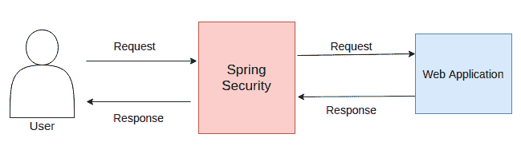

# Spring安全攻略

> 原文：<https://www.studytonight.com/spring-framework/spring-security-introduction>

Spring Security 是为保护基于 Spring 的应用而设计和开发的 Spring 项目之一。这是一个标准框架，可以用来保护 Spring 应用。它有助于解决创建非安全性 Spring 应用过程中出现的所有安全问题。它是在 2008 年作为 Spring Security 2.0.0】首次发布的**。**

它侧重于验证和授权，以保护应用的安全。**认证**是了解和识别想要访问的用户的过程，**授权**是允许权限执行操作和访问 Spring 应用中的资源的过程。它包含几个模块来处理各种领域，如远程、网络等。请参见下面的模块列表。

### 
Spring安全模块

Spring Security 由核心、授权、测试等几个独立的模块组成。我们列出了一些模块名称:

*   **核心:**包括 Spring Security 与身份验证和应用访问控制相关的核心类和接口。

*   **Remoting:** 它用于处理 Spring Remoting 应用，并包含必要的类。

*   **方面:**用于在 Spring Security 中包含面向方面编程(AOP)支持。

*   **配置:**使用 XML 和 Java 配置 Spring Security 应用。

*   **Crypto:** 该模块包含用于加密支持的类和接口。

*   **数据:**用于集成 Spring Security 和 Spring Data。

*   **消息传递:**在应用中实现消息传递是有帮助的。

*   **OAuth2:** 它包括 Spring Security 中 OAuth 2.x 的类和接口:

*   **OpenID:** 提供集成 OpenID 网络认证的支持。

*   **CAS:** CAS(中央认证服务)客户端集成。

*   **标签库:**它包含几个关于 Spring Security 的标签库。

*   **测试:**在 Spring Security 中增加了测试支持。

*   **Web:** 它包含 Web 安全代码，比如过滤器和 Servlet API 依赖关系。

您可以将 Spring Security 看作是一个工具，它充当用户和应用之间的桥梁，以保护应用免受非授权用户的攻击。查看 spring 安全性在应用中是如何分层的。



### Spring安全的优势

*   身份验证和授权支持
*   防范恶意程序
*   可扩张的
*   与 Spring MVC 的集成
*   轻便
*   CSRF 保护
*   Java 配置支持
*   易于维护
*   适当的文件

### 先决条件

我们正在使用 Spring Security 5.4.2，它需要 Java 8 或更高版本以及以下工具和库的知识。我们建议您在开始之前了解 Spring 框架。

*   [Java 8](https://www.studytonight.com/java-8/) 或更高

*   [Spring骨架](https://www.studytonight.com/spring-framework/spring-introduction)

*   [胃](https://www.studytonight.com/maven/)

*   集成开发环境(Eclipse，Spring工具套件)

*   服务器(Tomcat)

### Spring 安全性的 Maven 依赖关系

以下是将在示例教程中使用的依赖项。你可以使用这些或者在你的网络应用中选择最新的[官方专家](https://mvnrepository.com/artifact/org.springframework.security)。

```java
<!-- spring-security-core -->
<dependency>
	<groupId>org.springframework.security</groupId>
	<artifactId>spring-security-web</artifactId>
	<version>5.4.2</version>
</dependency>
<!-- spring-security-config -->
<dependency>
	<groupId>org.springframework.security</groupId>
	<artifactId>spring-security-config</artifactId>
	<version>5.4.2</version>
</dependency>
```

在下一个主题中，我们将通过一个简单的基本示例学习 spring security，稍后还将学习其他特性。

* * *

* * *