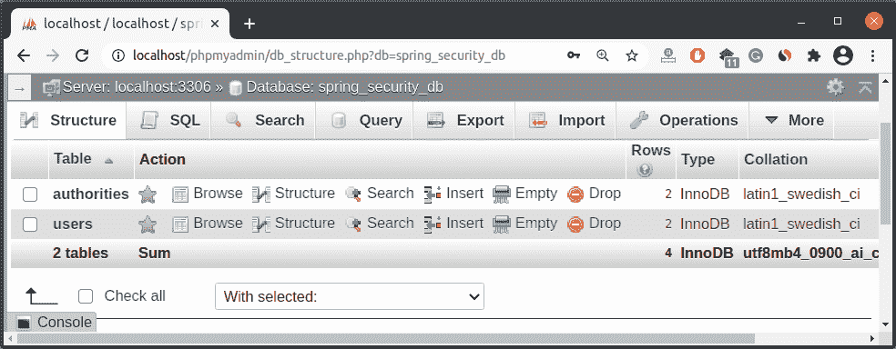
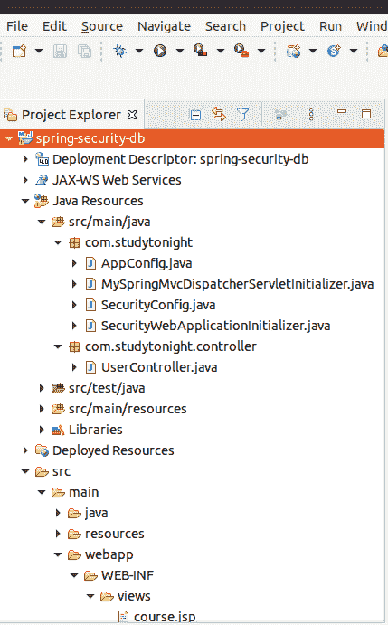
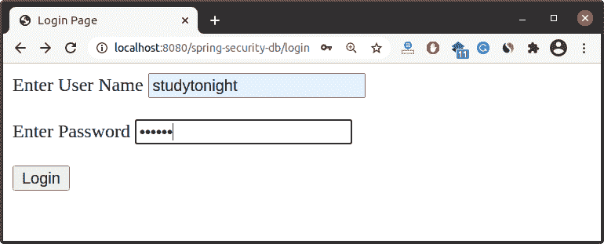
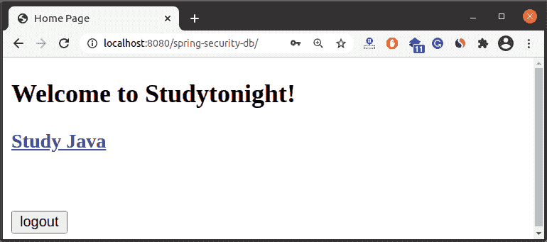

# JDBC 的Spring安全配置

> 原文：<https://www.studytonight.com/spring-framework/spring-security-configuration-with-jdbc>

在本主题中，我们将创建一个使用数据库表的数据登录的应用，而不是像我们在前面的文章和示例中所做的那样使用硬编码的值。这是一个简单的过程，我们只需要创建一个数据库，并用我们的项目配置它。创建一个项目对我们来说并不新鲜，因为我们在之前的主题中已经创建了很多次。在这里，我们将用一个数据库配置我们的项目。让我们一步一步来理解它。

1.  创建数据库和表

2.  添加数据库依赖项

3.  提供数据库详细信息

### 1.创建数据库和表

创建一个数据库 **spring_security_db** 和其中的两个表，并存储数据。使用下面的 SQL 转储创建数据库和表。

**// db.sql**

```java
CREATE DATABASE  IF NOT EXISTS `spring_security_db`;
USE `spring_security_db`;

--
-- Table structure for table `users`
--

CREATE TABLE `users` (
  `username` varchar(50) NOT NULL,
  `password` varchar(50) NOT NULL,
  `enabled` tinyint(1) NOT NULL,
  PRIMARY KEY (`username`)
) ENGINE=InnoDB DEFAULT CHARSET=latin1;

--
-- Inserting data for table `users`
--

INSERT INTO `users` 
VALUES 
('studytonight','{noop}abc123',1),
('pro-studytonight','{noop}abc123',1);

--
-- Table structure for table `authorities`
--

CREATE TABLE `authorities` (
  `username` varchar(50) NOT NULL,
  `authority` varchar(50) NOT NULL,
  UNIQUE KEY `authorities_idx_1` (`username`,`authority`),
  CONSTRAINT `authorities_ibfk_1` FOREIGN KEY (`username`) REFERENCES `users` (`username`)
) ENGINE=InnoDB DEFAULT CHARSET=latin1;

--
-- Inserting data for table `authorities`
--

INSERT INTO `authorities` 
VALUES 
('studytonight','ROLE_GUEST'),
('pro-studytonight','ROLE_REGISTERED'); 
```

执行这些 SQL 查询后，它将创建一个数据库和表，如下所示。



### 2.添加依赖项

将这些依赖项添加到您的 pom.xml 文件中，以便我们可以配置 Mysql 数据库。

```java
<dependency>
	<groupId>mysql</groupId>
	<artifactId>mysql-connector-java</artifactId>
	<version>5.1.45</version>
</dependency>
<dependency>
	<groupId>com.mchange</groupId>
	<artifactId>c3p0</artifactId>
	<version>0.9.5.2</version>
</dependency>
```

### 3.提供数据库详细信息

在资源目录中创建一个名为**persistence-MySQL . properties**的属性文件，并将数据库的详细信息如数据库名称和用户凭据放在这里。

```java
#
# JDBC connection properties
#
jdbc.driver=com.mysql.jdbc.Driver
jdbc.url=jdbc:mysql://localhost:3306/spring_security_db?useSSL=false
jdbc.user=user_name
jdbc.password=db_password

#
# Connection pool properties
#
connection.pool.initialPoolSize=5
connection.pool.minPoolSize=5
connection.pool.maxPoolSize=20
connection.pool.maxIdleTime=3000
```

并通过在**AppConfig.java**文件中配置数据源来获取项目中的这些属性值。

```java
@Bean
	public DataSource securityDataSource() {
		ComboPooledDataSource securityDataSource
		= new ComboPooledDataSource();
		try {
			securityDataSource.setDriverClass(env.getProperty("jdbc.driver"));
		} catch (PropertyVetoException exc) {
			throw new RuntimeException(exc);
		}
		logger.info(">>> jdbc.url=" + env.getProperty("jdbc.url"));
		logger.info(">>> jdbc.user=" + env.getProperty("jdbc.user"));
		securityDataSource.setJdbcUrl(env.getProperty("jdbc.url"));
		securityDataSource.setUser(env.getProperty("jdbc.user"));
		securityDataSource.setPassword(env.getProperty("jdbc.password"));
		securityDataSource.setInitialPoolSize(
				getIntProperty("connection.pool.initialPoolSize"));
		securityDataSource.setMinPoolSize(
				getIntProperty("connection.pool.minPoolSize"));
		securityDataSource.setMaxPoolSize(
				getIntProperty("connection.pool.maxPoolSize"));
		securityDataSource.setMaxIdleTime(
				getIntProperty("connection.pool.maxIdleTime"));
		return securityDataSource;
	}

	private int getIntProperty(String propName) {

		String propVal = env.getProperty(propName);
		int intPropVal = Integer.parseInt(propVal);
		return intPropVal;
	}
```

## 举个例子

做完这些配置后。让我们创建一个使用 MySQL 数据库验证用户身份的项目。

我们创建了一个基于 maven 的 Spring Security 项目，其中包含以下文件。

//app config . Java

这是我们的应用配置文件，它实现了`WebMvcConfugurer`接口来制作这个 MVC 应用，并创建了一个方法 viewResolver 来映射我们的视图文件(JSP)。我们又创建了一个方法 **securityDataSource()** ，它从**persistence-MySQL . properties**文件中读取数据库详细信息，并返回一个`Datasource`引用。我们使用`@PropertySource`注释来指定文件位置。

```java
package com.studytonight;

import java.beans.PropertyVetoException;
import java.util.logging.Logger;
import javax.sql.DataSource;
import org.springframework.beans.factory.annotation.Autowired;
import org.springframework.context.annotation.Bean;
import org.springframework.context.annotation.ComponentScan;
import org.springframework.context.annotation.Configuration;
import org.springframework.context.annotation.PropertySource;
import org.springframework.core.env.Environment;
import org.springframework.web.servlet.ViewResolver;
import org.springframework.web.servlet.config.annotation.EnableWebMvc;
import org.springframework.web.servlet.view.InternalResourceViewResolver;
import com.mchange.v2.c3p0.ComboPooledDataSource;

@Configuration
@EnableWebMvc
@ComponentScan(basePackages={"com.studytonight","com.studytonight.controller"})
@PropertySource("classpath:persistence-mysql.properties")
public class AppConfig {

	@Autowired
	private Environment env;	
	private Logger logger = Logger.getLogger(getClass().getName());

	@Bean
	public ViewResolver viewResolver() {

		InternalResourceViewResolver viewResolver = new InternalResourceViewResolver();
		viewResolver.setPrefix("/WEB-INF/views/");
		viewResolver.setSuffix(".jsp");
		return viewResolver;
	}

	@Bean
	public DataSource securityDataSource() {
		ComboPooledDataSource securityDataSource
		= new ComboPooledDataSource();
		try {
			securityDataSource.setDriverClass(env.getProperty("jdbc.driver"));
		} catch (PropertyVetoException exc) {
			throw new RuntimeException(exc);
		}
		logger.info(">>> jdbc.url=" + env.getProperty("jdbc.url"));
		logger.info(">>> jdbc.user=" + env.getProperty("jdbc.user"));
		securityDataSource.setJdbcUrl(env.getProperty("jdbc.url"));
		securityDataSource.setUser(env.getProperty("jdbc.user"));
		securityDataSource.setPassword(env.getProperty("jdbc.password"));
		securityDataSource.setInitialPoolSize(
				getIntProperty("connection.pool.initialPoolSize"));
		securityDataSource.setMinPoolSize(
				getIntProperty("connection.pool.minPoolSize"));
		securityDataSource.setMaxPoolSize(
				getIntProperty("connection.pool.maxPoolSize"));
		securityDataSource.setMaxIdleTime(
				getIntProperty("connection.pool.maxIdleTime"));
		return securityDataSource;
	}

	private int getIntProperty(String propName) {

		String propVal = env.getProperty(propName);
		int intPropVal = Integer.parseInt(propVal);
		return intPropVal;
	}
} 
```

【t0///my pringgmvcdisperservicinitiator . Java

这个类初始化我们的网络应用，并通过注册我们的 **AppConfig** 类来创建`ServletContext`(上图文件)。

```java
package com.studytonight;

import org.springframework.web.servlet.support.AbstractAnnotationConfigDispatcherServletInitializer;
public class MySpringMvcDispatcherServletInitializer extends AbstractAnnotationConfigDispatcherServletInitializer {

	@Override
	protected Class<?>[] getRootConfigClasses() {
		return null;
	}

	@Override
	protected Class<?>[] getServletConfigClasses() {
		return new Class[] { AppConfig.class };
	}

	@Override
	protected String[] getServletMappings() {
		return new String[] { "/" };
	}
} 
```

**// SecurityConfig.java**

这是我们的安全配置文件，扩展了`WebSecurityConfigurerAdapter`类，提供了`configure()`等几种方法来配置安全性。Spring Security 提供了作为身份验证管理器的`AuthenticationManagerBuilder`类，并提供了几种方法来验证用户。这里，我们使用`inMemoryAuthentication`概念，它允许映射硬编码的用户值。

我们使用`HttpSecurity`类来配置登录页面。`loginPage()`方法用于指定我们的**login.jsp**页面。我们还可以为登录表单使用任何其他名称，如 login-form.jsp 或 user-login.jsp，然后指定到该方法的映射。这里传递的**"/登录"**值将映射到控制器的动作，然后呈现 JSP 页面。

```java
package com.studytonight;

import javax.sql.DataSource;

import org.springframework.beans.factory.annotation.Autowired;
import org.springframework.context.annotation.Configuration;
import org.springframework.security.config.annotation.authentication.builders.AuthenticationManagerBuilder;
import org.springframework.security.config.annotation.web.builders.HttpSecurity;
import org.springframework.security.config.annotation.web.configuration.EnableWebSecurity;
import org.springframework.security.config.annotation.web.configuration.WebSecurityConfigurerAdapter;

@Configuration
@EnableWebSecurity
public class SecurityConfig extends WebSecurityConfigurerAdapter {

	@Autowired
	private DataSource securityDataSource;

	@Override
	protected void configure(AuthenticationManagerBuilder auth) throws Exception {
		auth.jdbcAuthentication().dataSource(securityDataSource);
	}
	@Override
	protected void configure(HttpSecurity hs) throws Exception {
		hs.authorizeRequests()
		.antMatchers("/").hasAnyRole("GUEST","REGISTERED")
		.antMatchers("/java-course").hasAnyRole("GUEST","REGISTERED")
		.antMatchers("/premium-courses").hasRole("REGISTERED")
		.and()
		.formLogin()
		.loginPage("/login")
		.loginProcessingUrl("/authenticateTheUser")
		.permitAll()
		.and()
		.logout()
		.permitAll()
		.and()
		.exceptionHandling().accessDeniedPage("/unauthorized");
	}
}
```

**//SecurityWebApplicationInitializer.java**

这是扩展`AbstractSecurityWebApplicationInitializer`的安全初始化器类，我们传递了`SecurityConfig`类，这样它就可以读取安全配置。

```java
package com.studytonight;

import org.springframework.security.web.context.AbstractSecurityWebApplicationInitializer;

public class SecurityWebApplicationInitializer 
						extends AbstractSecurityWebApplicationInitializer {

} 
```

//user controller . Java

这是我们的控制器类，它作为用户请求处理程序工作，将用户请求与资源进行映射，并相应地返回响应。我们创建了 login()方法来呈现登录页面，home()方法来显示**index.jsp**页面，当然()方法来显示**course.jsp**页面。

```java
package com.studytonight.controller;

import org.springframework.stereotype.Controller;
import org.springframework.web.bind.annotation.GetMapping;

@Controller
public class UserController {

	@GetMapping("/login")
	public String login() {
		return "login";
	}

	@GetMapping("/")  
	public String home() {
		return "index";
	}

	@GetMapping("/java-course")
	public String course() {
		return "course";
	}

	@GetMapping("/premium-courses")
	public String premiumCourse() {
		return "premium-courses";
	}

	@GetMapping("/unauthorized")
	public String unauthorized() {
		return "unauthorized-user";
	}
}
```

### 查看文件

这些是显示在浏览器中的项目视图文件。查看代码。

```java
<%@ page language="java" contentType="text/html; charset=UTF-8"
	pageEncoding="UTF-8"%>
<!DOCTYPE html>
<html>
<head>
<meta charset="UTF-8">
<title>Course Page</title>
</head>
<body>
	<h2>List of Courses</h2>
	<ul>
		<li>Java</li>
		<li>Python</li>
		<li>C++</li>
		<li>Linux</li>
	</ul>
</body>
</html>
```

**//index.jsp**

```java
<%@ page language="java" contentType="text/html; charset=UTF-8"
	pageEncoding="UTF-8"%>
	<%@ taglib prefix="form" uri="http://www.springframework.org/tags/form"%>
	<%@ taglib prefix="security" uri="http://www.springframework.org/security/tags"%>
<!DOCTYPE html>
<html>
<head>
<meta charset="UTF-8">
<title>Home Page</title>
</head>
<body>
	<h2>Welcome to Studytonight!</h2>
	<security:authorize access="hasRole('GUEST')">
	<h3>
		<a href="java-course">Study Java</a>
	</h3>
	</security:authorize>
	<security:authorize access="hasRole('REGISTERED')">
	<h2>
		<a href="premium-courses">Study Premium Courses</a>
	</h2>
	</security:authorize>
	<br><br>
	<form:form
		action="${pageContext.request.contextPath}/logout"
		method="post">
		<input type="submit" value="logout">
	</form:form>
</body>
</html>
```

**//login.jsp**

```java
<%@ page language="java" contentType="text/html; charset=UTF-8"
	pageEncoding="UTF-8"%>
<%@ taglib prefix="form" uri="http://www.springframework.org/tags/form"%>
<%@ taglib uri="http://java.sun.com/jsp/jstl/core" prefix="c"%>

<!DOCTYPE html>
<html>
<head>
<meta charset="UTF-8">
<title>Login Page</title>
</head>
<body>
	<form:form
		action="${pageContext.request.contextPath}/authenticateTheUser"
		method="post">
		<c:if test="${param.error!=null}">
			<p style="color: red">You entered wrong credentials!</p>

		</c:if>
		<c:if test="${param.logout!=null}">
			<p style="color: green">You have successfully logged out.!</p>
		</c:if>
		<label for="name">Enter User Name</label>
		<input type="text" name="username">
		<br>
		<br>
		<label for="password">Enter Password</label>
		<input type="password" name="password">
		<br>
		<br>
		<input type="submit" value="Login">
	</form:form>
</body>
</html>
```

**//premium-courses.jsp**

```java
<%@ page language="java" contentType="text/html; charset=UTF-8"
	pageEncoding="UTF-8"%>
<!DOCTYPE html>
<html>
<head>
<meta charset="UTF-8">
<title>Course Page</title>
</head>
<body>
	<h2>List of Premium Courses</h2>
	<ul>
		<li>Spring Framework</li>
		<li>Pandas</li>
		<li>Spring Security</li>
	</ul>
</body>
</html>
```

**//unauthorized-user.jsp**

```java
<%@ page language="java" contentType="text/html; charset=UTF-8"
    pageEncoding="UTF-8"%>
<!DOCTYPE html>
<html>
<head>
<meta charset="UTF-8">
<title>Unauthorized Page</title>
</head>
<body>
<h2>Error: You are not Authorized to access this Page</h2>
</body>
</html>
```

//POM . XML

这个文件包含这个项目的所有依赖项，比如 spring jars、servlet jars 等。将这些依赖项放入项目中以运行应用。

```java
<project  xmlns:xsi="http://www.w3.org/2001/XMLSchema-instance"
	xsi:schemaLocation="http://maven.apache.org/POM/4.0.0 http://maven.apache.org/xsd/maven-4.0.0.xsd">
	<modelVersion>4.0.0</modelVersion>

	<groupId>com.studytonight</groupId>
	<artifactId>spring-security-db</artifactId>
	<version>1.0</version>
	<packaging>war</packaging>

	<name>spring-security-db</name>

	<properties>
		<springframework.version>5.0.2.RELEASE</springframework.version>
		<springsecurity.version>5.0.0.RELEASE</springsecurity.version>

		<maven.compiler.source>1.8</maven.compiler.source>
		<maven.compiler.target>1.8</maven.compiler.target>
	</properties>

	<dependencies>

		<!-- Spring MVC support -->
		<dependency>
			<groupId>org.springframework</groupId>
			<artifactId>spring-webmvc</artifactId>
			<version>${springframework.version}</version>
		</dependency>

		<!-- Spring Security -->
		<!-- spring-security-web and spring-security-config -->

		<dependency>
		    <groupId>org.springframework.security</groupId>
		    <artifactId>spring-security-web</artifactId>
		    <version>${springsecurity.version}</version>
		</dependency>

		<dependency>
		    <groupId>org.springframework.security</groupId>
		    <artifactId>spring-security-config</artifactId>
		    <version>${springsecurity.version}</version>
		</dependency>	

		<!-- Add Spring Security Taglibs support -->
		<dependency>
		    <groupId>org.springframework.security</groupId>
		    <artifactId>spring-security-taglibs</artifactId>
		    <version>${springsecurity.version}</version>
		</dependency>	

		<!-- Add MySQL and C3P0 support -->

		<dependency>
			<groupId>mysql</groupId>
			<artifactId>mysql-connector-java</artifactId>
			<version>5.1.45</version>
		</dependency>

		<dependency>
			<groupId>com.mchange</groupId>
			<artifactId>c3p0</artifactId>
			<version>0.9.5.2</version>
		</dependency>

		<!-- Servlet, JSP and JSTL support -->
		<dependency>
			<groupId>javax.servlet</groupId>
			<artifactId>javax.servlet-api</artifactId>
			<version>3.1.0</version>
		</dependency>

		<dependency>
			<groupId>javax.servlet.jsp</groupId>
			<artifactId>javax.servlet.jsp-api</artifactId>
			<version>2.3.1</version>
		</dependency>

		<dependency>
			<groupId>javax.servlet</groupId>
			<artifactId>jstl</artifactId>
			<version>1.2</version>
		</dependency>

		<dependency>
			<groupId>junit</groupId>
			<artifactId>junit</artifactId>
			<version>3.8.1</version>
			<scope>test</scope>
		</dependency>

	</dependencies>

	<!-- TO DO: Add support for Maven WAR Plugin -->

	<build>
		<finalName>spring-security-db</finalName>

		<pluginManagement>
			<plugins>
				<plugin>
					<!-- Add Maven coordinates (GAV) for: maven-war-plugin -->
				    <groupId>org.apache.maven.plugins</groupId>
				    <artifactId>maven-war-plugin</artifactId>
				    <version>3.2.0</version>					
				</plugin>						
			</plugins>
		</pluginManagement>
	</build>

</project> 
```

### 项目结构

创建这些文件后，我们的项目将如下所示。你可以参考这个来了解项目的目录结构。



### 运行应用

成功完成项目并添加依赖项后，运行应用，您将获得如下输出。

它会将用户名和密码与我们在上面创建的数据库中提供的凭据进行匹配。



### 主页

现在，您已成功登录到应用。这是我们的**index.jsp**文件渲染为浏览器的主页。



* * *

* * *