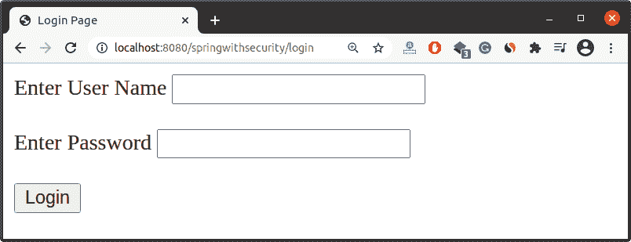
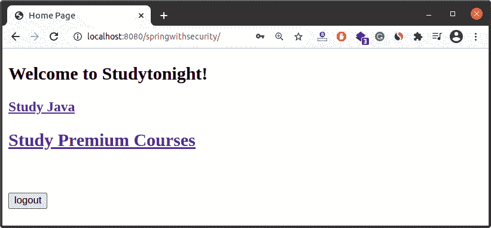
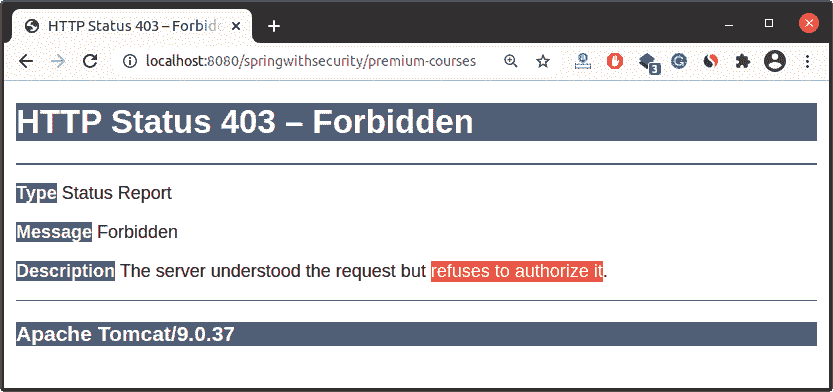

# Spring Security中基于角色的访问控制

> 原文：<https://www.studytonight.com/spring-framework/role-based-access-control-in-spring-security>

在这篇关于 Spring Security 的文章中，我们将学习实现 RBAC(基于角色的访问控制)。RBAC 是一个主要用于企业应用的概念，其中多个用户正在访问资源，但资源受到限制。

假设一个应用包含几个模块，包括一个管理模块和一个用户模块，那么开发人员的职责就是只为管理用户提供一个管理模块。除管理员以外的任何用户都将被拒绝访问管理模块。

因此，为了实现它，我们需要指定用户规则和用户在安全配置类中配置用户时可以访问的资源。

Spring 提供`roles()`方法指定用户角色，`hasRole()`方法检查用户是否具有访问资源的角色。

让我们通过一个简单的例子来理解它。

## 举个例子

我们创建了一个基于 maven 的 Spring Security 项目，其中包含以下文件。

//app config . Java

这是我们的应用配置文件，它实现了`WebMvcConfugurer`接口来制作这个 MVC 应用，并创建了一个方法 viewResolver 来映射我们的视图文件(JSP)。

**@EnableWebMvc** 注释用于使我们的应用成为具有 Mvc 模式的 web 应用。

**@Configuration** 注释用于将这个类声明为一个配置类， **@ComponentScan** 注释用于扫描我们应用的组件类。

```java
package com.studytonight;

import org.springframework.context.annotation.Bean;
import org.springframework.context.annotation.ComponentScan;
import org.springframework.context.annotation.Configuration;
import org.springframework.web.servlet.ViewResolver;
import org.springframework.web.servlet.config.annotation.EnableWebMvc;
import org.springframework.web.servlet.config.annotation.WebMvcConfigurer;
import org.springframework.web.servlet.view.InternalResourceViewResolver;

@EnableWebMvc
@Configuration
@ComponentScan("com.studytonight.controller")
public class AppConfig implements WebMvcConfigurer{
	@Bean
	public ViewResolver viewResolver() {
		InternalResourceViewResolver irvr = new InternalResourceViewResolver();
		irvr.setPrefix("WEB-INF/views/");
		irvr.setSuffix(".jsp");
		irvr.setOrder(0);
		return irvr;
	}
}
```

//main app . Java

这个类初始化我们的网络应用，并通过注册我们的 **AppConfig** 类来创建`ServletContext`(上图文件)。

```java
package com.studytonight;

import javax.servlet.ServletContext;
import javax.servlet.ServletException;
import javax.servlet.ServletRegistration;
import org.springframework.web.WebApplicationInitializer;
import org.springframework.web.context.support.AnnotationConfigWebApplicationContext;
import org.springframework.web.servlet.DispatcherServlet;
public class MainApp implements WebApplicationInitializer {

	@Override
	public void onStartup(ServletContext servletContext) throws ServletException {
		System.out.println("started");
		AnnotationConfigWebApplicationContext context = new AnnotationConfigWebApplicationContext();
		context.register(AppConfig.class);
		context.setServletContext(servletContext);
		ServletRegistration.Dynamic servlet = servletContext.addServlet("dispatcher", new DispatcherServlet(context));
		servlet.setLoadOnStartup(1);
		servlet.addMapping("/");
		context.close();	
	}
}
```

**//securityappnitizer . Java**

这是扩展`AbstractSecurityWebApplicationInitializer`的安全初始化器类，我们传递了`SecurityConfig`类，这样它就可以读取安全配置。

```java
package com.studytonight;

import org.springframework.security.web.context.AbstractSecurityWebApplicationInitializer;
public class SecurityAppInitializer  extends AbstractSecurityWebApplicationInitializer {

	public SecurityAppInitializer() {
		super(SecurityConfig.class);
	}
}
```

**// SecurityConfig.java**

这是我们的安全配置文件，扩展了`WebSecurityConfigurerAdapter`类，提供了`configure()`等几种方法来配置安全性。Spring Security 提供了作为认证管理器的`AuthenticationManagerBuilder`类，并提供了几种方法来验证用户。这里，我们使用`inMemoryAuthentication`概念，它允许映射硬编码的用户值。

借助 roles()方法，我们使用`AuthenticationManagerBuilder`类来设置用户角色，通过使用`HttpSecurity`类，我们指定了资源及其可访问性，因此只有授权用户才能访问资源。

```java
package com.studytonight;

import org.springframework.beans.factory.annotation.Autowired;
import org.springframework.context.annotation.Configuration;
import org.springframework.security.config.annotation.authentication.builders.AuthenticationManagerBuilder;
import org.springframework.security.config.annotation.web.builders.HttpSecurity;
import org.springframework.security.config.annotation.web.configuration.EnableWebSecurity;
import org.springframework.security.config.annotation.web.configuration.WebSecurityConfigurerAdapter;
import org.springframework.security.core.userdetails.User;
import org.springframework.security.core.userdetails.User.UserBuilder;

@Configuration
@EnableWebSecurity	
public class SecurityConfig extends WebSecurityConfigurerAdapter{

	@Override
	protected void configure(AuthenticationManagerBuilder auth) throws Exception {

		UserBuilder users = User.withDefaultPasswordEncoder();		
		auth.inMemoryAuthentication()
		.withUser(users.username("studytonight").password("abc123").roles("GUEST"))
		.withUser(users.username("pro-studytonight").password("abc123").roles("REGISTERED"));
	}

	@Autowired
	protected void configure(HttpSecurity hs) throws Exception {
		hs.authorizeRequests()
		.antMatchers("/").hasAnyRole("GUEST","REGISTERED")
		.antMatchers("/java-course").hasRole("GUEST")
		.antMatchers("/premium-courses").hasRole("REGISTERED")
		.and()
		.formLogin()
		.loginPage("/login")
		.loginProcessingUrl("/authenticateTheUser")
		.permitAll()
		.and()
		.logout()
		.permitAll();
	}
}
```

//user controller . Java

这是我们的控制器类，它作为用户请求处理程序工作，将用户请求与资源进行映射，并相应地返回响应。我们创建了 login()方法来呈现登录页面，home()方法来显示**index.jsp**页面，当然()方法来显示**course.jsp**页面。

```java
package com.studytonight.controller;

import org.springframework.stereotype.Controller;
import org.springframework.web.bind.annotation.GetMapping;

@Controller
public class UserController {

	@GetMapping("/login")
	public String login() {
		return "login";
	}

	@GetMapping("/")  
	public String home() {
		return "index";
	}

	@GetMapping("/java-course")
	public String course() {
		return "course";
	}

	@GetMapping("/premium-courses")
	public String premiumCourse() {
		return "premium-courses";
	}
}
```

### 查看文件

这些是显示在浏览器中的项目视图文件。查看代码。

**//course.jsp**

```java
<%@ page language="java" contentType="text/html; charset=UTF-8"
	pageEncoding="UTF-8"%>
<!DOCTYPE html>
<html>
<head>
<meta charset="UTF-8">
<title>Course Page</title>
</head>
<body>
	<h2>List of Courses</h2>
	<ul>
		<li>Java</li>
		<li>Python</li>
		<li>C++</li>
		<li>Linux</li>
	</ul>
</body>
</html>
```

**//index.jsp**

```java
<%@ page language="java" contentType="text/html; charset=UTF-8"
	pageEncoding="UTF-8"%>
	<%@ taglib prefix="form" uri="http://www.springframework.org/tags/form"%>
	<%@ taglib prefix="security" uri="http://www.springframework.org/security/tags"%>
<!DOCTYPE html>
<html>
<head>
<meta charset="UTF-8">
<title>Home Page</title>
</head>
<body>
	<h2>Welcome to Studytonight!</h2>
	<h3>
		<a href="java-course">Study Java</a>
	</h3>
	<h2>
		<a href="premium-courses">Study Premium Courses</a>
	</h2>
	<br><br>
	<form:form
		action="${pageContext.request.contextPath}/logout"
		method="post">
		<input type="submit" value="logout">
	</form:form>
</body>
</html>
```

**//login.jsp**

```java
<%@ page language="java" contentType="text/html; charset=UTF-8"
	pageEncoding="UTF-8"%>
<%@ taglib prefix="form" uri="http://www.springframework.org/tags/form"%>
<%@ taglib uri="http://java.sun.com/jsp/jstl/core" prefix="c"%>

<!DOCTYPE html>
<html>
<head>
<meta charset="UTF-8">
<title>Login Page</title>
</head>
<body>
	<form:form
		action="${pageContext.request.contextPath}/authenticateTheUser"
		method="post">
		<c:if test="${param.error!=null}">
			<p style="color: red">You entered wrong credentials!</p>

		</c:if>
		<c:if test="${param.logout!=null}">
			<p style="color: green">You have successfully logged out.!</p>
		</c:if>
		<label for="name">Enter User Name</label>
		<input type="text" name="username">
		<br>
		<br>
		<label for="password">Enter Password</label>
		<input type="password" name="password">
		<br>
		<br>
		<input type="submit" value="Login">
	</form:form>
</body>
</html>
```

**//premium-course.jsp**

```java
<%@ page language="java" contentType="text/html; charset=UTF-8"
	pageEncoding="UTF-8"%>
<!DOCTYPE html>
<html>
<head>
<meta charset="UTF-8">
<title>Course Page</title>
</head>
<body>
	<h2>List of Premium Courses</h2>
	<ul>
		<li>Spring Framework</li>
		<li>Pandas</li>
		<li>Spring Security</li>
	</ul>
</body>
</html>
```

//POM . XML

这个文件包含这个项目的所有依赖项，比如 spring jars、servlet jars 等。将这些依赖项放入项目中以运行应用。

```java
<project 
	xmlns:xsi="http://www.w3.org/2001/XMLSchema-instance"
	xsi:schemaLocation="http://maven.apache.org/POM/4.0.0 https://maven.apache.org/xsd/maven-4.0.0.xsd">
	<modelVersion>4.0.0</modelVersion>
	<groupId>com.studytonight</groupId>
	<artifactId>springwithsecurity</artifactId>
	<version>0.0.1-SNAPSHOT</version>
	<packaging>war</packaging>
	<properties>
		<spring.version>5.2.8.RELEASE</spring.version>
	</properties>
	<dependencies>
		<dependency>
			<groupId>org.springframework</groupId>
			<artifactId>spring-core</artifactId>
			<version>${spring.version}</version>
		</dependency>
		<dependency>
			<groupId>org.springframework</groupId>
			<artifactId>spring-context</artifactId>
			<version>${spring.version}</version>
		</dependency>
		<dependency>
			<groupId>org.springframework</groupId>
			<artifactId>spring-webmvc</artifactId>
			<version>${spring.version}</version>
		</dependency>
		<!-- https://mvnrepository.com/artifact/javax.servlet/servlet-api -->
		<!-- https://mvnrepository.com/artifact/javax.servlet/javax.servlet-api -->
		<dependency>
			<groupId>javax.servlet</groupId>
			<artifactId>javax.servlet-api</artifactId>
			<version>4.0.1</version>
		</dependency>
		<!-- https://mvnrepository.com/artifact/jstl/jstl -->
		<dependency>
			<groupId>jstl</groupId>
			<artifactId>jstl</artifactId>
			<version>1.2</version>
		</dependency>

		<!-- https://mvnrepository.com/artifact/javax.servlet.jsp/javax.servlet.jsp-api -->
		<dependency>
			<groupId>javax.servlet.jsp</groupId>
			<artifactId>javax.servlet.jsp-api</artifactId>
			<version>2.3.3</version>
		</dependency>
		<!-- https://mvnrepository.com/artifact/javax.servlet.jsp.jstl/jstl-api -->
		<dependency>
			<groupId>javax.servlet.jsp.jstl</groupId>
			<artifactId>jstl-api</artifactId>
			<version>1.2</version>
		</dependency>

		<!-- https://mvnrepository.com/artifact/javax.xml.bind/jaxb-api -->
		<dependency>
			<groupId>javax.xml.bind</groupId>
			<artifactId>jaxb-api</artifactId>
			<version>2.3.0</version>
		</dependency>
		<!-- https://mvnrepository.com/artifact/org.springframework.security/spring-security-web -->
		<dependency>
			<groupId>org.springframework.security</groupId>
			<artifactId>spring-security-web</artifactId>
			<version>5.4.2</version>
		</dependency>
		<!-- https://mvnrepository.com/artifact/org.springframework.security/spring-security-config -->
		<dependency>
			<groupId>org.springframework.security</groupId>
			<artifactId>spring-security-config</artifactId>
			<version>5.4.2</version>
		</dependency>
		<!-- https://mvnrepository.com/artifact/org.springframework.security/spring-security-taglibs -->
		<dependency>
			<groupId>org.springframework.security</groupId>
			<artifactId>spring-security-taglibs</artifactId>
			<version>5.4.1</version>
		</dependency>
	</dependencies>
	<build>
		<plugins>
			<plugin>
				<artifactId>maven-war-plugin</artifactId>
				<version>3.2.3</version>
				<configuration>
					<warSourceDirectory>WebContent</warSourceDirectory>
				</configuration>
			</plugin>
			<plugin>
				<groupId>org.apache.maven.plugins</groupId>
				<artifactId>maven-compiler-plugin</artifactId>
				<version>3.5.1</version>
				<configuration>
					<source>11</source>
					<target>11</target>
				</configuration>
			</plugin>
		</plugins>
	</build>
</project>
```

### 项目结构

创建这些文件后，我们的项目将如下所示。你可以参考这个来了解项目的目录结构。


### 运行应用

成功完成项目并添加依赖项后，运行应用，您将获得如下输出。

这是我们自己的登录页面，将提交至**/authenticatheuser**URL，并将用户名和密码与**SecurityConfig.java**文件中提供的凭据进行匹配。



### 提供正确的用户名和密码


### 主页

现在，我们已成功登录到应用。这是我们的**index.jsp**文件渲染为浏览器的主页。



由于用户是客人，并且具有客人用户的角色，因此可以访问非高级课程。


由于用户是客人，并且具有客人用户的角色，因此只能访问第一个课程链接。如果用户点击高级课程，就会出现一个被禁止的错误，这意味着他无权访问这些资源。



您也可以尝试用另一个用户登录，看看您是否能够看到 java 课程列表。

* * *

* * *