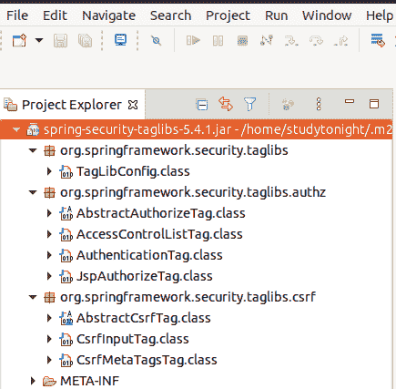

# Spring Security 标签库

> 原文：<https://www.studytonight.com/spring-framework/spring-security-tag-library>

在本文中，我们将讨论内置标签库。Spring Security 提供了一个内置的标签库，其中包含几个用于管理 JSP 页面内容的标签，并有助于访问安全信息和在 JSP 页面上应用安全约束。例如，如果我们想向普通用户显示 JSP 的一部分，向管理员用户显示其他部分，那么这个库会有更大的帮助。

要将这个库添加到我们的项目中，我们需要遵循以下步骤

*   添加依赖项

*   声明标签库

*   使用标签

### 添加依赖项

我们应该将这些依赖项添加到 spring 安全项目的 **pom.xml** 文件中。这是一个 maven 项目，你也可以从[官方 maven 网站](https://mvnrepository.com/artifact/org.springframework.security/spring-security-taglibs)获得最新消息。

```java
<dependency>
    <groupId>org.springframework.security</groupId>
    <artifactId>spring-security-taglibs</artifactId>
    <version>5.4.1</version>
</dependency> 
```

### 声明标记库

添加了上面的依赖项后，我们必须将它包含在 JSP 页面的顶部。它将提供该页面上的所有标签。它类似于 Java 中的 import 语句，可以访问导入包的所有类。

```java
<%@ taglib prefix="security" uri="http://www.springframework.org/security/tags" %>
```

### 验证项目中是否存在依赖关系

在 **pom.xml** 文件中添加依赖项后，首先更新您的项目，然后您可以验证所有标签库 JARs 在**库- > maven** 文件夹中可用。



### 在 JSP 页面中使用标签

在 JSP 页面的顶部声明标记库之后，我们可以使用它的标记。它提供了几个标签，例如

*   授权标签

*   认证标签

*   Accesscontrollist 标记

*   输入标签

*   标签

### 授权标签

Spring 使用这个标签来检查是否应该根据用户授权显示内容。例如，管理员用户只能看到包含在具有管理员角色的授权标签中的内容。非管理员用户将看不到此内容部分。它使用各种属性，例如:

**授权标签属性**

| **属性名称** | **描述** |
| 全球资源定位器(Uniform Resource Locator) | 它用于指定在用户被授予访问此 URL 的权限时呈现给用户的 URL。 |
| 方法 | 它用于指定获取或发布的 HTTP 方法 |
| 定义变量 | 它用于声明页面范围变量。 |
| 接近 | 它用于设置访问权限 |

### **授权标签示例**

我们可以像在这里一样，在 JSP 页面的任何地方使用这个标签。

```java
<security:authorize access="hasRole('admin')">
    <p>This content section is visible only for ADMIN</p>
</sec:authorize>
```

### 认证标签

我们可以使用这个标签来访问存储在安全上下文中的当前认证对象。它有助于获取 JSP 文件中对象的属性。例如，如果我们有一个学生对象，并想得到它的属性，如用户名，那么我们使用它作为

```java
<security:authentication property="principal.username" />
```

它将呈现当前学生的用户名。

### 访问控制列表标签

此标记用于检查以逗号分隔的所需权限列表。如果用户拥有此标签中列出的所有这些权限，则标签主体将被评估，否则将跳过执行。只有当 **Spring Security 的 ACL** ( **A** 访问 **C** 控制 **L** ist)模块被激活时，我们才能使用此标签。该标签具有以下属性。

| **属性名称** | **描述** |
| hasPermission | 它用于指定要针对域对象检查的权限列表。 |
| domainObject | 它用于指定要检查权限的对象。 |
| 定义变量 | 它用于声明页面范围变量。 |

### 男主角

该标签用于插入一个隐藏的表单字段，该字段保存 CSRF 保护令牌。它对浏览器不可见，但包含令牌。虽然如果我们像

<form>一样使用 spring 的表单标签库，那么我们不需要添加这个，如果我们使用普通的 HTML 表单，那么我们需要把这个放到我们的表单中。</form>

如果启用了 CSRF 保护，则该标记会插入令牌，否则该标记不会执行任何操作。

### 输入标签示例

```java
<form action="${pageContext.request.contextPath}/authenticateTheUser" method="post">
    <sec:csrfInput />
    <input type="text" name="username" />
    ...
</form>
```

### csrfmetatags 标记

如果启用了 CSRF 保护，此标签将插入包含 CSRF 保护令牌表单字段和标头名称以及 CSRF 保护令牌值的元标签。这些元标签对于在应用中使用 JavaScript 中的 CSRF 保护非常有用。

我们应该将这个标签放入 HTML 头部标签中。使用 JavaScript 可以很容易地获得表单字段名、标题名和标记值。请看下面的例子。

### 标签示例

```java
<security:csrfMetaTags />
<script type="text/javascript" language="javascript">
    var csrfParameter = $("meta[name='_csrf_parameter']").attr("content");
    var csrfHeader = $("meta[name='_csrf_header']").attr("content");
    var csrfToken = $("meta[name='_csrf']").attr("content");
</script>
```

比如可以参考我们**已有的文章:** [第 1 条](http://www.studytonight.com/spring-framework/display-data-based-on-rbac)[第 2 条](https://www.studytonight.com/spring-framework/user-information)。

* * *

* * *