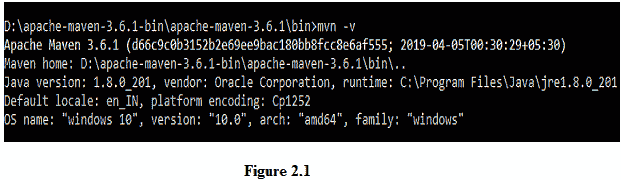
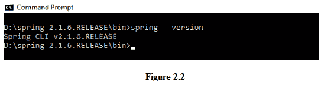
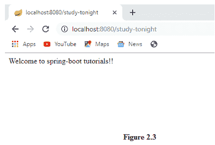
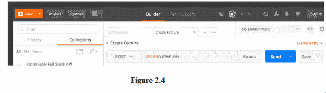

# 安装 Spring Boot 和其他软件

> 原文：<https://www.studytonight.com/spring-boot/installing-spring-boot-and-other-software>

我们将使用 spring-boot 框架开发一个 web 应用，它需要一些软件来开始开发。我们希望您在获得其他软件之前先拥有 [Java 环境设置](https://www.studytonight.com/java/setting-classpath-for-java.php)。它使用依赖管理技术，例如 maven，当与 Eclipse 等集成开发环境一起使用时，这非常容易。

在接下来的教程中，我们将使用 [Java 8](https://www.studytonight.com/java/overview-of-java.php) 、 [Maven(依赖管理)](https://www.studytonight.com/maven/)、Eclipse IDE 作为开发示例。

## Maven 安装:

虽然我们使用 Eclipse IDE 中的 maven，但是当项目作为 JAR 文件导出以从 CMD(命令行提示符)运行时，我们可能需要安装。

1.  下载 Maven ZIP 文件后，将其解压缩到驱动器上的某个文件夹，然后切换到 bin 目录。

2.  点击`mvn -v`命令，切换到 maven 安装文件夹内的 bin 目录后查看版本。

3.  上图分别显示了 maven 和 java 版本。建议将 maven bin 文件夹的环境路径设置为与 java 环境设置相同。

## Spring Boot 国家牵头倡议:

作为生产就绪的基于 spring 的应用的一个快速示例，让我们看看 Spring-boot CLI(命令行界面)。我们需要下载 spring-boot CLI。提取 ZIP 文件后，从命令行切换到 bin 目录，输入命令`spring --version.`



上图显示了 spring-boot CLI 的版本，在切换到 spring-boot CLI 的 bin 目录后一定要检查版本。现在，让我们在 bin 目录中创建一个文件**study now . groovy**。将下面的代码放入 groovy 文件并保存。

```java
@RestController
class StudyTonight
{
  @RequestMapping(value="/study-tonight",method=RequestMethod.GET)
  public String displayWelcomeMessage()
  {
  return "Welcome to spring-boot tutorials!!";
  }
}
```

在 CMD 中，在 bin 目录路径下，运行命令**spring run study south . groovy**，该命令在端口 8080 上的嵌入式 tomcat 上运行应用。

#### 

在上图中，我们收到了 spring-boot 自动配置的嵌入式 tomcat 的响应。需要注意的重要一点是，即使**我们没有在 groovy 文件**中包含任何导入语句，但是 Spring-Boot CLI 已经为我们解决了依赖关系。

## REST 客户端安装:

为了测试 RESTful 网络服务，我们需要一个 REST 客户端，用于发送请求和接收响应。这样的 REST 客户之一是**邮递员**。由于使用它的简单方便的方法，它变得非常重要。

对于 GET 请求，只需在浏览器中输入网址就可以访问应用编程接口。对于 POST 请求，需要使用一些 REST CLIENT，因为不可能通过在浏览器中粘贴 URL 来命中 API。

*   下载并启动邮差后，可以看到类似下图 2.4 的 UI。

### 

**结论:**在本教程中，我们已经看到了使用 spring-boot 进行 web 应用开发所需软件的安装。除了创建 web 应用，我们还将创建简单的控制台应用。在下一个教程中，我们将设置项目并将其导入到 Eclipse IDE 中。

* * *

* * *