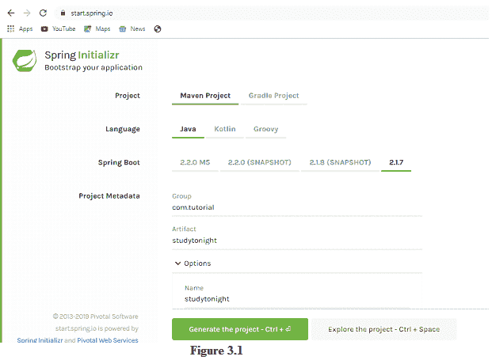
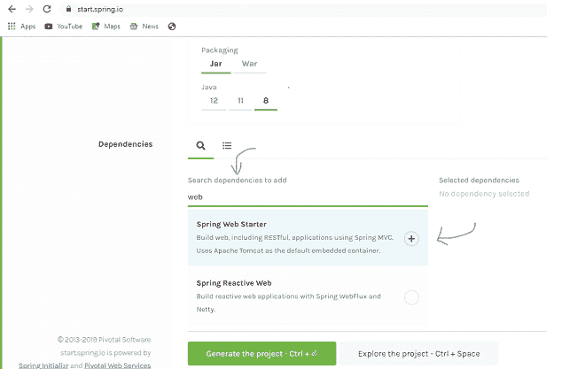
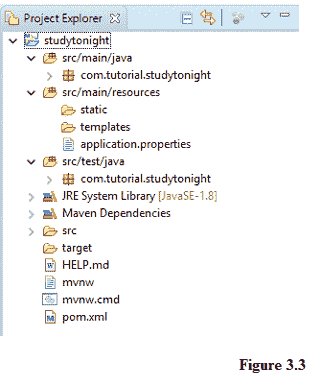
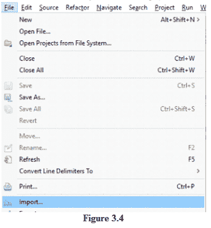
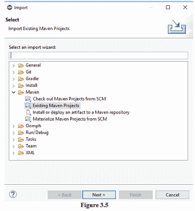
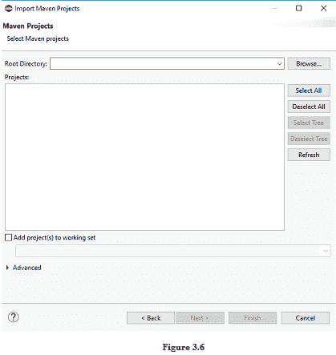
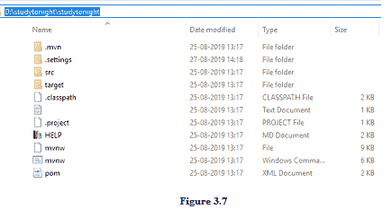

# 使用 Spring Boot 创建网络应用的设置

> 原文：<https://www.studytonight.com/spring-boot/setup-for-creating-a-web-application-with-spring-boot>

我们已经看到了 spring-boot 的重要性以及它在开发中提供的灵活配置。在本教程中，我们将使用**Spring 初始化器**设置项目(它为我们生成项目设置)。

## 使用 Spring 初始化工具

它有助于快速设置可以轻松引导(快速运行)的 spring-boot 应用。这里可以找到这个: [start.spring.io](https://start.spring.io/)

上面的快照是 PIVOTAL 团队托管的 spring initializer 的典型布局。生成我们选择的项目，需要输入**组、神器**等细节(可以在上面的快照中看到)，组合在一起得到包名。编写本教程时的当前版本是 **2.1.7** (2.1.7 仍然是最稳定的版本，但您也可以选择 **2.2.5** 或以上版本)。对于我们的 web 应用，我们选择了依赖管理工具作为 **MAVEN** ，语言作为 **Java** 。

我们需要从依赖项部分选择项目所需的依赖项，如上图所示。我们可以从显示给我们的搜索建议中进行选择。对于这个项目，我们选择了以下依赖项列表。

1.  Spring 网起动器

2.  spring-data-jpa

3.  春海棠(消歧义)

4.  h2 数据库(内存数据库)

当进一步需要时，我们可以添加更多的依赖项。选择所有内容后，点击生成项目按钮，下载一个包含项目的 ZIP 文件。

## 导入项目:

ZIP 文件需要解压到某个文件夹，然后我们将它作为一个 maven 项目导入到您的 Eclipse IDE 中。如果您是第一次导入 maven 项目，可能需要一些时间来解决依赖关系。

上图显示了 spring initializer 为我们生成的典型 maven 项目结构。它被解压并作为 Maven 项目导入到 eclipse 中。

在上图中， **src/main/java** 是所有 java 源代码的去向路径。观察我们在 spring initializer 中输入的包名，它是 groupid 和 artifact 的**组合。包 **src/main/resources** 有 **application.properties** 文件和 **src/test/java** 包含我们需要运行单元测试用例的类。**

**pom.xml** 文件是包含依赖脚本的地方，我们在使用 spring initializer 工具创建项目时选择了这个文件。

## 将项目导入 Eclipse 的步骤:

在 eclipse 中点击**文件**选项(左上角)下的导入选项后，我们必须导入，如下所示。请注意图 3.4、3.5、3.6 中的进一步步骤。

**文件= >导入= > Maven = >现有 Maven 项目**

#### 

图 3.7 显示了从 spring initializer 解压 ZIP 文件后，文件系统中的项目。

粘贴需要导入的项目的根目录路径(如上图 **pom.xml** 所在的目录)，继续点击向导上的下一步选项(如图 3.6 所示)。

## Pom.xml:

它负责向项目添加依赖项。例如，如果我们检查 project 下的 maven dependencies 部分，我们可以看到 hibernate 相关的 jar，它们是因为 spring 初始化器中的 **spring-data-jpa** 依赖关系而添加的。

Spring-boot 继承了名为**spring-boot-starter-parent**的父项目的大部分配置，在 spring-boot 中启用了自动配置功能。它还取决于类路径中可用的 JARs。所有项目元数据都可以在 *pom.xml* 文件中找到。

**结论:**在本教程中，我们从 spring initializer 创建了一个 spring-boot maven 项目，并将其导入到 eclipse IDE 中。我们还讨论了项目组件和依赖关系管理。

* * *

* * *