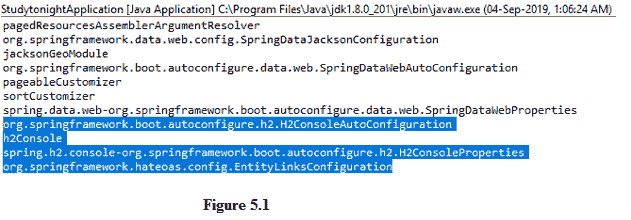
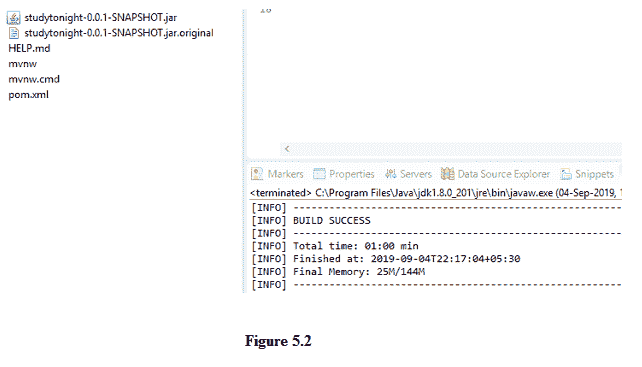
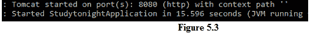
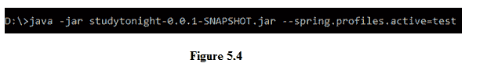
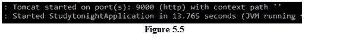
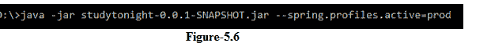
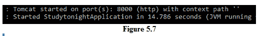
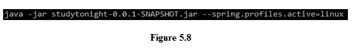
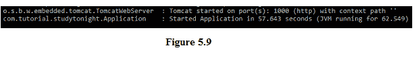

# 启动 Spring Boot 应用

> 原文：<https://www.studytonight.com/spring-boot/launching-spring-boot-application>

在本教程中，我们将讨论可用的 spring boot 注释以及如何启动 spring boot 应用。常见 Spring 靴注释:

*   **@回弹应用**:是应用启动的入口点，通常在类中用 main 方法注解。

*   **@ components scan**:扫描所有可用的`@Component`或其专业(`@Service`、`@Repository`等。)在包和子包中。

*   **@EnableAutoConfiguration** :它通过扫描类路径中可用的 JARs 来启用自动配置。

*   **@配置**:将类中可用的 beans 注册到 Spring 应用上下文中。

**Spring ApplicationContext** 负责管理应用中创建的所有 beans。在下面的例子中，我们将显示应用中注册的所有 beans。

以上三个注解都可以用`@SpringBootApplication`代替。

**SpringApplication** 类提供了一个静态方法`run(class <T>,String[])`，返回 ApplicationContext 的引用。它管理所有的 beans，可以显示如下:

```java
package com.tutorial.studytonight;

public class Application {
    static ApplicationContext context;
    public static void main(String a[]) {
        context  =SpringApplication.run(Application.class,a);
        String beans[] = context.getBeanDefinitionNames();
        for(String bean : beans)
            System.out.println(bean);
    }
}
```



在上图中，我们可以观察到创建的 beans 与自动配置相关。上面的截图突出显示了在项目设置过程中选择的与 H2、hateoas 依赖项相关的 beans。

## 从项目生成版本:

让我们从文件系统运行 JAR 文件。JAR 文件将被放在目标文件夹下，它需要被复制到您系统上的某个文件夹中。让我们为测试和生产环境创建两个概要文件。

1.创建一个名为**application-test . properties**的文件，并将下面的属性放置并保存该文件。

```java
server.port=9000
```

2.创建另一个名为**应用-产品属性**的文件，并将下面的属性放置并保存该文件。

```java
server.port=8000
```

我们可以在启动应用时选择所需的属性。在此之前，让我们了解一下马文。要获得项目的构建(以 JAR 或 WAR 格式)，我们需要运行命令`mvn install`，然而在 IDE 中我们有一个选项。以上两个文件都是在 **src/main/resources** 下创建的。

3。然后右击项目，点击**运行为**，然后点击 Maven 安装。



在上图中，我们看到构建成功，并且生成了 JAR 文件。它位于项目的目标文件夹下。

## 
运行构建并选择配置:

我们将遵循一些步骤来运行上面从文件系统生成的 JAR，它们是:

**1。**将上面生成的 JAR 从目标文件夹复制到任意文件夹，并在该文件夹中打开`CMD`。

**2。**在 CMD `java -jar studytonight-0.0.1-SNAPSHOT.jar`中运行以下命令



上图显示应用已启动，默认情况下，使用**应用.属性**。

**3。**我们还有两个配置文件，分别是测试和生产环境。为了选择特定的配置文件，我们需要提供将要应用的程序参数。记住班级**Spring 应用**中的静态方法`run(class<T>, String [])`。

```java
SpringApplication.run(Class<T>,String[])
```

**4。**其中一个参数是`String[]`，不过是主方法的程序参数。主方法中的 String[]参数可以访问程序参数。

```java
public static void main(String[] args)
```

**5。**应该将相同的引用传递给 SpringApplication 中的静态运行方法，因此，这就是在应用启动时如何使用程序参数来选择配置。

**6。** Spring 提供了一个命令 spring.profiles.active，作为程序参数传递。



**7。**上面的命令是用 **spring.profiles.active** 运行的，在这里选择了测试环境配置文件配置，并且为服务器运行设置的属性是 9000，如下图所示



**8。**同样，运行以下命令来应用生产环境属性





## Uing Application.yml 文件:

代替属性文件，我们也可以使用 **YML 文件**来指定属性。例如，在 **src/main/resources** 下创建一个文件 **application.yml** ，并添加以下属性，因为它在文件中具有相同的缩进。

```java
spring:
profiles:
active : test
server:
port : 2000
---
spring:
profiles:
active : linux
server:
port : 1000
```

现在，在构建另一个构建后运行 JAR 时指定 Linux 配置文件。



上面的命令在端口 1000 上运行应用，如 application.yml 中所述。



**结论:**在本教程中，我们已经看到了重要的 spring-boot 注释、application.properties 的概要文件选择、application.yml 的用法以及从 CMD 启动的应用。重要的一点是，我们没有像不同配置文件的 application.properties 那样为 application.yml 使用多个文件。

* * *

* * *