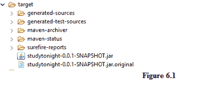
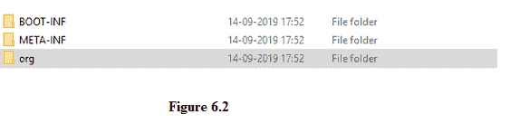

# Spring Boot·优步(胖)罐

> 原文：<https://www.studytonight.com/spring-boot/spring-boot-uber-fat-jar>

在本教程中，我们将讨论Spring靴项目的**优步 JAR** 创建。优步 JAR 是一个 JAR，其中所有应用的编译代码和依赖项被组合在一起，这样，如果程序员需要将它部署到某个地方，他可能会发现很容易，因为依赖项是和 JAR 一起出现的。**优步罐**就是**也叫**就是**肥罐**。让我们研究一下生成优步 JAR 的技术。

## 为我们的项目创建优步 JAR:

为 spring boot 项目生成一个优步 JAR 非常简单，因为你所要做的就是为 maven 添加一个插件。默认情况下，spring-boot 的最新版本已经包含了这个插件，但是如果在 **pom.xml** 下找不到它，那么复制下面的脚本并将其包含在您的 *pom.xml* 文件中。

```java
<project>
    <!-- This is used to define a comment in XML file -->
    <!--  Other maven script like dependencies section -->
    <build>
        <plugins>
            <plugin>
                <groupId>org.springframework.boot</groupId>
                <artifactId>spring-boot-maven-plugin</artifactId>
            </plugin>
        </plugins>
    </build>
</project>
```

令我们惊讶的是，我们已经自动生成了优步罐子(如果插件是默认包含的话)。观察下面的截图。



优步 JAR 是一个 JAR，其中所有的应用代码和依赖项(依赖的 JAR 文件)被组合在一起。作为一个更实用的视图，我们在我们的文件系统上使用 **WinRAR** 等软件提取了 JAR 文件，请看下面的截图。



上图有一个文件夹 **org** ，这里所有 spring 框架相关的依赖都是可用的，上图是优步 JAR 的提取。在优步罐子里，在**元信息**文件夹里，我们有**清单。MF** 文件保存项目的基本元信息， **BOOT-INF** 文件夹保存带有`@SpringBootApplication`注释的类的信息，该注释是执行开始的类。

**结论:**在本教程中，我们已经看到了优步 JAR(又名 Fat JAR)的重要性以及如何在Spring开机时生成它。

* * *

* * *