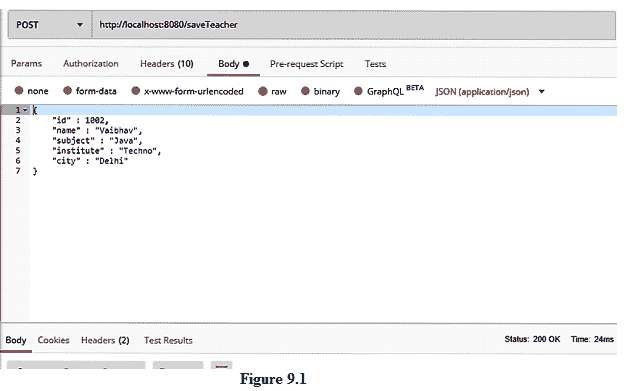
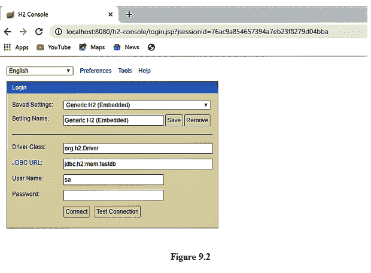
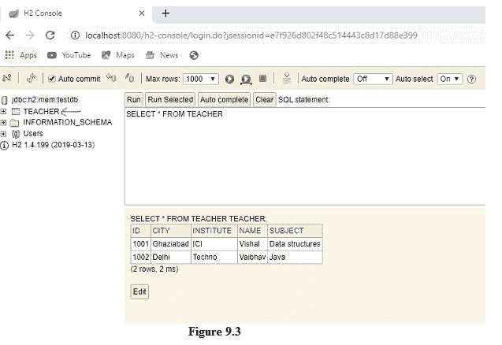

# 具有内存数据库的 Spring Boot 应用

> 原文：<https://www.studytonight.com/spring-boot/spring-boot-application-with-inmemory-database>

在本教程中，我们将学习**内存数据库** (H2)与 spring boot 的用法。在许多情况下，h2 不是使用关系数据库，而是用来测试开发功能，因为它不需要程序员进行配置。

## 使用 H2 数据库开发应用:

*   在项目设置期间选择了 H2 依赖项，它提供了启用内存数据库所需的 JARs。

*   我们在上一个教程中创建了 pojo，作为**com . tutorial . study south . POJO**包下的**Teacher.java**和**Student.java**。

*   我们需要将 pojo 的字段与内存数据库中创建的表的列进行映射。所以用下面的代码修改**Teacher.java**文件。

    ```java
    @Entity
    @Table(name="TEACHER")
    public class Teacher {
        @Id
        @Column(name="ID")
        private int id;
        @Column(name="NAME")
        private String name;
        @Column(name="SUBJECT")
        private String subject;
        @Column(name="INSTITUTE")
        private String institute;
        @Column(name="CITY")
        private String city;

        //Setters and Getters

    }
    ```

*   `@Entity`:这个注释用来将类标记为一个能够参与数据库事务的实体。

*   `@Table`:该注解用于将类与数据库中创建的表进行映射。它有一个名为 name 的属性(可以在上面的代码中看到)，用于命名数据库中的表。

*   `@Id`:该注解用于唯一标识数据库中的记录。它充当主键。在上面的代码字段中，id 标有这个注释，这样每个教师记录都是唯一的。

*   `@Column`:该注解用于将实体中的每个字段映射到数据库的列。

这样，类和字段分别映射到表和列。

## 更新我们的 REST 项目代码:

我们已经在`java.util.HashMap`中创建了端点、服务层、存储库层来保存教师详细信息。

代码在控制器和服务层保持不变，但是我们需要更改存储库细节，将值存储在数据库中，而不是哈希表中。观察不同层的代码。

```java
@RestController
public class ResourceController {

    @Autowired
    ResourceService resourceService;

    @PostMapping("/saveTeacher")
    public void saveTeacher(@RequestBody Teacher teacher){
        resourceService.saveTeacher(teacher);
    }
}

@Service
public class ResourceService {

    @Autowired
    ResourceRepository repository;

    public void saveTeacher(Teacher teacher){
        repository.saveTeacher(teacher);
    }
}

@Repository
public class ResourceRepository {

    @PersistenceContext
    EntityManager entityManager;

    @Transactional
    public void saveTeacher(Teacher teacher){
        entityManager.persist(teacher);
    }
}
```

在存储库层，我们使用`EntityManager`来帮助管理实体，该方法用`javax.persistence.Transactional`进行注释，并帮助管理数据库事务，同时将教师对象保存在内存数据库中。

### 用 POSTMAN 测试:

**1。**运行应用并发送`POST`请求将实体保存在数据库中。



**2。**上图显示客户端发送的`POST`请求，将详细信息保存在数据库中。收到的响应代码是`200 OK`，可以在右下角看到。

**3。**为了启用**H2-控制台**，我们需要**应用中的以下属性。**

```java
spring.h2.console.enabled=true
```

**4。**我们再次请求将实体保存在数据库中，h2-console 浏览到网址*本地主机:8080/h2-console* ，该网址将重定向到类似于下面截图的 JSP 页面。



**5。**默认情况下，以上字段会填写用户名、URL，我们只需要点击连接即可，无需输入任何字段。它将重定向到类似下图的另一个屏幕。



**6。**请注意，上图中有一个名为教师创建的表，因为该类被映射到名为教师的表(参见**Teacher.java**)。

**7。**上表包含客户端保存的教师实体。

**结论:**在本教程中，我们讨论了 spring boot 应用，它使用内存中的 H2 数据库将数据存储到数据库中，这与 HashMap 不同。需要注意的一点是，内存数据库是一个临时数据库，每次启动服务器时，记录都会被删除。在生产环境中，如果选择了关系数据库管理系统，我们需要提供数据源网址、用户名和密码等详细信息。

* * *

* * *