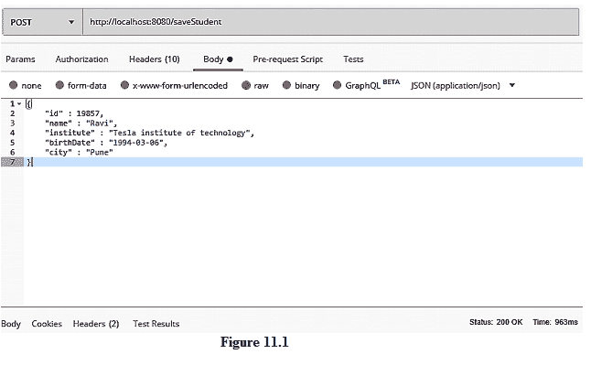
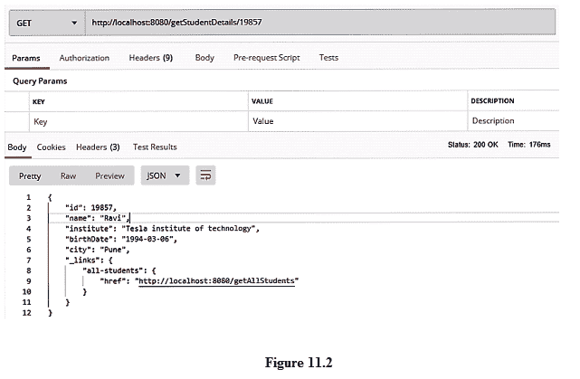

# 春船海神

> 原文：<https://www.studytonight.com/spring-boot/spring-boot-hateoas>

在本教程中，我们将讨论 Spring boot HATEOAS(从这里 了解 **[HATEOAS)，它代表**超媒体作为应用状态**的引擎。每当我们访问一个 web 应用程序时，我们也会发现一些超链接，允许我们进行多种活动。比如在任何一个网银网站的首页，我们都可以找到*查看交易*、*查看余额*、*进行交易*、*添加收款人*等多个选项。所有这些超链接提供了多种信息。让我们在本教程中实现一个 HATEOAS 技术。](https://www.studytonight.com/rest-web-service/hateoas)**

## 创建符合 Spring Boot HATEOS 的休息应用编程接口

我们正在开发一个允许我们保存与学生相关的细节的应用编程接口。

在前面的例子中，我们在包**中创建了名为**Teacher.java**、**Student.java**的 pojo。**

我们将在`java.util.Map`中保存学生的详细信息，并将从另一个 GET 端点获取学生的详细信息。

当用户请求任何学生数据时，我们将提供所请求的数据以及所有学生的链接，作为附加信息的一部分。

将下面的代码添加到我们之前创建的**ResourceController.java**中。为了强调这个例子，有目的地删除了前面的代码。

```java
@RestController
public class ResourceController {

    @PostMapping("/saveStudent")
    public void saveStudent(@RequestBody Student student){
        resourceService.saveStudent(student);
    }

    @GetMapping("/getAllStudents")
    public Map<Integer,Student> allStudents(){
        return resourceService.allStudents();
    }

    @GetMapping("/getStudentDetails/{id}")
    public Resource<Student> getStudentDetails(@PathVariable("id") int id){
        Student student=resourceService.getStudentDetails(id);
        ControllerLinkBuilder link=linkTo(methodOn(this.getClass()).allStudents());
        Resource<Student> resource=new Resource<Student>(student);
        resource.add(link.withRel("all-students"));
        return resource;
    }
}
```

上述资源控制器类中定义的端点用于保存学生数据，并从地图中检索学生的详细信息。

Spring HATEOS 提供了像 **ControllerLinkBuilder** 这样的类，帮助我们在使用 spring boot 开发 REST 服务时启用 HATEOAS 原则。

我们需要使用`import static`语句导入 ControllerLinkBuilder 类的静态方法。让我们举一个简单的例子来解释我们如何以及何时使用`import static`语句。

```java
package com.airline;

Class Airline{

    public static String airLicense;
    public static String headQuarters;

    public static String getLicense() {
        return airLicense;
    }

    public void getData(){
        //  Statements
    }

}
```

要导入上述**航空公司**等级的静态成员，我们需要使用如下`import static`语句:`import static com.airline.Airline.*;`

在上面指定的端点中，我们有从`ControllerLinkBuilder`开始的方法，如`methodOn`、`linkTo`等，它们是静态的。

`methodOn(Class<T>)`返回`class<T>`引用，该引用作为参数传递，然后传递给`linkTo(Class<T>)`方法，该方法返回`ControllerLinkBuilder`的引用。

**资源**是另一个类，用于添加`ControllerLinkBuilder`返回的链接，并为链接提供自定义名称，我们使用来自`ControllerLinkBuilder`类的方法`withRel(String name)`。

**资源**是包含请求的单个学生详细信息以及与所有学生相关的 HATEOAS 链接的实例。

我们还需要在服务层和存储库层进行更改。将下面的代码添加到我们之前创建的**ResourceService.java**中。

```java
public class ResourceService {

    public void saveStudent(Student student){
        repository.saveStudent(student);
    }

    public Map<Integer,Student> allStudents(){
        return repository.allStudents();
    }

    public Student getStudentDetails(int id){
        return repository.getStudentDetails(id);
    }
}
```

将下面的代码添加到我们之前创建的**ResourceRepository.java**中。

```java
@Repository
public class ResourceRepository {              

    public void saveStudent(Student student){
        studentMap.put(student.getId(),student);
    }

    public Map<Integer,Student> allStudents(){
        return studentMap;
    }

    public Student getStudentDetails(int id){
        return studentMap.get(id);
    }
}
```

## 测试应用编程接口

让我们保存学生的详细信息，如下图所示。



**开机自检**请求成功，右下角可以看到 200 OK 状态。

我们可以再创建一个 POST 请求来存储详细信息，这样我们就可以查看多个学生数据。

现在让我们获取一个单独的学生信息，该信息还返回所有可用学生的 **HATEOAS 链接**。



**结论:**在本教程中，我们已经看到了 spring HATEOAS 的重要性，并使用一个示例实现了它。这里需要注意的一点是，spring boot 在 HATEOAS 和 URIs 之间提供了松散的耦合，这些耦合是用端点映射的。这是因为我们不关心 URI 模式是否会改变，因为我们正在从它被映射到的端点捕获 HATEOAS 链接。

* * *

* * *