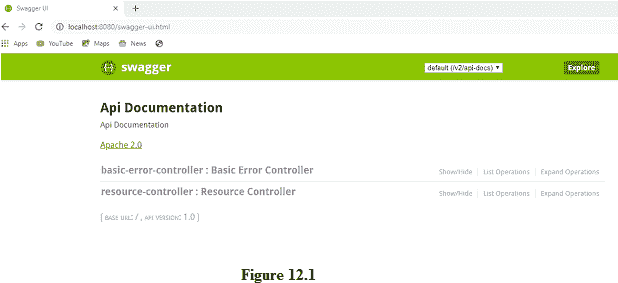
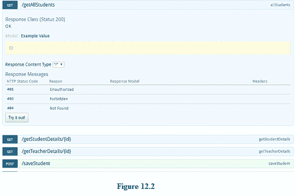
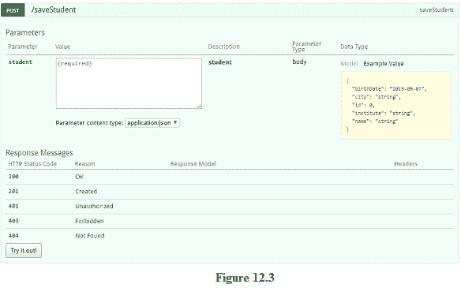

# Spring Boot Swagger 服务

> 原文：<https://www.studytonight.com/spring-boot/spring-boot-swagger-service>

在本教程中，我们将使用Swagger实现已开发的 REST APIs 的服务定义。

## Spring Boot·Swagger-服务定义:

Web 应用为其正常功能定义了许多 API。随着 API 数量的增加，为客户端提供一个通用的服务定义是至关重要的，这样客户端就可以详细了解 API。它提供关于各种端点、参数、请求类型、响应类型等的信息。**swaggle**是由 *SmartBear 软件*开发的**开源软件框架**，最常用于**自动化文档**，RESTful Web Services 的代码生成和测试用例生成。

### Spring Boot·Swagger-实施:

我们需要在我们的 **pom.xml** 文件中添加一些 maven 依赖脚本来开发 swagger 服务定义。将以下 maven 脚本添加到 pom.xml 文件中:

```java
<dependency>
    <groupId>io.springfox</groupId>
    <artifactId>springfox-swagger2</artifactId>
    <version>2.6.1</version>
</dependency>
<dependency>
    <groupId>io.springfox</groupId>
    <artifactId>springfox-swagger-ui</artifactId>
    <version>2.6.1</version>
</dependency>
```

添加上述脚本后，**右键点击项目**选择选项 **Maven = >更新项目**。Swagger 是由显示 web 应用中可用服务的脚本提供的。我们需要添加一些豆子来实现这一点。让我们将下面的代码添加到我们之前创建的**BeansConfiguration.java**中。

```java
@Configuration
@EnableSwagger2
public class BeansConfiguration {

    @Bean
    public Docket docket() {
        Docket docket = new Docket(DocumentationType.SWAGGER_2);
        return docket;
    }
}
```

以上代码启用了项目中的 swag 用法，要查看 spring boot 的 swagger dependecy 提供的 swag UI，请键入 URL `*http://localhost:8080/swagger-ui.html*`，如下图所示:



在上图中请注意提供的两个控制器， **BasicErrorController** 由 spring boot 自动提供，将用于**向客户端显示白标错误等错误信息**。

另一个控制器是**资源控制器**，由我们创建，由几个用于数据访问的 **GET** 和 **POST** 端点组成。点击**swagger-ui.html**页面的上述资源控制器，会显示下图。





上图分别显示了 GET 和 POST 端点的服务定义。对于 post 请求，它还提供了一种测试 API 的方法，如上所示。它还提供了输入请求结构和可能显示的输出响应消息。

**结论:**在本教程中，我们已经看到了 swag 在理解已开发 REST APIs 的各种服务定义中的重要性。

* * *

* * *