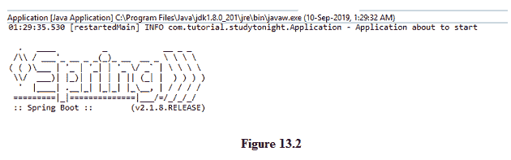
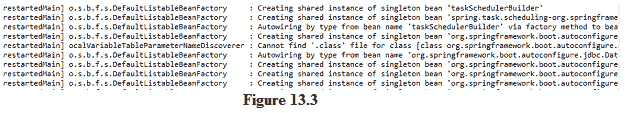

# Spring Boot 伐木公司

> 原文：<https://www.studytonight.com/spring-boot/spring-boot-logging>

在本教程中，我们将讨论 Spring boot 中可用的日志选项。

## Spring Boot 文件记录:

在任何应用程序运行和执行某些操作时，跟踪其正在进行的活动是非常重要的，而最有效的方法是通过日志记录。日志有助于我们更好地理解应用程序中发生的事情。日志还可以帮助我们跟踪应用程序的性能，并帮助我们了解优化的范围。也可以将它们发送到其他专用服务器进行进一步的处理和分析。可以通过在**应用程序中添加简单属性来启用。**

```java
logging.path=D:
```

``

上述属性启用自动创建的名为**弹簧**的 **D 驱动器**的默认文件登录。

## Spring Boot 控制台日志记录:

这样可以登录控制台，并注意下面的代码。我们需要使用由弹簧靴配置的 **slf4j** 来遵循以下程序。

```java
@SpringBootApplication
public class Application {

    public static void main(String a[]){
        // initialise the logger
        Logger logger = LoggerFactory.getLogger(Application.class);
        // use the logger
        logger.info("Application about to start");
        SpringApplication.run(Application.class, a);
    } 
}
```



上图显示了应用程序启动前的控制台日志记录。它显示时间、线程名称和消息。弹簧启动自动配置`org.slf4j.Logger`，可以按照上面的代码使用。

我们也可以在**应用程序中使用属性。例如，如果您想查看内部 springframework 运行的日志，可以通过添加以下属性来实现:**

```java
logging.level.org.springframework=debug

```

上述属性允许在 DEBUG 模式下运行 spring 框架，这意味着我们将能够看到由 spring 完成的实例自动连接和为我们生成的自动配置报告。



上图显示了应用程序启动期间实例的自动连接描述。

我们还可以通过在**应用程序中指定少量属性来更改日志的模式。要更改控制台的日志模式，请使用`logging.pattern.console`属性；要更改文件的日志模式，请使用`logging.pattern.file`属性。**

```java
# Logging pattern for the console
logging.pattern.console=%d{yyyy-MM-dd HH:mm:ss} - %msg%n

# Logging pattern for file
logging.pattern.file=%d{yyyy-MM-dd HH:mm:ss} [%thread] %-5level %logger{36} - %msg%n
```

测井级别可以是`TRACE`、`DEBUG`、`INFO`、`WARN`、`ERROR`、`FATAL`、`OFF`中的一个。最常用的日志记录级别是:

**INFO:** 用于基础信息记录

**DEBUG:** 用于记录有助于应用程序调试的附加信息

**错误:**用于记录错误情况。

**结论:**在本教程中，我们看到了 spring boot 应用程序的日志记录，这一点非常重要，尤其是在生产环境中。

* * *

* * *