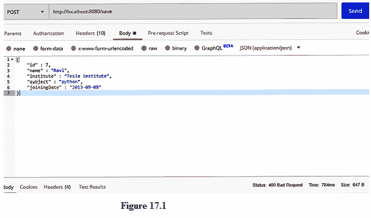
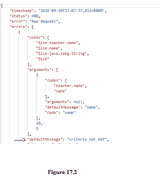
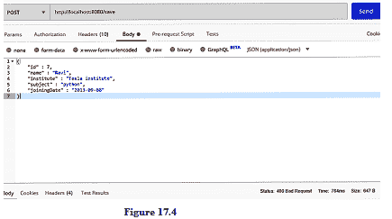
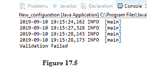

# Spring Boot 验证

> 原文：<https://www.studytonight.com/spring-boot/spring-boot-validations>

在本教程中，我们将讨论Spring启动验证及其实现。验证用于限制字段的值、大小、范围等。大多数验证通常是在前端使用 Javascript 完成的，但是 spring boot 也提供了一种服务器端验证的方式。

## Spring Boot 验证实施:

让我们将之前创建的**网站教程. study now . POJO**中的**Teacher.java**更改如下:

```java
public class Teacher {
    private int id;
    private String name;
    private LocalDate joiningDate;
    private String institute;
    private String subject;

    //Setters and Getters
} 
```

javax.validation 包提供了许多验证注释，使我们能够验证字段。用下面的代码修改**Teacher.java**:

```java
public class Teacher {

    @Size(max=10,min=5,message="criteria not met")
    private String name;

    @Size(min=3)
    private String institute;

    @Max(value=10)
    private int id;

    private String subject;

    @Past
    private LocalDate joiningDate;

    //Setters and Getters
}
```

*   `@Size`注释用于将字段长度限制为指定值。它具有**最大**和**最小**等属性，分别用于设置最大值和最小值。该注释中的**消息**属性用于显示验证失败的默认消息。
*   `@Max`注释用于限制字段的值。在上面的代码中， **id** 字段可以有最大值 10。
*   `@Min`注释用于将字段的值限制为最小值。
*   `@Past`和`@Future`应用于**日期**，以确保数据分别在过去或未来。



在上图中，我们使用 POSTMAN 发送教师详细信息。注意右下角的 **400 不良请求**。当我们将**Teacher.java**类中提到的验证与 postman 中的 JSON 结构进行比较时，字段名应该至少为 5 个字符，因此它导致了 400 个错误请求。



上图表示 400 个坏请求的响应主体。请注意默认消息“*不符合标准”*，这是在验证 Teacher.java 类中的名称字段时设置属性消息时显示的。让我们测试完成所有验证的应用编程接口。


可以看到，上述请求已经成功返回 200 OK 状态。**response entityexceptionhandler**有一个在验证失败时调用的方法。我们在 package**com . tutorial . study south . exception**中创建了一个**customizedexception handler**，它扩展了**response entityexceptionhandler**类。我们需要覆盖**响应异常处理程序**类的方法，如下所示:

```java
@Override
protected ResponseEntity<Object> handleMethodArgumentNotValid(MethodArgumentNotValidException ex,
HttpHeaders headers, HttpStatus status, WebRequest request) {

    System.out.println("Validation failed");
    return super.handleMethodArgumentNotValid(ex,headers, status,request);

}
```

让我们再次测试 API，如下所示。



由于上图中的请求失败，它调用覆盖`handleMethodArgumentNotValid`方法显示控制台消息，如下所示:



**结论:**在本教程中，我们已经看到了在 spring boot 中使用不同注释的验证实现。

* * *

* * *