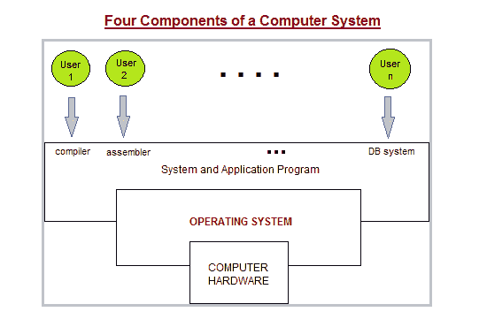

# 操作系统简介

> 原文：<https://www.studytonight.com/operating-system/introduction-operating-systems>

计算机系统有许多资源(硬件和软件)，完成一项任务可能需要这些资源。通常需要的资源是输入/输出设备、内存、文件存储空间、CPU 等。操作系统充当上述资源的管理者，并在需要执行特定任务时将它们分配给特定的程序和用户。因此，操作系统是资源管理器，即它可以在内部管理计算机系统的资源。资源是处理器、内存、文件和输入/输出设备。**简单来说，操作系统就是计算机用户和机器之间的接口。**

对你来说非常重要的是，每台计算机都必须有一个操作系统，以便运行其他程序。操作系统主要协调各种用户的各种系统程序和应用程序之间的硬件使用。

一个**操作系统**的行为类似于**政府**的意思是一个操作系统**自己不执行任何有用的功能**；虽然**它提供了一个环境，其他程序可以在其中做有用的工作。**

下面我们有一个计算机系统组件的抽象视图:

在上图中:

*   **计算机硬件**包含CPU(CPU)、存储器和输入/输出(I/O)设备，并为系统提供基本的计算资源。

*   像电子表格、网络浏览器、文字处理器等应用程序。用于定义这些资源用于解决用户计算问题的方式。系统程序主要由编译器、加载器、编辑器、操作系统等组成。

*   操作系统主要用于控制硬件，并协调不同用户的各种应用程序之间的使用。

*   基本上，计算机系统主要由硬件、软件和数据组成。

操作系统主要设计用于两个基本目的:

1.  操作系统主要控制计算系统资源在各种用户和任务之间的分配和使用。

2.  它主要提供计算机硬件和程序员之间的接口，简化了编码、应用程序的创建和调试，并使之成为可能

## 操作系统的两种观点

1.  用户视图

2.  系统视图

### 操作系统:用户视图

计算机的用户视图是指正在使用的界面。这样的系统是为一个用户独占其资源而设计的，以最大化用户正在执行的工作。在这些情况下，操作系统主要是为了易用性而设计的，有些关注性能，而没有关注资源利用率。

### 操作系统:系统视图

操作系统也可以被视为资源分配器。计算机系统由许多资源组成，如硬件和软件，它们必须得到有效的管理。操作系统充当资源的管理者，在冲突的请求之间做出决定，控制程序的执行，等等。

## 操作系统管理任务

1.  **进程管理**包括将任务按顺序排列，并在任务进入CPU之前将其配对成可管理的大小。

2.  **内存管理**协调进出随机存取存储器的数据，并确定虚拟内存的必要性。

3.  **设备管理**提供连接设备之间的接口。

4.  **存储管理**指导永久数据存储。

5.  **一个允许软件和你的计算机之间进行标准通信的应用程序**。

6.  **用户界面**可以和电脑进行通讯。

## 操作系统的类型

下面给出了不同类型的操作系统:

1.  简单批量系统

2.  多道程序批处理系统

3.  多处理机系统

4.  桌面系统

5.  分布式操作系统

6.  集群系统

7.  实时操作系统

8.  手持系统

## 操作系统的功能

1.  它启动电脑

2.  它执行基本的计算机任务，例如管理各种外围设备，例如鼠标、键盘

3.  它提供用户界面，例如命令行、图形用户界面

4.  它处理系统资源，如计算机内存和各种应用程序或外围设备共享CPU时间。

5.  它提供文件管理，指的是操作系统操作、存储、检索和保存数据的方式。

6.  错误处理由操作系统完成。每当需要避免错误时，它都会采取预防措施。

## 操作系统的优势

下面给出了操作系统的一些优点:

*   操作系统有助于提高工作效率，并通过降低复杂性来节省大量时间。

*   系统的不同组件相互独立，因此一个组件的故障不会影响另一个组件的功能。

*   操作系统主要充当硬件和软件之间的接口。

*   用户无需编写大型程序即可轻松访问硬件。

*   在操作系统的帮助下，与大量用户共享数据变得更加容易。

*   我们可以轻松地在操作系统上安装任何游戏或应用程序，并且可以运行它们

*   一个操作系统可以很容易地随时刷新而没有任何问题。

*   操作系统很容易更新。

*   开源环境中有各种各样的操作系统。例子:Unix/Linux 这些可以很容易地在个人电脑上运行，不需要任何费用，这意味着免费。

*   操作系统主要用于隐藏硬件的复杂性。

*   随着编程变得更加容易，操作系统可以轻松管理计算机。

*   在操作系统的帮助下，多任务处理变得更加容易。

### 操作系统的缺点

下面给出了使用操作系统的缺点:

*   **昂贵**
    有一些开源平台，比如 Linux。但是有些操作系统很贵。此外，用户可以使用免费的操作系统，但一般来说，运行它们比运行其他操作系统有一点困难。另一方面，像微软视窗这样具有图形用户界面功能和其他内置功能的操作系统非常昂贵。

*   **病毒威胁**
    操作系统容易受到病毒攻击，有时会发生许多用户在他们的系统上下载恶意软件包的情况，这会暂停操作系统的运行，并使其变慢。

*   **复杂性**
    有些操作系统本质上是复杂的，因为用来建立它们的语言并不清晰，定义也不明确。如果操作系统出现问题，用户将无法解决该问题。

*   **系统故障**
    操作系统是计算机系统的心脏，如果由于任何原因它将停止运行，那么整个系统将崩溃。

## 操作系统示例

*   Windows 操作系统

*   机器人

*   ios

*   Mac OS 系统

*   Linux 操作系统

*   窗口电话操作系统

*   铬作业系统

* * *

* * *