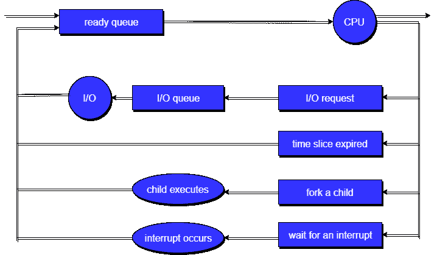
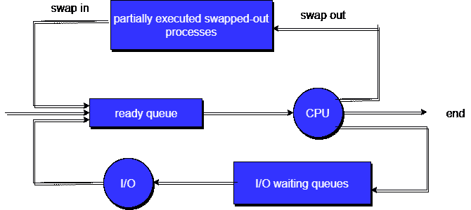
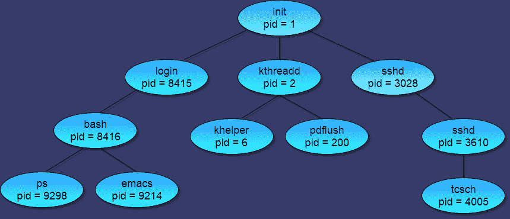

# 什么是进程调度？

> 原文：<https://www.studytonight.com/operating-system/process-scheduling>

确定哪个进程处于**就绪**状态，并且应该移动到**运行**状态的动作称为**进程调度**。

进程调度系统的主要目标是让 CPU 一直忙碌，并为所有程序提供最短的响应时间。为了实现这一点，调度程序必须为交换进程`IN`和`OUT`应用适当的规则。

日程安排分为两大类:

*   **非优先调度:**当前执行进程主动放弃 CPU 时。
*   **抢占式调度:**当操作系统决定偏向另一个进程时，抢占当前正在执行的进程。

* * *

## 什么是调度队列？

*   所有进程进入系统后，都存储在**作业队列**中。
*   处于`Ready`状态的进程被置于**就绪队列**中。
*   等待设备可用的进程被放置在**设备队列**中。每个输入/输出设备都有唯一的设备队列。

一个新的进程最初被放入**就绪队列**。它在就绪队列中等待，直到被选择执行(或调度)。一旦进程被分配给 CPU 并正在执行，就会发生以下几个事件之一:

*   该进程可以发出一个输入/输出请求，然后被放入**输入/输出队列**。
*   该进程可以创建一个新的子进程并等待其终止。
*   作为中断的结果，该进程可以被强制从 CPU 中移除，并被放回就绪队列。



在前两种情况下，进程最终从等待状态切换到就绪状态，然后被放回就绪队列。一个进程继续这个循环，直到它终止，此时它从所有队列中被移除，并且它的印刷电路板和资源被解除分配。

* * *

## 调度程序的类型

有三种类型的调度程序可用:

1.  长期调度程序
2.  短期调度程序
3.  中期调度程序

让我们详细讨论所有不同类型的调度器:

### 长期调度程序

长期调度程序运行频率较低。长期调度器决定哪个程序必须进入作业队列。作业处理器从作业队列中选择进程，并将其加载到内存中执行。作业调度器的主要目的是保持良好的多道程序设计程度。多道程序设计的最佳程度意味着进程创建的平均速率等于进程离开执行内存的平均速率。

### 短期调度程序

这也称为 CPU 调度程序，运行非常频繁。该调度器的主要目的是提高 CPU 性能和进程执行速度。

### 中期调度程序

这个调度程序从内存(以及对 CPU 的主动争用)中移除进程，从而降低多道程序设计的程度。在稍后的某个时间，该进程可以被重新引入内存，并且它的执行可以在它停止的地方继续。这个方案叫做**交换**。中期调度程序将进程换出，然后再换入。

交换可能是改善进程组合所必需的，或者因为内存需求的变化过度使用了可用内存，需要释放内存。下图描述了整个进程:



**排队图增加中期调度。**

* * *

## 什么是语境转换？

1.  将 CPU 切换到另一个进程需要**保存**旧进程的状态，**加载**新进程的保存状态。该任务被称为**上下文切换**。
2.  进程的**上下文**在进程的**进程控制块(PCB)** 中表示；它包括 CPU 寄存器的值、进程状态和内存管理信息。当上下文切换发生时，内核将旧进程的上下文保存在其印刷电路板上，并加载计划运行的新进程的保存上下文。
3.  上下文切换时间是**纯开销**，因为**系统在切换**时没有任何有用的工作。它的速度因机器而异，取决于内存速度、必须复制的寄存器数量以及特殊指令的存在(例如加载或存储所有寄存器的单个指令)。典型的速度范围从 1 到 1000 微秒。
4.  上下文切换已经成为这样一个性能**瓶颈**，以至于程序员在任何可能的时候和任何可能的地方都在使用新的结构(线程)来避免它。

* * *

## 工艺操作

下面我们讨论了两个主要操作**进程创建**和**进程终止**。

* * *

### 进程创建

通过适当的系统调用，如分叉或派生，进程可以创建其他进程。创建其他进程的进程称为其他进程的**父进程**，而创建的子进程称为其**子进程**。

每个进程都有一个整数标识符，称为进程标识符或 PID。还为每个进程存储父进程号(PPID)。

在典型的 UNIX 系统上，进程调度器被称为`sched`，并且被赋予 PID 0。它在系统启动时做的第一件事是启动`init`，这给了该进程 PID 1。进一步初始化启动所有系统守护程序和用户登录，并成为所有其他进程的最终父进程。



根据系统实现，子进程可能会与其父进程接收一定数量的共享资源。为了防止失控的子进程消耗某个系统的所有资源，子进程可以或可以不局限于最初分配给父进程的资源子集。

创建子进程后，父进程有两个选项:

*   继续之前，请等待子进程终止。父进程对特定的子进程或任何特定的子进程进行`wait()`系统调用，导致父进程阻塞，直到`wait()`返回。UNIX shells 通常会等待其子进程完成，然后再发出新的提示。
*   与子进程并发运行，无需等待即可继续处理。当 UNIX shell 运行一个进程作为后台任务时，这就是所看到的操作。父进程也可能运行一段时间，然后等待子进程，这可能发生在某种并行处理操作中。

就新进程的地址空间而言，还有两种可能性:

1.  子进程是父进程的副本。
2.  子进程中加载了一个程序。

为了说明这些不同的实现，让我们考虑一下 **UNIX** 操作系统。在 UNIX 中，每个进程由它的**进程标识符**标识，这是一个唯一的整数。一个新的进程由**分叉**系统调用创建。新进程由原始进程地址空间的副本组成。这种机制允许父进程与其子进程轻松通信。两个进程(父进程和子进程)在分叉系统调用后继续在指令上执行，只有一个区别:**对于新(子)进程，分叉系统调用的返回代码为零，而子进程的(非零)进程标识符返回给父进程。**

通常情况下， **execlp 系统调用**在两个进程中的一个进行分叉系统调用后使用，以新程序替换进程内存空间。execlp 系统调用将一个二进制文件加载到内存中，破坏包含 execlp 系统调用的程序的内存映像，并开始其执行。通过这种方式，这两个进程能够相互交流，然后分道扬镳。

下面是一个 **C 程序**来说明使用 UNIX(使用 Ubuntu 制作)分叉一个单独的进程:

```
#include<stdio.h>

void main(int argc, char *argv[])
{
    int pid;

    /* Fork another process */
    pid = fork();

    if(pid < 0)
    {
        //Error occurred
        fprintf(stderr, "Fork Failed");
        exit(-1);
    }
    else if (pid == 0)
    {
        //Child process
        execlp("/bin/ls","ls",NULL);
    }
    else
    {
        //Parent process
        //Parent will wait for the child to complete
        wait(NULL);
        printf("Child complete");
        exit(0);
    }
}
```

> **GATE 数值提示:** *如果 **fork** 被调用`n`次，则创建的子进程或新进程数为:`2<sup>n</sup> – 1`。*

* * *

### 进程终止

通过进行`exit`(系统调用)，通常返回一个 int，进程可以请求自己的终止。如果父进程正在执行`wait()`，这个 int 将被传递给父进程，如果成功完成，这个 int 通常为零，如果出现任何问题，这个 int 将传递给一些非零代码。

系统也可能出于各种原因终止进程，包括:

*   系统无法提供必要的系统资源。
*   响应 KILL 命令或其他未处理的进程中断。
*   如果分配给孩子的任务不再需要，即不再需要孩子，父母可以杀死孩子。
*   如果父进程退出，系统可能允许也可能不允许子进程在没有父进程的情况下继续(在 UNIX 系统中，孤立进程通常由`init`继承，然后由`init`继续杀死它们。)

当一个进程结束时，它的所有系统资源都被释放，打开的文件被刷新和关闭，等等。如果父进程正在等待子进程终止，则进程终止状态和执行时间将返回给父进程，如果进程已经成为孤立进程，则最终返回到 init。

试图终止但由于其父进程没有等待而无法终止的进程被称为**僵尸**。这些最终被 init 作为孤儿继承并杀死。

* * *

* * *