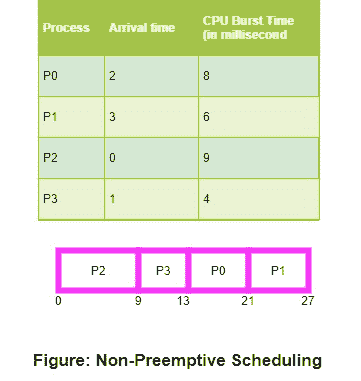
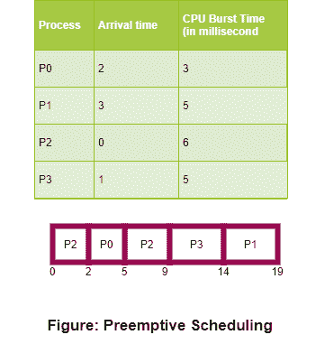

# 操作系统中的 CPU 调度

> 原文：<https://www.studytonight.com/operating-system/cpu-scheduling>

CPU 调度是一个进程，它允许一个进程使用 CPU，而另一个进程的执行由于任何资源(如输入/输出等)不可用而被搁置(处于等待状态)，从而充分利用 CPU。CPU 调度的目的是使系统高效、快速、公平。

每当 CPU 空闲时，操作系统必须选择**就绪队列**中的一个进程来执行。选择进程由短期调度程序(或 CPU 调度程序)执行。调度程序从内存中准备执行的进程中进行选择，并将 CPU 分配给其中一个进程。

## CPU 调度:调度程序

CPU 调度功能涉及的另一个组件是**调度器**。调度程序是一个模块，它将 CPU 的控制权交给由**短期调度程序**选择的进程。该功能包括:

*   切换上下文
*   切换到用户模式
*   跳到用户程序中的适当位置，从上次离开的地方重新启动该程序。

调度程序应该尽可能快，因为它在每个进程切换期间都会被调用。调度程序停止一个进程并启动另一个进程所花费的时间称为**调度延迟**。调度延迟可以用下图来解释:

## CPU 调度的类型

CPU 调度决策可能在以下四种情况下发生:

1.  当一个进程从**运行**状态切换到**等待**状态时(对于输入/输出请求或等待一个子进程终止的调用)。

2.  当进程从**运行**状态切换到**就绪**状态时(例如，当中断发生时)。

3.  当进程从**等待**状态切换到**就绪**状态时(例如，输入输出完成)。

4.  当进程**终止**时。

在情况 1 和 4 中，在调度方面没有选择。必须选择一个新进程(如果就绪队列中存在)来执行。但是，在情况 2 和情况 3 下，有一个选择。

当调度只在情况 1 和 4 下发生时，我们说调度方案是**非抢占**；否则，调度方案是**抢先**。

### 非抢占式调度

在非抢先调度下，一旦 CPU 被分配给一个进程，该进程就会保留 CPU，直到它通过终止或切换到等待状态来释放 CPU。

微软视窗 3.1 和苹果麦金塔操作系统都使用这种调度方法。

这是唯一可以在某些硬件平台上使用的方法，因为它不需要抢先调度所需的特殊硬件(例如定时器)。

在非抢占式调度中，它不会在执行进程中中断运行 CPU 的进程。相反，它会一直等到进程完成它的 CPU 爆发时间，然后它可以将 CPU 分配给任何其他进程。

基于非抢占式调度的一些算法有:最短作业优先(SJF 基本非抢占式)调度和优先级(非抢占式)调度等。

### 抢先调度

在这种调度中，任务通常被分配优先级。有时，有必要在另一个任务之前运行某个优先级较高的任务，尽管它正在运行。因此，正在运行的任务会被中断一段时间，并在稍后优先级任务完成执行时继续运行。

因此，这种类型的调度主要在进程从运行状态切换到就绪状态或者从等待状态切换到就绪状态时使用。资源(即 CPU 周期)主要在有限的时间内分配给该进程，然后被取走，此后，如果该进程仍剩余 CPU 突发时间，则该进程再次被放回到就绪队列中。该进程将保留在就绪队列中，直到下一次有机会执行。

基于抢占式调度的算法有循环调度、最短剩余时间优先(SRTF)、优先级(抢占式)调度等。

## CPU 调度:调度标准

在考虑**“最佳”**调度算法时，有许多不同的标准需要检查，它们是:

### CPU 利用率

为了充分利用 CPU，不浪费任何 CPU 周期，CPU 大部分时间都在工作(理想情况下是 100%的时间)。考虑到一个真实的系统，CPU 使用率应该在 40%(轻负载)到 90%(重负载)之间。)

### 生产能力

它是单位时间内完成的进程总数，或者说是单位时间内完成的工作总量。这可能在 10/秒到 1/小时之间，具体取决于具体的进程。

### 解题时间

它是执行特定进程所花费的时间，即从进程提交到进程完成的时间间隔(挂钟时间)。

### 等待时间

在就绪队列中等待的时间的总和一个进程在就绪队列中等待获得对 CPU 的控制的时间量。

### 平均负载

它是驻留在就绪队列中等待进入 CPU 的平均进程数。

### 响应时间

从提交请求到产生第一个响应所需的时间。请记住，这是第一次响应的时间，而不是进程执行(最终响应)完成的时间。

一般来说，CPU 利用率和吞吐量最大化，其他因素减少，以实现适当的优化。

## 调度算法

为了决定首先执行哪个进程，最后执行哪个进程，以实现最大的 CPU 利用率，计算机科学家定义了一些算法，它们是:

1.  [先到先得(FCFS)调度](https://www.studytonight.com/operating-system/first-come-first-serve)

2.  [最短作业优先(SJF)调度](https://www.studytonight.com/operating-system/shortest-job-first)

3.  [优先调度](https://www.studytonight.com/operating-system/priority-scheduling)

4.  [循环调度](https://www.studytonight.com/operating-system/round-robin-scheduling)

5.  [多级队列调度](https://www.studytonight.com/operating-system/multilevel-queue-scheduling)

6.  [多级反馈队列调度](https://www.studytonight.com/operating-system/multilevel-feedback-queue-scheduling)

7.  [最短剩余时间优先(SRTF)](#)

8.  [最长剩余时间优先(LRTF)](#)

9.  [最高响应率 Next (HRRN)](#)

我们将在接下来的教程中逐一详细讨论所有的调度算法。

* * *

* * *