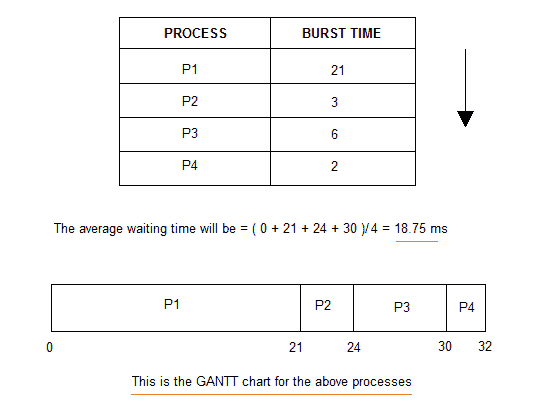

# 先到先得的服务调度

> 原文：<https://www.studytonight.com/operating-system/first-come-first-serve>

在“先到先服务”的调度算法中，顾名思义，先到达的[进程](process-scheduling)先执行，或者我们可以说先请求 CPU 的进程，先得到分配的 CPU。

*   先来先服务，就像 **FIFO** (先进先出)[队列数据结构](queue-data-structure)一样，先加入队列的数据元素是先离开队列的。
*   这在[批处理系统](types-of-os)中使用。
*   使用 Queue 数据结构通过编程很容易理解和实现**，其中一个新的进程通过队列的**尾部**进入，调度器从队列的**头部**选择进程。**
*   FCFS 调度的一个完美现实例子是**在售票柜台**购票。

* * *

## 计算平均等待时间

对于每一种调度算法来说，**平均等待时间**是判断其性能的关键参数。

AWT 或 Average waiting time 是队列中进程的平均等待时间，等待调度程序挑选它们执行。

> *平均等待时间越低，调度算法越好。*

考虑下表中给出的流程 P1、P2、P3、P4，按照相同的顺序到达执行，其中**到达时间**为`0`，给定**突发时间**，让我们使用 FCFS 调度算法求出平均等待时间。



平均等待时间为`18.75 ms`

对于上述给定的进程，首先将为 **P1** 提供 CPU 资源，

*   因此，P1 的等待时间将是`0`
*   **P1** 要求`21 ms`完成，因此 **P2** 的等待时间为`21 ms`
*   同样，流程 **P3** 的等待时间为 **P1** 的执行时间+P2**的执行时间，为`(21 + 3) ms` = `24 ms`。**
*   流程 **P4** 为**P1****P2****P3**执行次数之和。

上面的**甘特图**完美的代表了每个流程的等待时间。

* * *

## FCFS 调度的问题

以下是 FCFS 调度算法的一些缺点或问题:

1.  It is **Non Pre-emptive** algorithm, which means the **process priority** doesn't matter.

    如果一个优先级最低的进程正在执行，更像**日常例行备份**进程，需要更多的时间，突然其他一些高优先级进程到来，像**中断避免系统崩溃**，高优先级进程将不得不等待，因此在这种情况下，系统将崩溃，只是因为进程调度不当。

2.  不是最佳平均等待时间。
3.  无法并行利用资源，导致**护航效应**，资源(CPU、I/O 等)利用不佳。

### 什么是护航效应？

护航效应是指许多需要短时间使用资源的进程被一个长时间持有该资源的进程阻塞的情况。

这本质上导致资源利用率低，从而导致性能差。

* * *

## FCFS 调度程序

这里我们有一个简单的 C++程序，用于将**到达时间**作为`0`的过程。

如果你不熟悉 C++语言，我们建议你先[学习 C++语言](/cpp/introduction-to-cpp)。

在程序中，我们将计算流程列表中**突发时间**的给定`array`的**平均等待时间**和**平均周转时间**。

```
/* Simple C++ program for implementation 
of FCFS scheduling */

#include<iostream>

using namespace std;

// function to find the waiting time for all processes
void findWaitingTime(int processes[], int n, int bt[], int wt[])
{
    // waiting time for first process will be 0
    wt[0] = 0;

    // calculating waiting time
    for (int i = 1; i < n ; i++)
    {
        wt[i] =  bt[i-1] + wt[i-1];
    }
}

// function to calculate turn around time
void findTurnAroundTime( int processes[], int n, int bt[], int wt[], int tat[])
{
    // calculating turnaround time by adding
    // bt[i] + wt[i]
    for (int i = 0; i < n ; i++)
    {
        tat[i] = bt[i] + wt[i];
    }
}

// function to calculate average time
void findAverageTime( int processes[], int n, int bt[])
{
    int wt[n], tat[n], total_wt = 0, total_tat = 0;

    // function to find waiting time of all processes
    findWaitingTime(processes, n, bt, wt);

    // function to find turn around time for all processes
    findTurnAroundTime(processes, n, bt, wt, tat);

    // display processes along with all details
    cout << "Processes  "<< " Burst time  "<< " Waiting time  " << " Turn around time\n";

    // calculate total waiting time and total turn around time
    for (int i = 0; i < n; i++)
    {
        total_wt = total_wt + wt[i];
        total_tat = total_tat + tat[i];
        cout << "   " << i+1 << "\t\t" << bt[i] <<"\t    "<< wt[i] <<"\t\t  " << tat[i] <<endl;
    }

    cout << "Average waiting time = "<< (float)total_wt / (float)n;
    cout << "\nAverage turn around time = "<< (float)total_tat / (float)n;
}

// main function
int main()
{
    // process ids
    int processes[] = { 1, 2, 3, 4};
    int n = sizeof processes / sizeof processes[0];

    // burst time of all processes
    int  burst_time[] = {21, 3, 6, 2};

    findAverageTime(processes, n,  burst_time);

    return 0;
}
```

进程突发时间等待时间周转时间 1 21 0 21 2 3 21 24 3 6 24 30 4 2 30 32 平均等待时间= 18.75 平均周转时间= 26.75

这里我们有简单的公式来计算给定过程的不同时间:

**完成时间**:从到达时间开始，执行完成所花费的时间。

**周转时间**:到达后完成所花费的时间。简单来说，就是完成时间和到达时间的区别。

**等待时间**:流程开始执行前必须等待的总时间。它是流程的周转时间和突发时间之间的差异。

对于上面的程序，我们考虑了**到达时间**为`0`对于所有的流程，尝试实现一个可变到达时间的程序。

* * *

* * *