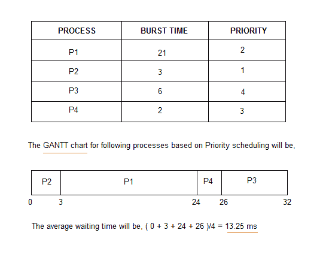

# 优先级CPU调度

> 原文：<https://www.studytonight.com/operating-system/priority-scheduling>

在本教程中，我们将了解优先级调度算法，它的工作原理及其优缺点。

在[最短作业优先](shortest-job-first)调度算法中，进程的优先级一般是 CPU 突发时间的倒数，即突发时间越大，该进程的优先级越低。

在优先级调度的情况下，优先级并不总是设置为CPU突发时间的倒数，而是可以在内部或外部设置，但是是的，调度是基于进程的优先级来完成的，其中最紧急的进程首先被处理，其次是优先级较低的进程。

具有相同优先级的进程以 FCFS 方式执行。

内部定义的进程优先级可以根据**内存需求**、**时间限制**、**打开文件数量**、**输入/输出突发与CPU突发的比率**等来决定。

然而，外部优先级是基于操作系统之外的标准来设置的，例如进程的重要性、为计算机资源使用支付的资金、makrte 因素等。

* * *

### 优先级调度算法的类型

优先级调度可以有两种类型:

1.  **抢占优先级调度**:如果到达就绪队列的新进程优先级高于当前正在运行的进程，则 CPU 被抢占，这意味着当前进程的处理停止，优先级较高的传入新进程得到 CPU 执行。
2.  **非抢占式优先级调度**:在非抢占式优先级调度算法的情况下，如果一个新的进程以比当前正在运行的进程更高的优先级到达，那么传入的进程将被放在就绪队列的头部，这意味着在当前进程执行之后，它将被处理。

* * *

## 优先级调度算法示例

考虑下表中的进程及其各自的 CPU 突发时间和优先级。



正如您在甘特图中看到的那样，进程只是根据优先级被分配了 CPU 时间。

* * *

### 优先级调度算法的问题

在优先级调度算法中，**无限期阻塞**或**饥饿**的几率。

当一个进程准备好运行时，它被认为是阻塞的，但必须等待CPU，因为其他进程正在运行。

但是在优先级调度的情况下，如果新的更高优先级的进程不断进入就绪队列，那么在具有较低优先级的就绪队列中等待的进程可能必须等待很长的持续时间，然后才能让 CPU 执行。

> 1973 年，当 IBM 7904 机器在麻省理工学院关闭时，发现了一个 1967 年提交但尚未运行的低优先级进程。

* * *

### 使用优先调度的老化技术

为了防止任何进程的饥饿，我们可以使用**老化**的概念，其中我们根据低优先级进程的等待时间不断增加其优先级。

例如，如果我们将等待的每一天的老化因子确定为 **0.5** ，那么如果优先级为 **20** 的进程(其优先级相对较低)进入就绪队列。经过一天的等待，其优先级提升至 **19.5** 等。

这样做，我们可以确保没有进程需要等待无限的时间来获取 CPU 时间进行处理。

* * *

## C++中优先级调度算法的实现

实现优先级调度算法很容易。我们要做的就是根据进程的优先级和 CPU 爆发时间进行排序，然后对其应用 。

下面是优先级调度算法的 C++代码:

```
// Implementation of Priority scheduling algorithm
#include<bits/stdc++.h> 
using namespace std; 

struct Process 
{ 
	// this is the process ID 
    int pid;  
    // the CPU burst time 
    int bt;   
    // priority of the process 
    int priority; 
}; 

// sort the processes based on priority
bool sortProcesses(Process a, Process b) 
{ 
    return (a.priority > b.priority); 
} 

// Function to find the waiting time for all processes 
void findWaitingTime(Process proc[], int n, 
                     int wt[]) 
{ 
    // waiting time for first process is 0 
    wt[0] = 0; 

    // calculating waiting time 
    for (int  i = 1; i < n ; i++ ) 
        wt[i] =  proc[i-1].bt + wt[i-1] ; 
} 

// Function to calculate turn around time 
void findTurnAroundTime( Process proc[], int n, 
                         int wt[], int tat[]) 
{ 
    // calculating turnaround time by adding 
    // bt[i] + wt[i] 
    for (int  i = 0; i < n ; i++) 
        tat[i] = proc[i].bt + wt[i]; 
} 

//Function to calculate average time 
void findavgTime(Process proc[], int n) 
{ 
    int wt[n], tat[n], total_wt = 0, total_tat = 0; 

    //Function to find waiting time of all processes 
    findWaitingTime(proc, n, wt); 

    //Function to find turn around time for all processes 
    findTurnAroundTime(proc, n, wt, tat); 

    //Display processes along with all details 
    cout << "\nProcesses  "<< " Burst time  "
         << " Waiting time  " << " Turn around time\n"; 

    // Calculate total waiting time and total turn 
    // around time 
    for (int  i=0; i<n; i++) 
    { 
        total_wt = total_wt + wt[i]; 
        total_tat = total_tat + tat[i]; 
        cout << "   " << proc[i].pid << "\t\t"
             << proc[i].bt << "\t    " << wt[i] 
             << "\t\t  " << tat[i] <<endl; 
    } 

    cout << "\nAverage waiting time = "
         << (float)total_wt / (float)n; 
    cout << "\nAverage turn around time = "
         << (float)total_tat / (float)n; 
} 

void priorityScheduling(Process proc[], int n) 
{ 
    // Sort processes by priority 
    sort(proc, proc + n, sortProcesses); 

    cout<< "Order in which processes gets executed \n"; 
    for (int  i = 0 ; i <  n; i++) 
        cout << proc[i].pid <<" " ; 

    findavgTime(proc, n); 
} 

// Driver code 
int main() 
{ 
    Process proc[] = {{1, 10, 2}, {2, 5, 0}, {3, 8, 1}}; 
    int n = sizeof proc / sizeof proc[0]; 
    priorityScheduling(proc, n); 
    return 0; 
}
```

* * *

* * *