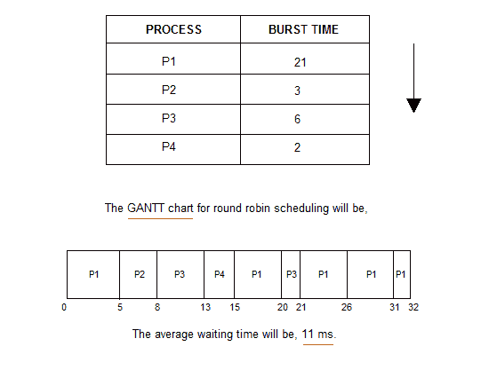
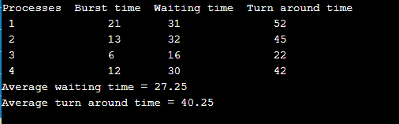

# 循环调度

> 原文：<https://www.studytonight.com/operating-system/round-robin-scheduling>

循环调度算法主要是为分时系统设计的。这种算法类似于 FCFS 调度，但是在 Round Robin(RR)调度中，增加了抢占，使得系统能够在进程之间切换。

*   每个进程都有一个固定的执行时间，称为**时间量**。

*   一旦一个进程在给定的时间周期内被执行，该进程被抢占，另一个进程在给定的时间周期内被执行。

*   上下文切换用于保存被抢占进程的状态。

*   这个算法简单，容易实现，最重要的是这个算法是无饥饿的，因为所有进程都获得了公平的 CPU 份额。

*   这里需要注意的是，时间量的长度一般为 10 到 100 毫秒。

循环算法的一些重要特征如下:

1.  循环调度算法属于抢先算法的范畴。

2.  该算法是最古老、最简单、最公平的算法之一。

3.  该算法是一种实时算法，因为它在特定的时间限制内响应事件。

4.  在该算法中，时间片应该是分配给需要处理的特定任务的最小值。尽管它可能因不同的操作系统而异。

5.  这是一个混合模型，本质上是时钟驱动的。

6.  这是传统操作系统中广泛使用的调度方法。

## 重要术语

1.  **完成时间**
    它是任何进程完成其执行的时间。

2.  **周转时间**
    这主要表示完工时间和到达时间的时间差。计算公式相同为:**周转时间=完成时间-到达时间**

3.  **等待时间(W.T):**
    表示掉头时间和突发时间的时间差。
    计算为**等待时间=掉头时间-突发时间**

现在让我们举一个同样的例子:



**上图中没有提到到达时间，所以所有流程都取 0。**

注:如果没有给出任何问题陈述的到达时间，则所有过程的到达时间均为 0；如果给出了，那么问题就可以相应地解决了。

## 说明

上例中的时间量值为 5。现在让我们为上面的例子计算周转时间和等待时间:

| 处理 | 突发时间 | 

解题时间

**周转时间=完成时间-到达时间**

 | 

等待时间

**等待时间=周转时间-突发时间**

 |
| --- | --- | --- | --- |
| 第一亲代 | Twenty-one | 32-0=32 | 32-21=11 |
| P2 | three | 8-0=8 | 8-3=5 |
| P3 | six | 21-0=21 | 21-6=15 |
| P4 | Two | 15-0=15 | 15-2=13 |

平均等待时间的计算方法是将所有进程的等待时间相加，然后除以进程数。

**平均等待时间=所有进程的等待时间/进程数**

**平均等待时间**= 11+5+15+13/4 = 44/4 =**11 毫秒**

## RR 调度的 C++实现

```
// Program implementation in C++ for Round Robin scheduling 
#include<iostream> 
using namespace std; 

//The Function to find the waiting time for all processes 
void fWaitingTime(int processes[], int n, 
			int bt[], int wt[], int quantum) 
{ 
	// Let us Make a copy of burst times bt[] to store remaining burst times

	int rem_bt[n]; 
	for (int i = 0 ; i < n ; i++) 
		rem_bt[i] = bt[i]; 

	int t = 0; // for Current time 

	// Let us keep traverse the processes in the round robin manner until all of them are not done.

	while (1) 
	{ 
		bool done = true; 

		//let us Traverse all processes one by one repeatedly 
		for (int i = 0 ; i < n; i++) 
		{ 
			// If burst time of a process is greater than 0 then there is a need to process further
			if (rem_bt[i] > 0) 
			{ 
				done = false; // indicates there is a pending process 

				if (rem_bt[i] > quantum) 
				{ 
					// By Increasing the value of t it shows how much time a process has been processed 
					t += quantum; 

					// Decreasing the burst_time of current process by the quantum
					rem_bt[i] -= quantum; 
				} 

				// If burst time is smaller than or equal to the quantum then it is Last cycle for this process 
				else
				{ 
					// Increase the value of t to show how much time a process has been processed 
					t = t + rem_bt[i]; 

					// Waiting time is current time minus time used by this process.
					wt[i] = t - bt[i]; 

					// As the process gets fully executed thus remaining burst time becomes 0.

					rem_bt[i] = 0; 
				} 
			} 
		} 

		// If all the processes are done 
		if (done == true) 
		break; 
	} 
} 

// Function used to calculate the turn around time 
void fTurnAroundTime(int processes[], int n, 
						int bt[], int wt[], int tat[]) 
{ 
	// calculating turnaround time by adding bt[i] + wt[i] 
	for (int i = 0; i < n ; i++) 
		tat[i] = bt[i] + wt[i]; 
} 

// Function to calculate the average time 
void findavgTime(int processes[], int n, int bt[], 
									int quantum) 
{ 
	int wt[n], tat[n], total_wt = 0, total_tat = 0; 

	// Function to find waiting time of all processes 
	fWaitingTime(processes, n, bt, wt, quantum); 

	// Function to find turn around time for all processes 
	fTurnAroundTime(processes, n, bt, wt, tat); 

	// Display processes along with all details 
	cout << "Processes "<< " Burst time "
		<< " Waiting time " << " Turn around time\n"; 

	// Calculate the total waiting time and total turn 
	// around time 
	for (int i=0; i<n; i++) 
	{ 
		total_wt = total_wt + wt[i]; 
		total_tat = total_tat + tat[i]; 
		cout << " " << i+1 << "\t\t" << bt[i] <<"\t "
			<< wt[i] <<"\t\t " << tat[i] <<endl; 
	} 

	cout << "Average waiting time = "
		<< (float)total_wt / (float)n; 
	cout << "\nAverage turn around time = "
		<< (float)total_tat / (float)n; 
} 

//Given below is the Driver Code
int main() 
{ 
	// process id's 
	int processes[] = { 1, 2, 3,4}; 
	int x = sizeof processes / sizeof processes[0]; 

	// Burst time of all processes 
	int burst_time[] = {21, 13, 6,12}; 

	// Time quantum 
	int quantum = 2; 
	findavgTime(processes, x, burst_time, quantum); 
	return 0; 
} 
```

### 输出

上述代码的输出如下:



## 循环调度算法的优势

循环调度算法的一些优点如下:

*   在执行该调度算法时，特定的时间段被分配给不同的作业。

*   就平均响应时间而言，该算法的性能最好。

*   在这个算法的帮助下，所有的作业都得到了公平的 CPU 分配。

*   在这个算法中，不存在饥饿或车队效应的问题。

*   该算法处理所有进程，没有任何优先级。

*   该算法本质上是循环的。

*   在这种情况下，新创建的进程被添加到就绪队列的末尾。

*   此外，在这种情况下，循环调度器通常采用分时方式，这意味着为每个作业提供一个时隙或时间段。

*   在这个调度算法中，每个进程都有机会在特定的时间段后重新调度。

## 循环调度算法的缺点

循环调度算法的一些缺点如下:

*   该算法在上下文切换上花费更多的时间。

*   对于小量子来说，是耗时的调度。

*   该算法提供了更长的等待时间和响应时间。

*   在这种情况下，吞吐量较低。

*   如果调度的时间量较少，那么它的甘特图就显得太大了。

## 需要记住的几点

**1。时间量递减值**

随着时间量的减少

*   上下文切换的数量会增加。

*   响应时间缩短

*   在这种情况下，挨饿的机会减少了。

对于**较小的时间量值，**在**响应时间方面变得更好。**

**2。时间量增加值**

随着时间量子价值的增加

*   上下文切换的次数减少

*   响应时间增加

*   在这种情况下，饥饿的几率会增加。

对于时间量的较高值，它在上下文切换的**数量方面变得更好。**

3.如果**时间量的值增加**，则循环调度趋向于**成为 FCFS 调度。**

4.在这种情况下，当时间量**的值趋于无穷大**时，循环调度**变为 FCFS 调度。**

5.因此，循环调度的性能主要取决于时间量的**值。**

6.而**时间量子**的值应该是既不**太大也不太小。**

* * *

* * *