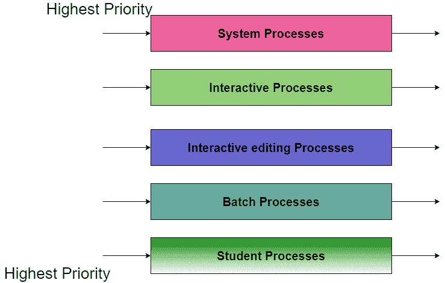

# 多级队列调度算法

> 原文：<https://www.studytonight.com/operating-system/multilevel-queue-scheduling>

另一类调度算法已经被创建用于进程容易被分类到不同组的情况。

**例如，**在前台(或交互)进程和后台(或批处理)进程之间进行共同的划分。这两种类型的进程有不同的响应时间要求，因此可能有不同的调度需求。此外，前台进程可能优先于后台进程。

多级队列调度算法将就绪队列分成几个独立的队列。通常根据进程的某些属性，如内存大小、进程优先级或进程类型，进程被永久分配到一个队列。每个队列都有自己的调度算法。

**例如，**单独的队列可能用于前台和后台进程。前台队列可能由循环算法调度，而后台队列由 FCFS 算法调度。

此外，队列之间必须有调度，这通常被实现为固定优先级抢先调度。**例如，**前台队列相对于后台队列可能具有绝对的优先级。

让我们考虑一个具有五个队列的多级队列调度算法的例子:

1.  系统进程

2.  互动进程

3.  交互式编辑进程

4.  批处理

5.  学生进程

每个队列相对于低优先级队列都有绝对的优先级。例如，批处理队列中的任何进程都不能运行，除非系统进程、交互进程和交互编辑进程的队列都是空的。如果在批处理运行时交互编辑进程进入就绪队列，批处理将被抢占。



在这种情况下，如果高优先级队列中没有进程，那么只有低优先级队列中的进程才会运行。对于**示例:**一旦系统队列、交互队列和交互编辑队列上的进程变为空，批处理队列上的进程才会运行。

上图中的进程描述如下:

*   **系统进程**
    操作系统本身有自己的进程要运行，被称为系统进程。

*   **互动进程**
    互动进程是一个应该有同样互动的进程(基本上是一个网络游戏)。

*   **批处理**
    批处理基本上是操作系统中的一种技术，在**处理**开始之前，以**批处理**的形式将程序和数据收集在一起。

*   **学生进程**
    系统进程总是获得最高优先级，而学生进程总是获得最低优先级。

在一个操作系统中，有很多进程，为了获得结果我们不能把所有的进程都放在一个队列中；因此，这个进程通过多级队列调度来解决。

## 履行

下面给出了多级队列调度的 C 实现:

```
#include<stdio.h>
int main()
{
	int p[20],bt[20], su[20], wt[20],tat[20],i, k, n, temp;
	float wtavg, tatavg;
	printf("Enter the number of processes:");
	scanf("%d",&n);
	for(i=0;i<n;i++)
	{
		p[i] = i;
		printf("Enter the Burst Time of Process%d:", i);
		scanf("%d",&bt[i]);
		printf("System/User Process (0/1) ? ");
		scanf("%d", &su[i]);
	}
	for(i=0;i<n;i++)
		for(k=i+1;k<n;k++)
			if(su[i] > su[k])
			{
			temp=p[i];
			p[i]=p[k];
			p[k]=temp;
			temp=bt[i];
			bt[i]=bt[k];
			bt[k]=temp;
			temp=su[i];
			su[i]=su[k];
			su[k]=temp;
			}
	wtavg = wt[0] = 0;
	tatavg = tat[0] = bt[0];
	for(i=1;i<n;i++)
	{
		wt[i] = wt[i-1] + bt[i-1];
		tat[i] = tat[i-1] + bt[i];
		wtavg = wtavg + wt[i];
		tatavg = tatavg + tat[i];
	}
	printf("\nPROCESS\t\t SYSTEM/USER PROCESS \tBURST TIME\tWAITING TIME\tTURNAROUND TIME");
	for(i=0;i<n;i++)
		printf("\n%d \t\t %d \t\t %d \t\t %d \t\t %d ",p[i],su[i],bt[i],wt[i],tat[i]);
	printf("\nAverage Waiting Time is --- %f",wtavg/n);
	printf("\nAverage Turnaround Time is --- %f",tatavg/n);
	return 0;
}
```

## 输出

上述代码的输出如下:


## 多级队列调度的优势

在这种调度的帮助下，我们可以为不同类型的进程应用不同类型的调度:

**对于系统进程**:先到先得(FCFS)调度。

**对于交互进程**:最短作业优先(SJF)调度。

**对于批处理**:循环调度

**对于学生进程**:优先级调度

## 多级队列调度的缺点

多级队列调度的主要缺点是低级进程的饥饿问题。

让我们明白**什么是饥饿？**

**饥饿:**

由于饥饿，较低级别的进程要么永远不执行，要么因为较低优先级或较高优先级的进程占用大量时间而不得不等待很长时间。

* * *

* * *