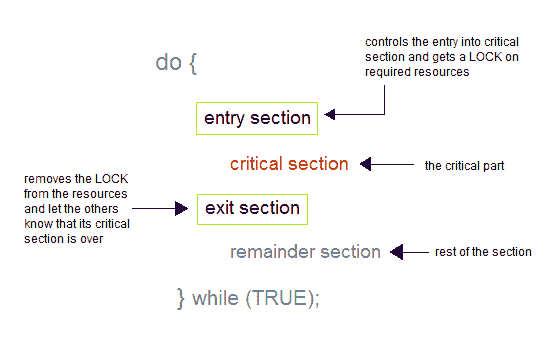
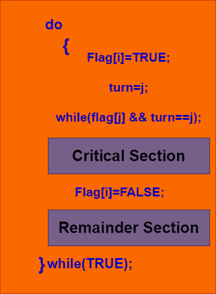

# 进程同步

> 原文：<https://www.studytonight.com/operating-system/process-synchronization>

在本教程中，我们将介绍操作系统中进程同步的概念。

引入进程同步是为了处理多个进程执行时出现的问题。

基于同步，流程分为两种类型，如下所示:

*   独立过程

*   合作过程

### 独立流程

如果一个进程的执行不影响另一个进程的执行，则称两个进程是独立的。

### 合作过程

如果一个进程的执行影响了另一个进程的执行，那么这两个进程被称为是合作的。这些进程需要同步，这样才能保证执行的顺序。

## **进程同步**

它是以这样一种方式协调进程执行的任务现象，即没有两个进程可以访问相同的共享数据和资源。

*   这是一个为了保持合作过程的适当执行顺序而涉及的过程。

*   为了同步进程，有各种同步机制。

*   多进程系统中，当多个进程同时运行，多个进程试图同时访问同一共享资源或任何数据时，主要需要进程同步。

## 竞态条件

当多个进程执行相同的代码或访问相同的内存或任何共享变量时；在这种情况下，共享变量的输出或值有可能是错误的，因此为了这个目的，所有进程都争着说我的输出是正确的。这种情况通常被称为**比赛状态。**由于多个进程以并发方式访问和处理对同一数据的操作，因此结果取决于数据访问发生的特定顺序。

主要是这种情况可能发生在**临界区**内。当多个线程执行的结果根据线程执行的顺序不同时，就会出现临界区的竞争情况。但这种情况是临界区可以避免的，如果临界区被视为原子指令。使用锁或原子变量进行适当的线程同步也可以防止争用情况。

## 临界区问题

关键部分是访问共享变量的代码段，必须作为原子操作来执行。这意味着在一组协作的进程中，在给定的时间点，只有一个进程必须执行其关键部分。如果任何其他进程也想执行它的关键部分，它必须等到第一个进程完成。进入临界区主要由`wait()`功能控制，而离开临界区则由`signal()`功能控制。

### 带卷送进段

在这一节中，主要是流程请求进入关键部分。

### 出口部分

本节之后是关键部分。

## 临界截面问题的解决方案

临界区问题的解决方案必须满足以下三个条件:

### 1.互斥现象

在一组协作过程中，在给定的时间点，只有一个过程可以处于其关键部分。

### 2.进步

如果没有进程在其关键部分，并且如果一个或多个线程想要执行它们的关键部分，那么必须允许这些线程中的任何一个进入其关键部分。

### 3.有界等待

在一个进程请求进入其关键部分之后，在这个进程的请求被批准之前，有一个限制，即有多少其他进程可以进入它们的关键部分。因此，达到限制后，系统必须授予进程进入其关键部分的权限。

## 关键部分的解决方案

关键部分在进程同步中起着重要作用，因此必须解决这个问题。

一些广泛使用的解决临界截面问题的方法如下:

### 1.彼得森的解决方案

这是一种广泛使用的基于软件的解决关键部分问题的方法。彼得森的解决方案是由计算机科学家彼得森开发的，这就是为什么它被如此命名。

在这个解决方案的帮助下，当一个进程在任何关键状态下执行时，另一个进程只执行剩余的代码，反之亦然。这种方法还有助于确保在特定时间只有一个进程可以在关键部分运行。

该解决方案保留了所有三个条件:

*   互斥得到了安慰，因为在任何时候只有一个进程可以访问关键部分。

*   进展也得到安慰，因为关键部分之外的进程无法阻止其他进程进入关键部分。

*   有界等待是有保证的，因为每个进程都有公平的机会进入临界区。

以上是彼得森解中 **Pi 过程的结构。**

*   假设有 **N 个进程(P1，P2，...PN)** 并且在某个时间点，每个过程都需要进入**临界区**

*   这里维护一个大小为 N 的 **FLAG[]** 数组，默认为 false。每当一个进程需要进入临界区时，它必须将其标志设置为真。例如:如果圆周率想要进入，它将设置**标志【1】=真。**

*   另一个变量叫做 **TURN** ，用来表示当前等待进入临界区的工序号。

*   退出时进入临界区的流程会将 **TURN** 从准备好的流程列表中更改为另一个数字。

*   例如:如果转弯是 3，那么 P3 进入临界区，当离开时，转弯=4，因此 P4 打破了等待循环。

### 同步硬件

许多系统为关键部分代码提供硬件支持。如果我们可以禁止在修改共享变量或资源时发生中断，那么在单处理器环境中，临界区问题可以很容易地解决。

以这种方式，我们可以确定当前的指令序列将被允许按顺序执行，而没有先发制人。不幸的是，这种解决方案在多处理器环境中不可行。

在多处理器环境中禁用中断可能很耗时，因为消息会传递给所有处理器。

这种消息传输延迟会延迟线程进入临界区，从而降低系统效率。

### 互斥锁

由于同步硬件解决方案对每个人来说都不容易实现，引入了一种称为互斥锁的严格软件方法。在这种方法中，在代码的入口部分，在关键部分内修改和使用的关键资源上获取锁，在出口部分释放锁。

当一个进程执行其关键部分时，资源被锁定，因此没有其他进程可以访问它。

* * *

* * *