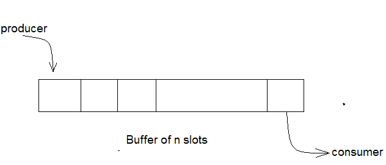

# 有界缓冲区问题

> 原文：<https://www.studytonight.com/operating-system/bounded-buffer>

有界缓冲区问题，又称**生产者消费者问题**，是同步的经典问题之一。在继续讨论解决方案和程序代码之前，让我们从理解这个问题开始。

* * *

### 什么是问题陈述？

有一个`n`槽的缓冲器，每个槽能够存储一个单位的数据。有两个进程在运行，即**生产者**和**消费者**，它们在缓冲区上运行。



**有界缓冲区问题**

生产者试图将数据插入缓冲区的空槽中。使用者试图从缓冲区中已填充的槽中移除数据。正如您现在可能已经猜到的，如果这两个过程同时执行，它们将不会产生预期的输出。

需要有一种方法让生产者和消费者以独立的方式工作。

* * *

## 这里有一个解决方案

这个问题的一个解决方案是使用信号量。这里将使用的信号量有:

*   `m`，一种用于获取和释放锁的**二进制信号量**。
*   `empty`，一种计数信号量的**，其初始值是缓冲区中的槽数，因为最初所有槽都是空的。**
*   `full`，初始值为`0`的**计数信号量**。

在任何时刻，当前值“空”表示缓冲区中的空槽数，“满”表示缓冲区中已占用的槽数。

* * *

## 生产者经营

生产者函数的伪代码如下所示:

```
do 
{
    // wait until empty > 0 and then decrement 'empty'
    wait(empty);   
    // acquire lock
    wait(mutex);  

    /* perform the insert operation in a slot */

    // release lock
    signal(mutex);  
    // increment 'full'
    signal(full);   
} 
while(TRUE)
```

*   查看上面的生产者代码，我们可以看到生产者首先等待，直到至少有一个空槽。
*   然后它递减**空**信号量，因为现在将少一个空槽，因为生产者将在其中一个槽中插入数据。
*   然后，它获取缓冲区的锁，这样，直到生产者完成操作，消费者才能访问缓冲区。
*   在执行插入操作之后，锁被释放并且 **full** 的值递增，因为生产者刚刚填充了缓冲器中的一个槽。

* * *

## 消费者行动

消费函数的伪代码如下所示:

```
do 
{
    // wait until full > 0 and then decrement 'full'
    wait(full);
    // acquire the lock
    wait(mutex);  

    /* perform the remove operation in a slot */ 

    // release the lock
    signal(mutex); 
    // increment 'empty'
    signal(empty); 
} 
while(TRUE);
```

*   使用者等待，直到缓冲区中至少有一个满槽。
*   然后它递减**满**信号量，因为在消费者完成其操作后，占用的槽数将减少 1。
*   之后，消费者获得缓冲区的锁。
*   随后，使用者完成删除操作，以便删除其中一个完整插槽中的数据。
*   然后，消费者释放锁。
*   最后，**空**信号量递增 1，因为消费者刚刚从一个被占用的槽中移除了数据，从而使其为空。

* * *

* * *