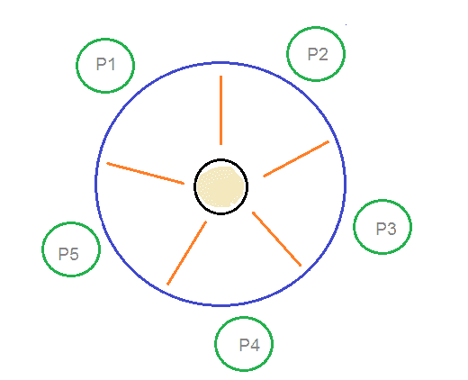

# 用餐哲学家问题

> 原文：<https://www.studytonight.com/operating-system/dining-philosophers-problem>

哲学家就餐问题是另一个经典的同步问题，用于评估需要将多个资源分配给多个进程的情况。

* * *

### 什么是问题陈述？

假设有五个哲学家围坐在一张圆形餐桌旁。餐桌中间有五根筷子和一碗米饭，如下图所示。



**哲学家就餐问题**

在任何时刻，哲学家不是在吃饭就是在思考。当一个哲学家想吃饭时，他用两根筷子——一根从他们的左边，一根从他们的右边。当一个哲学家想思考时，他会把两根筷子都放在原来的位置。

* * *

## 这是解决方案

从问题陈述中可以清楚地看出，哲学家可以无限期地思考。但是当一个哲学家开始吃饭时，他必须在某个时间点停下来。哲学家处于无休止的思考和进食的循环中。

五根筷子各有一组五个信号量`stick[5]`。

每个哲学家的代码如下:

```
while(TRUE) 
{
    wait(stick[i]);
    /* 
        mod is used because if i=5, next 
        chopstick is 1 (dining table is circular)
    */
    wait(stick[(i+1) % 5]);  

    /* eat */
    signal(stick[i]);

    signal(stick[(i+1) % 5]); 
    /* think */
}
```

当一个哲学家想吃米饭时，他会等他左边的筷子，然后拿起那根筷子。然后他等待合适的筷子出现，然后也拿起它。吃完后，他放下了两根筷子。

但是如果五个哲学家同时饥饿，并且每个人都拿起一根筷子，那么就会出现僵局，因为他们将永远等待另一根筷子。对此，可能的解决方案是:

*   哲学家必须被允许拿起筷子，只要左筷子和右筷子都有。
*   只允许四个哲学家坐在桌旁。这样，如果四个哲学家都拿起四根筷子，桌子上就剩下一根筷子了。所以，一个哲学家可以开始吃饭，最终，会有两根筷子。这样可以避免死锁。

* * *

* * *