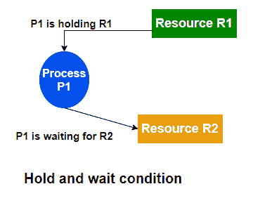

# 操作系统中的死锁预防

> 原文：<https://www.studytonight.com/operating-system/deadlock-prevention-in-operating-system>

在本教程中，我们将详细介绍死锁预防方法。

因为我们已经熟悉了僵局的所有必要条件。简而言之，条件如下:

*   互斥现象

*   等待

*   没有优先权

*   循环等待

## 操作系统中的死锁预防

让我们举一个椅子的例子，因为我们知道椅子总是用四条腿站立。同样，对于死锁问题，上述所有给定的四个条件都是需要的。如果椅子的任何一条腿断了，那么它肯定会掉下来。死锁的情况也是如此，如果我们能够违反四个条件中的任何一个，并且不让它们同时发生，那么就可以避免死锁问题。

我们将通过分别检查四个必要条件来阐述死锁预防方法。

### 互斥现象

对于不可共享的资源，此条件必须成立。例如，一台打印机不能由多个进程同时共享。相比之下，可共享资源不需要互斥访问，因此不会陷入死锁。可共享资源的一个很好的例子是只读文件，因为如果几个进程试图同时打开一个只读文件，那么它们可以被授权同时访问该文件。

进程不需要等待共享资源。通常，不能通过拒绝互斥条件来防止死锁，因为有些资源本质上是不可共享的。

### 等待

当一个进程持有一个资源，并且还在等待其他资源来完成它的执行时，就会出现保持和等待状态。因此，如果我们不希望出现这种情况，那么我们必须保证当一个进程请求一个资源时，它不持有任何其他资源。

有一些协议可以用来确保保持和等待状态永远不会发生:

*   根据第一协议；每个进程必须在开始执行之前请求并获得所有资源。

*   第二种协议只允许进程在不占用任何资源的情况下请求资源。

让我们来说明这两种协议之间的区别:

我们将考虑一个进程，主要是将数据从 DVD 驱动器复制到磁盘上的文件，对文件进行排序，然后将结果打印到打印机上。如果根据第一个协议，在进程开始时必须请求所有资源，那么进程最初会请求 DVD 驱动器、磁盘文件和打印机。它将在整个执行进程中保持打印机，即使打印机只在最后才需要。

而第二种方法允许进程最初只请求 DVD 驱动器和磁盘文件。它将数据从 DVD 驱动器复制到磁盘，然后释放 DVD 驱动器和磁盘文件。然后，该进程必须再次请求磁盘文件和打印机。将磁盘文件复制到打印机后，该进程也会释放这两个资源，然后终止。

**两种协议的缺点**

*   资源利用率可能较低，因为资源可能已分配但长时间未使用。例如，在上面给出的例子中，我们可以释放 DVD 驱动器和磁盘文件，并且仅当我们能够确定我们的数据将保留在磁盘文件上时，才再次请求磁盘文件和打印机。否则，我们必须在两个协议开始时请求所有资源。

*   有饿死的可能。一个需要几个流行资源的进程可能不得不无限期等待，因为它需要的资源中至少有一个总是被分配给其他进程。

### 没有优先权

死锁的第三个必要条件是不应该抢占已经分配的资源。为了确保此条件不成立，可以使用以下协议:

*   根据第一协议:“如果已经持有一些资源的进程请求另一个资源，并且如果所请求的资源不能被分配给它，那么它必须释放当前分配给它的所有资源。”

*   根据第二个协议:“当一个进程请求一些资源时，如果它们可用，那么就分配它们。如果请求的资源不可用，那么我们将检查它是否正在被使用，或者是否被分配给等待其他资源的其他进程。如果该资源没有被使用，则操作系统从等待进程中抢占该资源，并将其分配给请求进程。如果该资源正在被使用，则请求进程必须等待”。

第二种协议可以应用于那些状态可以很容易保存和以后恢复的资源，例如CPU寄存器和内存空间，而不能应用于像打印机和磁带驱动器这样的资源。

### 循环等待

导致死锁的第四个必要条件是循环等待，为了确保违反这个条件我们可以做以下事情:

为每个资源分配一个优先级编号。将有一个条件，即任何进程都不能请求较低优先级的资源。这种方法确保没有任何一个进程可以请求正被任何其他进程使用的资源，并且不会形成循环。

示例:假设 R5 资源分配给 P1，如果下次 P1 请求 R4，R3 小于 R5；那么这种请求将不会被批准。只有超过 R5 的资源请求才会被批准。

| S.No | 必要条件 | 方法 | 实际执行 |
| --- | --- | --- | --- |
| one | 互斥现象 | 违反这一条件的方法是假脱机。 | 不可能 |
| Two | 保持等待 | 为了违反这个条件，方法是最初请求一个进程的所有资源 | 不可能 |
| three | 没有优先权 | 为了违反这个条件，办法是:从进程中抢夺所有资源。 | 不可能 |
| four | 循环等待 | 这种方法是给每个资源分配优先级，并按数字顺序排列 | **可能** |

* * *

* * *