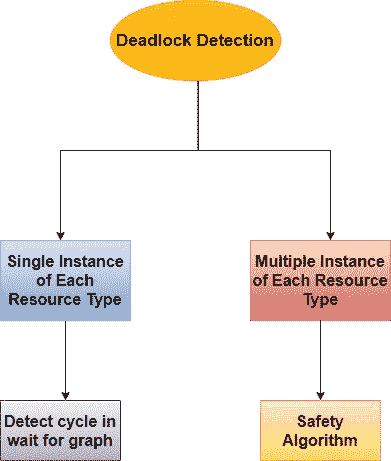
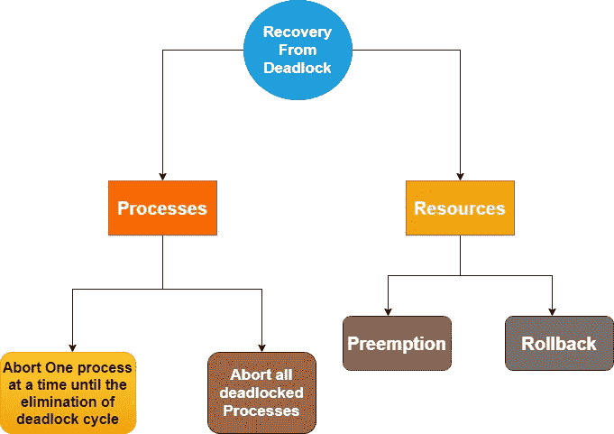

# 操作系统中的死锁检测和恢复

> 原文：<https://www.studytonight.com/operating-system/deadlock-detection-and-recovery-in-os>

在本教程中，我们将介绍死锁检测和恢复的概念。

如果系统没有采用死锁预防或死锁避免算法，那么就有可能发生死锁。

在这种情况下，系统可能会提供两件事:

*   一种算法用于**检查系统的状态**，以便确定**是否发生了死锁**。

*   用于从死锁中恢复的算法。

因此，为了摆脱死锁，操作系统定期检查系统是否有死锁。找到死锁后，操作系统将使用恢复技术从中恢复。

现在，操作系统的主要任务是检测死锁，这是借助资源分配图来完成的。



## 每种资源类型的单一实例

如果所有资源只有一个实例，那么可以定义一个死锁检测算法，它主要使用资源分配图的变体，称为等待图。这个等待图是从资源分配图中通过移除其资源节点并折叠其适当的边而获得的。

等待图中从 Pi 到 Pj 的一条边仅仅意味着进程 Pi 基本上是在等待进程 Pj，以便释放它需要的资源。当且仅当对应的资源分配图包含资源 Rq 的两条边 Pi，Rq 和 Rq，Pj 时，等待图中存在边 Pi，Pj。

当且仅当**等待**图中有周期时，系统中存在死锁。为了检测死锁，系统需要维护等待图，并且周期性地系统调用在**等待**图中搜索循环的算法。

用来检测图中循环的算法主要需要 n 次运算；其中 n 表示图中顶点的数量。

## 每种资源类型的多个实例

作为等待图的上述方案不适用于具有每种资源类型的多个实例的资源分配系统。现在，我们将转向适用于此类系统的死锁检测算法。

该算法主要使用几种时变数据结构，类似于银行家算法中使用的数据结构，如下所示:

### 1.有空的

这是一个长度为`m`的**阵**。它表示每种类型的可用资源数量。

### 2.分配

它是一个`n x m`矩阵，表示当前分配给每个进程的每种类型的资源数量。

### 3.请求

它是一个 **n*m** 矩阵，用来表示每个进程的请求；如果请求[i][j]等于 k，那么进程 Pi 请求更多的资源类型 Ri 的实例。

分配和请求作为向量，称为分配和请求。给定的检测算法仅用于调查剩余待完成进程的每个可能的分配序列。

1.让`Work`和`Finish`分别是长度为 **m** 和 **n** 的向量。初始化:

```
Work = Available
Finish[i] =false for i = 0, 1, ... , n - 1.
```

如果**分配 i** 不等于 **0** ，则**完成[i] =假**；否则**完成【I】=真**

2.找到一个索引 **i** 这样两者

```
Finish[i] ==false
Requesti <= Work
```

如果不存在这样的 **i** ，则转到步骤 4。

3.执行以下操作:

```
Work = Work + Allocationi
Finish[i] = true
```

转到步骤 2。

4.如果`Finish[i] == false`对于某个 I， **0 < =i < n** ，则表示系统处于死锁状态。

而且，如果 Finish[i]==false，那么进程 Pi 就陷入了僵局。

该算法可能需要 **mxn 操作**的顺序，以确定系统是否处于死锁状态。

## 从死锁中恢复

当检测算法确定存在死锁时，有几种可供选择的方法。有一种可能性，那就是通知操作员死锁，让他手动处理这个问题。

另一种可能是让系统自动从死锁中恢复。这是两个主要用来打破僵局的选项。



现在我们将讨论进程终止和资源抢占

## 流程终止

为了通过中止进程来消除死锁，我们将使用下面给出的两种方法之一。在这两种方法中，系统回收分配给终止进程的所有资源。

*   **中止所有陷入僵局的进程**
    显然，这种方法有助于打破僵局的循环，但这是一种昂贵的方法。这种方法不是建议性的，但是如果问题变得非常严重，可以使用。如果所有进程都被终止，那么系统中可能会出现不足，所有进程将从启动时重新执行。

*   **一次中止一个进程，直到消除死锁循环**
    这个方法可以使用，但是我们必须决定杀死哪个进程，这个方法会产生相当大的开销。工作量最少的进程首先被操作系统杀死。

## 资源抢占

为了利用资源抢占来消除死锁，我们会相继抢占进程中的一些资源，并将这些资源交给其他一些进程，直到死锁周期被打破，系统有可能从死锁中恢复。但是系统有可能陷入饥饿。


* * *

* * *