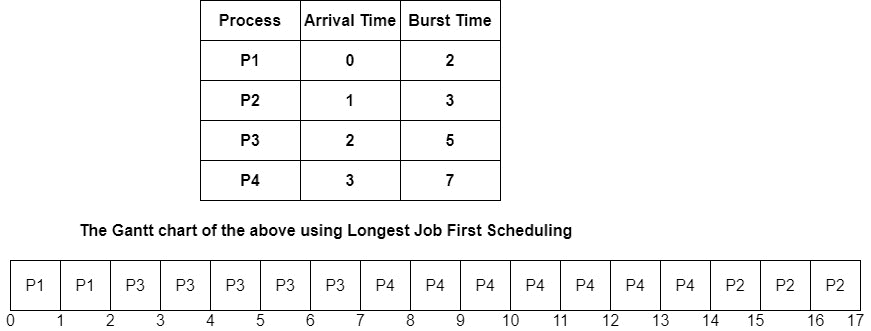

> 原文：<https://www.studytonight.com/operating-system/longest-job-first-scheduling-algorithm>

[← Prev](/operating-system/shortest-remaining-time-first-scheduling-algorithm "Shortest Remaining Time First")[Next →](/operating-system/longest-remaining-time-first-scheduling-algorithm "Longest Remaining Time First Scheduling")

<nav aria-label="breadcrumb">

1.  [家](/)
2.  [操作系统](/operating-system)
3.  最长作业优先调度算法

</nav>

<article>

# 最长作业优先调度算法

最长作业优先 **(LJF)** 调度属于**非抢占式调度**算法范畴。该算法主要跟踪在到达时间本身可用的所有进程的突发时间，然后将处理器分配给具有最长突发时间的进程。在这种算法中，一旦一个进程开始执行，它就不能在两次处理之间被中断。只有在分配的进程完成其处理并被终止后，**才能执行任何其他进程。**

该调度类似于 SJF 调度算法。但是，在该调度算法中，优先级被给予具有最长突发时间的进程。

尽管这种调度算法被认为不是调度进程的有效方式，因为它有许多缺点:

*   第一个是它显示的护航效果

*   第二个是这个算法有非常大的平均周转时间和平均等待时间。由于这两个原因，系统的有效性降低，处理变得缓慢。

在一种情况下，如果两个进程具有相同的突发时间，则使用 FCFS 断开连接，即首先到达的进程被首先处理。

让我们看一下在 LJF 调度中使用的程序:

*   在第一步中，算法根据到达时间的递增顺序对进程进行排序。

*   在第二步中，它将在所有到达该时间的进程中选择具有最高突发时间的进程。

*   之后，它将在给定的突发时间内处理它。LJF 还会检查是否有其他进程到达，直到该进程完成执行。

*   最后但同样重要的是，它将重复上述所有步骤，直到所有的过程都被执行。

现在是时候看看 LJF 调度的例子了:

## 最长作业优先调度示例

在上面的例子中，给出了四个过程 P1、P2、P3、P4 以及它们的突发时间和到达时间。

**解释**

让我们从上面给出的甘特图中了解 LJF 的工作；

1.  在 t = 0 时，有一个进程具有 2 个单位的突发时间。因此，选择 P1 并执行 2 毫秒

2.  在 t = 2 时，即 P1 被执行后，可用的进程是 P3 的 P2。如你所见，P3 的爆发时间超过了 P2。因此，选择 P3 并执行 5 分钟。

3.  在 t = 7 时，即执行 P3 之后，可用的流程是 P4 P2。如你所见，P4 的爆发时间超过了 P2。因此，选择 P4 并执行 7ms。

4.  最后，P4 完成后，执行 P2 3 毫秒的过程。

借助甘特图，您可以轻松确定完成时间。让我们计算等待时间和周转时间。

| 过程 | 到达时间 | 突发时间 | 完成时间 | 

解题时间

**周转时间=完成时间-到达时间**

 | 

等待时间

**等待时间=周转时间-突发时间**

 |
| --- | --- | --- | --- | --- | --- |
| 第一亲代 | Zero | Two | Two | 2-0=2 | 2-2=0 |
| P2 | one | three | Seventeen | 17-1=16 | 16-3=13 |
| P3 | Two | five | seven | 7-2=5 | 5-5=0 |
| P4 | three | seven | Fourteen | 14-3=11 | 11-7=4 |

平均等待时间的计算方法是将所有进程的等待时间相加，然后除以进程数。

**平均等待时间=等待所有进程的时间/进程数**

**平均等待时间**= 0+13+0+4/4 = 17/4 = 4.25 毫秒

## LJF 时间表的缺点

*   这种算法导致处理速度的降低，从而降低了系统的效率和利用率。

*   由于该算法，对于给定的一组过程，平均等待时间和平均周转时间增加。

*   这种算法导致了车队效应。

*   使用这种算法，有可能一个短进程可能永远不会被执行，而系统继续执行长进程。

</article>

* * *

* * *