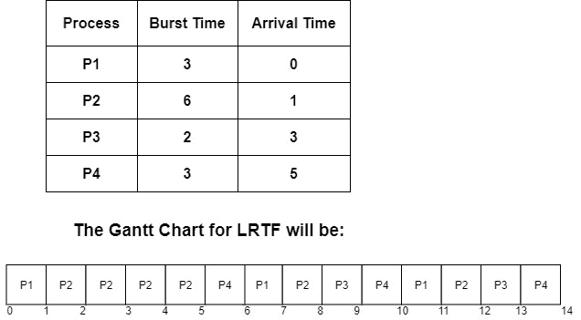

> 原文：<https://www.studytonight.com/operating-system/longest-remaining-time-first-scheduling-algorithm>

[← Prev](/operating-system/longest-job-first-scheduling-algorithm "Longest Job First Scheduling")[Next →](/operating-system/)

<nav aria-label="breadcrumb">

1.  [家](/)
2.  [操作系统](/operating-system)
3.  最长剩余时间优先调度算法

</nav>

<article>

# 最长剩余时间优先调度算法

最长剩余时间优先 **(LRTF)** 调度是最长作业优先 **(LJF)** 调度的抢先版。操作系统使用这种调度算法来调度传入的进程，以便以系统的方式执行它们。

利用该算法，首先处理具有最大剩余时间的进程。在这种情况下，我们将检查一段时间间隔(比如 1 个单位)后的最大剩余时间，即是否有另一个进程在这段时间之前到达了更多的突发时间。

现在让我们了解 LRTF 调度算法遵循的程序；

## LRTF 调度是如何工作的？

*   第一步是按照到达时间的递增顺序对流程进行排序

*   下一步是选择到达时间最少但突发时间最多的进程。之后处理 1 个单位。在一个单元之后，您需要检查在该执行时间之前；任何其他进程是否到达

*   只需重复上述步骤，直到所有流程执行完毕。

## LRTF 调度的特点

以下是 LRTF 的一些特点:

*   它是一种 CPU 调度算法，用于系统地确定所有传入进程中首先执行的进程。

*   这种算法遵循抢占式方法，因为在这种方法中，CPU 只在固定的时间段内分配给任何进程。

*   在该算法中，根据最高突发时间选择进程(首先处理具有最高突发时间的进程)，并且该进程一直运行到固定的时间片。之后，选择过程再次发生。

*   由于平均等待时间值较高，该算法不是最优的。

现在是时候讲述 LRTF 的例子了。

## LRTF 调度示例

在上面的例子中，给出了四个过程 P1、P2、P3、P4 以及它们的到达时间和突发时间。

借助甘特图，让我们计算完成时间、等待时间和周转时间。

| 过程 | 到达时间 | 爆发时间 | 完成时间 | 

解题时间

**周转时间=完成时间-到达时间**

 | 

等待时间

**等待时间=周转时间-突发时间**

 |
| --- | --- | --- | --- | --- | --- |
| 第一亲代 | Zero | three | Eleven | 11-0=11 | 11-3=8 |
| P2 | one | six | Twelve | 12-1=11 | 11-6=5 |
| P3 | three | Two | Thirteen | 13-2=11 | 13-2=11 |
| P4 | five | three | Fourteen | 14-5=11 | 11-3=8 |

平均等待时间的计算方法是将所有进程的等待时间相加，然后除以进程数。

**平均等待时间=所有进程的等待时间/进程数**

**平均等待时间**= 8+5+11+8/4 =**4 毫秒**

## LRTF 的优势

*   该算法易于实现且简单

*   这个算法是无饥饿的，因为所有进程都获得了公平的 CPU 份额。

*   所有的过程都在最长的作业完成时完成。

## LRTF 的缺点

*   使用该算法，即使每个进程的突发时间较少，平均等待时间和周转时间也过高。

*   在这种突发时间较少的进程中(较小的进程)，需要等待 CPU 来完成突发大小较大的进程。

*   上下文切换消耗了 CPU 的宝贵时间；其可用于执行过程。

</article>

* * *

* * *