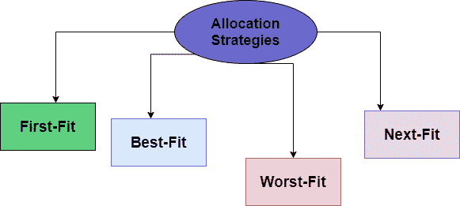
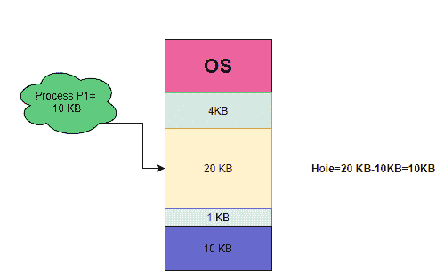
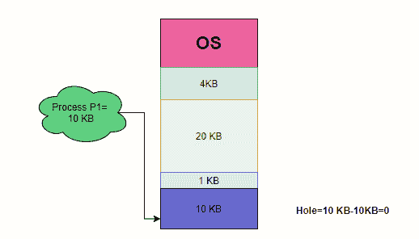
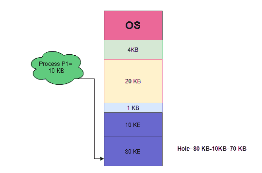

# 操作系统中的分区分配方法

> 原文：<https://www.studytonight.com/operating-system/partition-allocation-methods-in-operating-system>

在本教程中，我们将介绍操作系统中分区分配方法的概念。

作为由分散在整个存储器中的一组不同大小的孔组成的可用存储器块。每当一个进程到达并需要内存时，系统会在集合中搜索一个足够大的洞来容纳到达的进程。

如果孔太大，它会把孔分成两部分。一部分分配给到达的过程，另一部分返回到孔组。

每当该过程终止时，它释放存储器的块，然后释放的块被放回该组孔中。如果新孔与其他孔相邻，则这些相邻的孔会合并在一起，形成一个大的单孔。

此时，系统可能需要检查是否有进程在等待内存，以及这个新释放和合并的内存是否能够满足等待队列中任何进程的需求。

上面给出的过程是**一般动态存储分配问题**的一个特定实例，它涉及如何满足自由洞列表中大小为 **n** 的请求。

因为这个问题有很多解决方法。

## 分区分配(内存分配)策略

在下图中，有一些策略用于从可用孔集中选择一个孔。

让我们逐一讨论这些策略:内存管理

## 1.首次拟合分配

按照这个策略，把**第一个孔或者第一个自由分区**分配给足够大的进程。该搜索可以从孔组的开始处开始，也可以从先前第一次拟合搜索结束的位置开始。

一旦我们发现一个足够大的自由洞，就可以停止搜索。

让我们看看下面给出的例子:

尺寸为 10KB 的工艺 P1 已经到达，然后选择足以满足尺寸为 20KB 的要求的第一个孔并分配给该工艺。

## 2.最佳分配

通过这种策略，将足够大并满足流程要求的最小空闲分区/孔分配给流程。该策略搜索整个空闲分区/孔列表，以便找到大小大于或等于进程大小的孔。

让我们看看下面给出的例子:

到达 10 KB 大小的工艺 P1，然后选择满足 10KB 大小要求的最小孔并分配给该工艺。

## 3.最不适合分配

通过这种策略，满足流程要求的最大自由分区/孔被分配给流程。这样做是为了让剩下的部分足够大而有用。这个策略正好与最差匹配相反。

该策略搜索整个孔列表，以便找到最大的孔，然后分配最大的孔进行处理。

让我们看看下面给出的例子:

大小为 10KB 的进程 P1 已经到达，然后选择大小为 80 KB 的最大孔并分配给该进程。

## 4.下次拟合分配

该策略是第一次拟合的修改版本，因为在下一次拟合中以及在该存储器中搜索空白空间，类似于第一次拟合存储器分配方案。但它不同于第一次拟合，因为当调用下一次时，它从它开始的地方开始，而不是从开始。

* * *

* * *