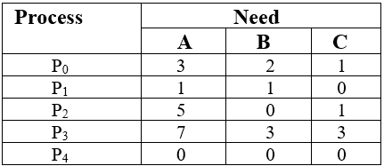
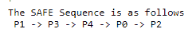

# 操作系统中的银行家算法

> 原文：<https://www.studytonight.com/operating-system/bankers-algorithm>

庄家算法是一种**死锁避免算法**。之所以这样命名，是因为这种算法在银行系统中用于确定是否可以发放贷款。

假设银行中有`n`个账户持有人，他们所有账户中的资金总和为`S`。每次银行必须发放贷款时，都会从银行拥有的**总金额**中减去**贷款金额**。然后它检查这个差值是否大于`S`。之所以这样做，是因为只有这样，即使所有`n`账户持有人一次性提现，银行才有足够的资金。

银行家算法在计算机中的工作原理类似。

> 每当创建一个新的进程时，它必须确切地指定它需要的每种资源类型的最大实例数。

## 银行家算法的特点

银行家算法的特点如下:

*   如果任何进程请求资源，那么它必须等待。

*   该算法由最大化资源分配的高级特性组成。

*   我们的系统资源有限。

*   在这个算法中，如果任何进程获得了所有需要的资源，那么它应该在一个受限的时间内返回资源。

*   该算法维护各种资源，可以满足至少一个客户端的需求。

假设有`n`进程和`m`资源类型。

## 用于实现银行家算法的数据结构

用于实现银行家算法的一些数据结构是:

### 1.`Available`

这是一个长度为`m`的**阵**。它表示每种类型的可用资源数量。如果`Available[j] = k`，则有资源类型`Rj`的`k`实例可用。

### 2.`Max`

这是一个`n x m`矩阵，表示一个进程可以请求的每个资源的最大实例数。如果`Max[i][j] = k`，则进程`Pi`可以请求资源类型`Rj`的 atmost】实例。

### 3.`Allocation`

它是一个`n x m`矩阵，表示当前分配给每个进程的每种类型的资源数量。如果`Allocation[i][j] = k`，则进程`Pi`当前被分配`k`资源类型`Rj`的实例。

### 4.`Need`

它是一个二维数组。它是一个`n x m`矩阵，表示每个进程的剩余资源需求。如果`Need[i][j] = k`，那么进程`Pi`可能需要`k`更多的资源类型实例`Rj`来完成其任务。

```c
Need[i][j] = Max[i][j] - Allocation [i][j]
```

### 银行家算法由两种算法组成:

1.  安全算法

2.  资源请求算法

## 安全算法

安全算法是一种用于发现系统是否处于安全状态的算法。算法如下:

1.  Let `Work` and `Finish` be vectors of length **m** and **n**, respectively. Initially,

    ```c
    Work = Available
    Finish[i] =false for i = 0, 1, ... , n - 1.

    ```

    这意味着，最初没有进程完成，可用资源的数量由**可用**数组表示。

2.  Find an index **i** such that both

    ```c
    Finish[i] ==false
    Needi <= Work

    ```

    如果没有这样的我在场，那么进行到步骤 4。

    这意味着，我们需要找到一个未完成的进程，其需求可以通过可用的资源来满足。如果不存在这样的进程，只需转到步骤 4。

3.  Perform the following:

    ```c
    Work = Work + Allocationi
    Finish[i] = true

    ```

    转到步骤 2。

    当发现一个未完成的进程时，资源被分配，进程被标记为完成。然后，重复该循环，检查所有其他进程是否相同。

4.  If `Finish[i] == true` for all i, then the system is in a safe state.

    这意味着如果所有进程都完成了，那么系统就处于安全状态。

该算法可能需要 **mxn 操作**的顺序，以确定状态是否安全。

## 资源请求算法

现在下一个算法是资源请求算法，它主要用于确定请求是否可以被安全地授予。

让 Requesti 成为进程 Pi 的请求向量。如果 Requesti[j]==k，那么进程 Pi 需要资源类型 Rj 的 k 个实例。当进程 Pi 请求资源时，将采取以下操作:

1.如果 Requesti <= Needi，则转到步骤 2；否则会引发错误情况，因为进程已经超过了它的最大声明。

2.如果 Requesti < = Availablei，则转到步骤 3；否则 Pi 必须等待，因为资源不可用。

3.现在，我们将假设资源被分配给进程 Pi，从而执行以下步骤:

可用=可用-请求；

allocation I = allocation I+Requesti；

Needi = Needi - Requesti;

如果得到的资源分配状态是安全的，那么事务就完成了，进程 Pi 被分配了它的资源。但是在这种情况下，如果新的状态不安全，那么 Pi 等待 Requesti，旧的资源分配状态被恢复。

## 银行家算法的缺点

该算法的一些缺点如下:

1.  在处理期间，该算法不允许进程改变其最大需求。

2.  这种算法的另一个缺点是，所有进程都必须提前知道最大资源需求。

3.  该算法允许在有限的时间内提供请求，但以一年为固定期限。

现在是时候看看银行家算法的例子了:

**示例:**

**为了理解庄家的算法，让我们考虑以下快照:**

| **进程** | **分配**T2**甲乙丙** | **Max**T2**A B C** | **可用**T2**甲乙丙** |
| **P0** | **1 1 2** | **4 3 3** | **2 1 0** |
| **P1** | **2 1 2** | **3 2 2** |   |
| **P2** | **4 0 1** | **9 0 2** |   |
| **P3** | **0 2 0** | **7 5 3** |   |
| **P4** | **1 1 2** | **1 1 2** |   |

1.  计算需求矩阵的内容？
2.  检查系统是否处于安全状态？
3.  确定每种资源的总和？

**解决方案:**

**1** 。**需求矩阵的**内容可以使用下面给出的公式计算:

**需求=最大-分配**


**2** 。现在让我们检查一下安全状态。

**安全顺序:**

1.  对于进程 P0，需要= (3，2，1)和

可用= (2，1，0)

需要< =可用=假

因此，系统将进入下一个进程。

**2。**对于进程 P1，需要= (1，1，0)

可用= (2，1，0)

需求< =可用=真

P1 的请求被批准了。

可用=可用+分配

= (2, 1, 0) + (2, 1, 2)

= (4，2，2)(新可用)

**3。**对于进程 P2，需要= (5，0，1)

可用= (4，2，2)

需要< =可用=假

因此，系统将进入下一个进程。

**4。**对于进程 P3，需要= (7，3，3)

可用= (4，2，2)

需要< =可用=假

因此，系统将进入下一个进程。

**5。**对于进程 P4，需要= (0，0，0)

可用= (4，2，2)

需求< =可用=真

P4 的请求被批准了。

可用=可用+分配

= (4, 2, 2) + (1, 1, 2)

= (5，3，4)现在，(新可用)

**6。**现在再次检查进程 P2，需要= (5，0，1)

可用= (5，3，4)

需求< =可用=真

P2 的请求被批准了。

可用=可用+分配

= (5, 3, 4) + (4, 0, 1)

= (9，3，5)现在，(新可用)

**7。**现在再次检查进程 P3，需要= (7，3，3)

可用= (9，3，5)

需求< =可用=真

P3 的请求被批准了。

可用=可用+分配

= (9, 3, 5) + (0, 2, 0) = (9, 5, 5)

**8。**现在再次检查进程 P0，=需要(3，2，1)

=可用(9、5、5)

需求< =可用=真

因此，请求将被授予 P0。

安全顺序:< P1, P4, P2, P3, P0>

**系统将所有需要的资源分配给每个进程。所以，我们可以说系统处于安全状态。**

**3。**资源总量将通过以下公式计算:

资源总量=分配列的总和+可用

= [8 5 7] + [2 1 0] = [10 6 7]

## 银行家算法在 C 语言中的实现

下面给出了银行家算法实现的代码:

```c
//C program for Banker's Algorithm 
#include <stdio.h> 
int main() 
{ 
	// P0, P1, P2, P3, P4 are the names of Process

	int n, r, i, j, k; 
	n = 5; // Indicates the Number of processes 
	r = 3; //Indicates the Number of resources 
	int alloc[5][3] = { { 0, 0, 1 }, // P0 // This is Allocation Matrix 
						{ 3, 0, 0 }, // P1 
						{ 1, 0, 1 }, // P2 
						{ 2, 3, 2 }, // P3 
						{ 0, 0, 3 } }; // P4 

	int max[5][3] = { { 7, 6, 3 }, // P0 // MAX Matrix 
					{ 3, 2, 2 }, // P1 
					{ 8, 0, 2 }, // P2 
					{ 2, 1, 2 }, // P3 
					{ 5, 2, 3 } }; // P4 

	int avail[3] = { 2, 3, 2 }; // These are Available Resources 

	int f[n], ans[n], ind = 0; 
	for (k = 0; k < n; k++) { 
		f[k] = 0; 
	} 
	int need[n][r]; 
	for (i = 0; i < n; i++) { 
		for (j = 0; j < r; j++) 
			need[i][j] = max[i][j] - alloc[i][j]; 
	} 
	int y = 0; 
	for (k = 0; k < 5; k++) { 
		for (i = 0; i < n; i++) { 
			if (f[i] == 0) { 

				int flag = 0; 
				for (j = 0; j < r; j++) { 
					if (need[i][j] > avail[j]){ 
						flag = 1; 
						break; 
					} 
				} 

				if (flag == 0) { 
					ans[ind++] = i; 
					for (y = 0; y < r; y++) 
						avail[y] += alloc[i][y]; 
					f[i] = 1; 
				} 
			} 
		} 
	} 

	printf("Th SAFE Sequence is as follows\n"); 
	for (i = 0; i < n - 1; i++) 
		printf(" P%d ->", ans[i]); 
	printf(" P%d", ans[n - 1]); 

	return (0); 

} 
```

### 输出:

以下是上述程序的输出:



至此，银行家算法教程结束。我们希望你能理解，如果不能，请到我们的[论坛](/forum/)询问你的疑问。

* * *

* * *