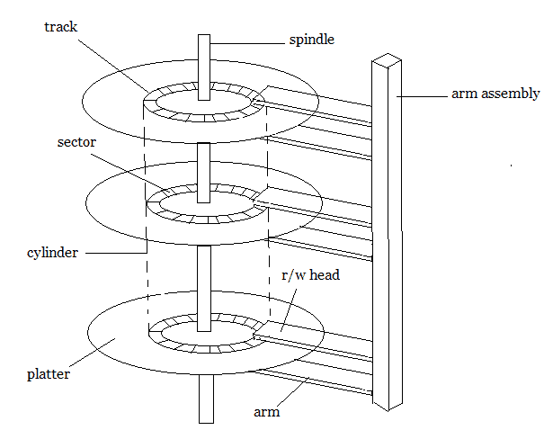
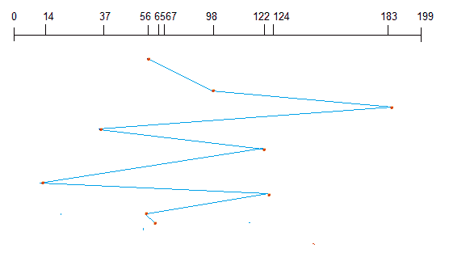
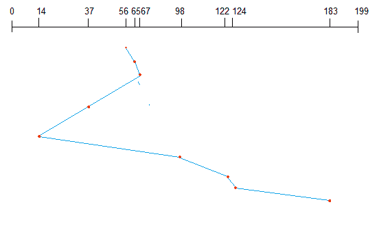
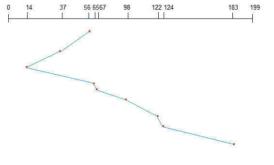

# 辅助存储和磁盘调度算法

> 原文：<https://www.studytonight.com/operating-system/secondary-storage>

辅助存储设备是那些内存非易失性的设备，也就是说，即使系统关闭，存储的数据也将保持不变。这里有一些关于二级存储值得注意的事情。

*   二级存储也称为辅助存储。
*   与 ram 等主存储器相比，二级存储器更便宜。
*   辅助存储的速度也低于主存储。
*   因此，不太频繁访问的数据被保存在辅助存储器中。
*   一些例子是磁盘、磁带、可移动拇指驱动器等。

* * *

## 磁盘结构

在现代计算机中，大部分二级存储器是磁盘形式的。因此，了解磁盘的结构对于理解计算机如何访问磁盘中的数据是必要的。

**磁盘的结构**

一个磁盘包含几个**盘片**。每个盘子被分成圆形的**轨道**。靠近中心的轨道长度小于远离中心的轨道长度。如图所示，每个轨道进一步划分为**扇区**。

离中心相同距离的轨道形成一个圆柱体。读写头用于从磁盘的扇区读取数据。

磁盘的速度分为两部分:

*   **传输速率:**这是数据从磁盘移动到计算机的速率。
*   **随机访问时间:**是寻道时间和旋转延迟的总和。

**寻道时间**是手臂移动到所需轨迹所需的时间。**旋转延迟**定义为机械臂到达轨道中所需扇区的时间。

即使磁盘在物理上被安排为扇区和磁道，数据在逻辑上被安排和寻址为固定大小的块阵列。块的大小可以是 **512** 或 **1024** 字节。每个逻辑块都与磁盘上的一个扇区顺序映射。这样，磁盘中的每个扇区都将有一个逻辑地址。

* * *

## 磁盘调度算法

在典型的多道程序设计系统中，通常在任何时间点都会有多个磁盘访问请求。因此，必须安排这些请求以实现良好的效率。磁盘调度类似于进程调度。下面介绍一些磁盘调度算法。

* * *

### 先到先得

该算法按照系统要求的相同顺序执行请求。让我们举一个例子，其中队列有如下带有柱面编号的请求:

**98、183、37、122、14、124、65、67**

假设气缸盖最初位于气缸 **56** 处。头部按照队列中的给定顺序移动，即 **56→98→183→...→67** 。

* * *

### 最短寻道时间优先(SSTF)

这里，首先选择最接近当前头部位置的位置。考虑前面磁盘队列的例子，

**98、183、37、122、14、124、65、67**

假设气缸盖最初位于气缸 **56** 处。距离 **56** 最近的下一个气缸是 **65** ，然后是 **67** ，然后是 **37** 、 **14** 等等。

* * *

### 扫描算法

由于它的行为，这个算法也被称为电梯算法。这里，首先头部在一个方向上移动(比如向后)，并覆盖路径中的所有请求。然后，它向相反的方向移动，并覆盖路径中的其余请求。这种行为类似于电梯。让我们举前面的例子，

**98、183、37、122、14、124、65、67**

假设气缸盖最初位于气缸 **56** 处。头部向后移动，进入 **37** 和 **14** 。然后它以相反的方向前进，并在圆柱体进入路径时进入圆柱体。

* * *

* * *