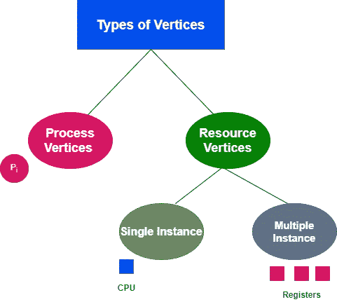
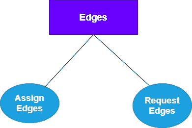
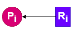
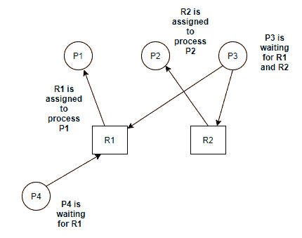
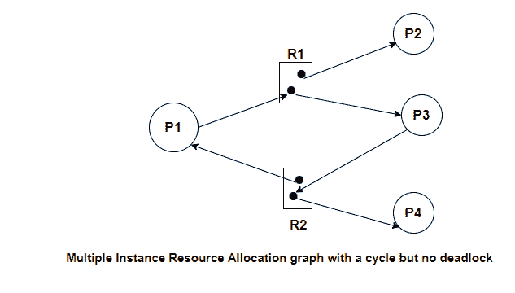

> 原文：<https://www.studytonight.com/operating-system/resource-allocation-graph-in-operating-system>

[← Prev](/operating-system/secondary-storage "Secondary Storage")[Next →](/operating-system/system-calls "System Calls")

<nav aria-label="breadcrumb">

1.  [家](/)
2.  [操作系统](/operating-system)
3.  操作系统中的资源分配图

</nav>

<article>

# 操作系统中的资源分配图

在本教程中，我们将介绍操作系统中的资源分配图。

为了以更精确的方式描述死锁，使用了称为**系统资源分配图的有向图。**

*   该图作为系统状态的图形表示。

*   资源分配图主要由一组**顶点和一组**边组成****

*   该图主要包含与持有一些资源的进程相关的所有信息，还包含等待系统中更多资源的进程的信息。

*   此外，该图包含与资源的所有实例相关的所有信息，这意味着关于可用资源和进程正在使用的资源的信息

*   在该图中，圆圈用于表示流程，矩形用于表示资源。

现在让我们讨论**资源分配图的组成部分。**

## 资源分配图的组成部分

下面给出了 RAG 的组件:

1.  头顶

2.  优势

## 1.头顶

资源分配图中使用了两种顶点，它们是:

*   处理顶点

*   资源顶点

**处理顶点**

这些顶点用于表示过程顶点。圆圈用于绘制流程顶点，圆圈内提到流程的名称。

**资源顶点**

这些顶点用于表示资源顶点。矩形用于绘制资源顶点，我们使用圆圈内的点来表示该资源的实例数。

在系统中，可能存在多个实例，根据它们，有两种类型的资源顶点，它们是单个实例和多个实例。

**单个实例**

在单个实例资源类型中，框内只有一个点。单点主要表示资源有一个实例。

**多实例**

在多实例资源类型中，框内有多个点，这些多个点表示资源有多个实例。

## 2.优势

在资源分配图中，边进一步分为两类:

**1。分配边**

分配边主要用于表示流程的资源分配。我们可以借助箭头来绘制分配边，箭头主要指向流程，流程主要指向资源实例。

在上图中，资源被分配给了流程

**2。请求边**

请求边缘主要用于表示进程的等待状态。同样，在指定边中，箭头用于绘制箭头边。但是这里箭头指向资源的实例，流程的尾部指向流程。

在上图中，流程正在请求资源

## 单实例 RAG 示例

假设有四个进程 P1、P2、P3、P4 和两个资源 R1 和 R2，其中 P1 持有 R1，P2 持有 R2，P3 等待 R1 和 R2，而 P4 等待资源 R1。

在上面的例子中，没有循环依赖，所以不会出现死锁。

因此，在单实例资源类型中循环一定是死锁的充分条件。

## 多实例 RAG 示例

假设有四个进程 P1、P2、P3、P4，并且有两个资源 R1 的实例和两个资源 R2 的实例:

R2 的一个实例被分配到进程 P1，R2 的另一个实例被分配到进程 P4，进程 P1 正在等待资源 R1。

R1 的一个实例被分配给 P2 进程，而 R2 的另一个实例被分配给 P3 进程，P3 进程正在等待资源 R2。

</article>

* * *

* * *