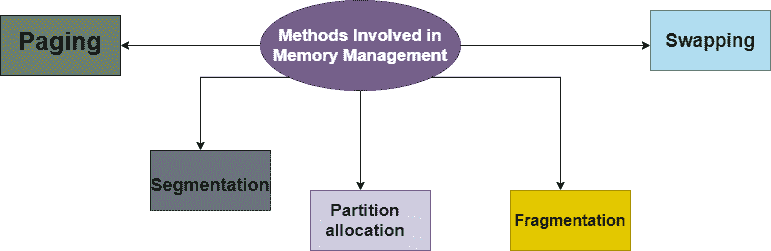

> 原文：<https://www.studytonight.com/operating-system/memory-management-in-os>

[← Prev](/operating-system/system-calls "System Calls")[Next →](/operating-system/os-logical-and-physical-address-space "Logical and Physical Address")

<nav aria-label="breadcrumb">

1.  [家](/)
2.  [操作系统](/operating-system)
3.  操作系统中的内存管理

</nav>

<article>

# 操作系统中的内存管理

**计算机内存**基本上是以二进制格式**表示的数据集合。主存储器**是指作为计算机内部存储器的物理存储器。主这个词是用来区别于外部大容量存储设备，如磁盘驱动器。主存储器也被称为随机存取存储器。计算机只能改变主存储器中的数据。因此，我们执行的每个程序和访问的每个文件都必须从存储设备复制到主内存中。

所有的程序都被加载到主存储器中执行。有时将完整的程序加载到内存中，但有时程序的某个部分或例程只有在被程序调用时才加载到主内存中，这种机制称为**动态加载**，增强了性能。

另外，有时一个程序依赖于另一个程序。在这种情况下，中央处理器不是加载所有的从属程序，而是在需要时将从属程序链接到主执行程序。这种机制被称为**动态链接**。

让我们了解数据是如何存储在计算机系统中的。

## 什么是操作系统中的内存管理？

内存管理是协调和控制计算机内存的过程，块是分配给各种运行程序的部分，以优化系统的整体性能。这项技术有助于跟踪每个内存位置，无论该内存位置是分配给某个进程还是空闲的。

这项技术决定了哪个进程将在什么时间获得内存。它还记录了可以分配给进程的内存数量。因为它跟踪所有的事情，所以每当一些内存被释放或未分配时，它就相应地更新状态。

## 操作系统内存管理的需求

出于以下原因，需要内存管理技术:

*   这种技术有助于将程序放在内存中，以便最大限度地利用内存。

*   这种技术有助于保护不同的进程，使它们不会相互干扰。

*   它有助于为不同的应用程序例程分配空间。

*   这种技术允许您检查需要分配给进程的内存量，这些进程决定了哪个处理器应该在什么时间获得内存。

*   它跟踪每个内存位置，不管它是空闲的还是已分配的。

*   每当内存释放或未分配时，这种技术都会跟踪清单，并相应地更新状态。

## 内存管理中涉及的方法

有多种方法，在它们的帮助下，操作系统可以智能地进行内存管理:

## 换入操作系统

进程需要在内存中才能执行。但是有时没有足够的主内存来保存分时系统中所有当前活动的进程。因此，多余的进程被保存在磁盘上，并被引入动态运行。交换是将每个进程引入主内存，运行一段时间，然后将其放回磁盘的过程。

## 连续内存分配

在连续内存分配中，每个进程都包含在一个连续的内存块中。内存被分成几个固定大小的分区。每个分区恰好包含一个进程。当一个分区空闲时，从输入队列中选择一个进程并加载到其中。内存的空闲块被称为*孔*。搜索该组孔以确定哪个孔最好分配。

## 存储保护

内存保护是一种我们控制计算机内存访问权限的现象。它的主要目的是防止进程访问尚未分配给它的内存。因此，防止进程内的错误影响其他进程或操作系统本身，而是导致分段错误或存储违规异常被发送到干扰进程，通常会杀死进程。

## 操作系统中的内存分配

内存分配是一个为计算机程序分配内存或空间的过程。它有三种类型:

1.  **First Fit Allocation**

    第一个足够大的洞被分配给程序。

2.  **Best Fit Allocation**

    足够大的最小孔被分配给程序。

3.  **Worst Fit Allocation**

    足够大的最大洞被分配给程序。

## 操作系统中的碎片

当大多数空闲块太小而不能满足任何请求时，动态内存分配系统中就会出现碎片。它通常被称为无法使用可用内存。

在这种情况下，进程被加载并从内存中移除。因此，存在满足请求的自由孔，但它们是非连续的，即内存被分割成大量的小孔。这种现象被称为**外部碎裂。**

此外，有时物理内存被分成固定大小的块，内存以块大小为单位进行分配。分配给空间的内存可能略大于请求的内存。已分配内存和所需内存之间的差异被称为**内部碎片**，即位于分区内部但无用的内存。

## 分页

碎片问题的解决方案是分页。分页是一种内存管理机制，它允许进程的物理地址空间是非传染性的。这里，物理内存被分成大小相等的块，称为**页**。属于某个进程的页面被加载到可用的内存框架中。

### 页表

页表是计算机操作系统中虚拟内存系统用来存储*虚拟地址*和*物理地址之间映射的数据结构。*

虚拟地址也称为逻辑地址，由中央处理器生成。而物理地址是内存中实际存在的地址。

## 操作系统中的细分

分段是另一种支持内存用户视图的内存管理方案。分段允许将单个进程的虚拟地址空间分解成可以放在物理内存的非连续区域中的段。

### 带分页的分段

分页和分段各有优缺点，最好将这两种方案结合起来进行改进。这种组合方案被称为“页面元素”。该方案中的每个段被分成页面，并且每个段被维护在页面表中。所以逻辑地址分为以下 3 个部分:

*   段号

*   页码

*   位移或偏移数(D)

我们将在即将到来的教程中逐一介绍上述所有方法。

</article>

* * *

* * *