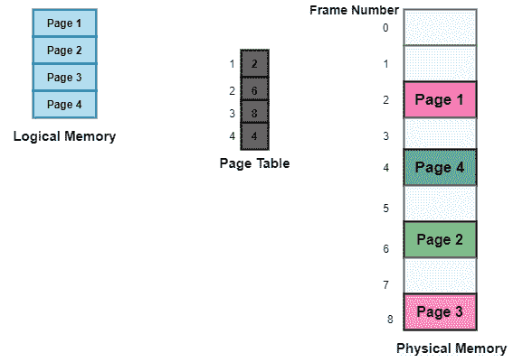
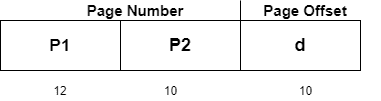
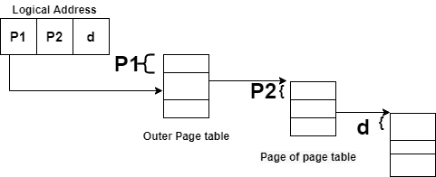
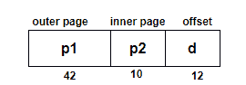
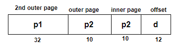
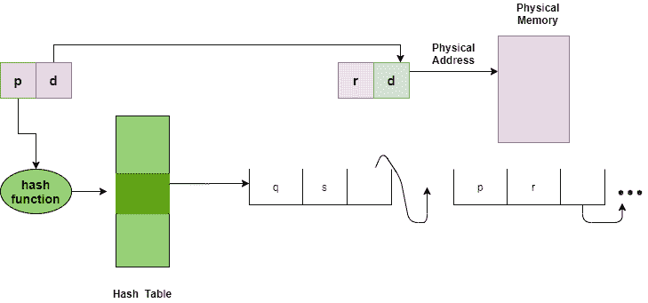
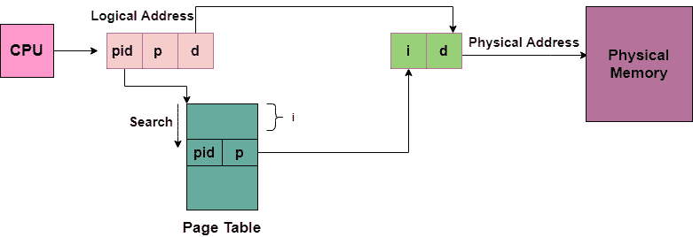

# 操作系统中页表的结构

> 原文：<https://www.studytonight.com/operating-system/structure-of-page-table-in-operating-systems>

在本教程中，我们将介绍一些最常用的构建页面表的技术。

计算机操作系统中虚拟内存系统用来存储物理地址和逻辑地址之间映射的数据结构通常称为**页表**。

正如我们已经告诉你的，由CPU产生的逻辑地址在页表的帮助下被转换成物理地址。

*   因此，页表主要提供相应的帧号(帧的基址)，其中该页存储在主存储器中。

上图显示了物理和逻辑内存的分页模型。

## 页表的特征

页表的一些特征如下:

*   它存储在主存储器中。

*   一般情况下；页表中的条目数=进程被划分的页数。

*   **PTBR** 表示页表基址寄存器，基本上是用来保存当前进程页表的基址。

*   每个进程都有自己独立的页表。

## 用于构建页表的技术

用于构建页表的一些常用技术如下:

1.  分级分页

2.  散列页表

3.  倒排页表格

让我们逐一介绍这些技巧；

## 分级分页

分层分页的另一个名称是多级分页。

*   可能会出现页表太大而无法容纳在连续空间中的情况，因此我们可能有一个包含多个级别的层次结构。

*   在这种类型的分页中，逻辑地址空间被分成多个页表。

*   分层分页是最简单的技术之一，为此，可以使用两级页表和三级页表。

### 两级页面表

考虑一个具有 32 位逻辑地址空间和 1 KB 页面大小的系统，它进一步分为:

*   页码由 22 位组成。

*   由 10 位组成的页面偏移量。

当我们对页面表进行分页时，页码进一步分为:

*   页码由 12 位组成。

*   由 10 位组成的页面偏移量。

因此，逻辑地址如下:

在上图中，

P1 是**外页**表格的索引。

P2 表示**内页**表格页面内的位移。

由于地址转换是从外部页表向内进行的，因此被称为**前向映射页表**。

下图显示了两级页面表的地址转换方案

### 三级页面表

对于具有 64 位逻辑地址空间的系统，两级分页方案是不合适的。让我们假设页面大小，在这种情况下，是 4KB。如果在这种情况下，我们将使用两页级别的方案，那么地址将如下所示:

因此为了避免这么大的表，有一个解决方案，那就是划分外部页表，然后会产生一个**三级页表:**

## 散列页表

这种方法用于处理大于 32 位的地址空间。

*   在这个虚拟页面中，数字被散列到一个页面表中。

*   这个页面表主要包含一个散列到相同元素的元素链。

每个元素主要包括:

1.  虚拟页码

2.  映射页面框架的值。

3.  指向链表中下一个元素的指针。

下图显示了哈希表的地址转换方案:

上图显示了散列页表

在此链中比较虚拟页码以寻找匹配；如果找到匹配，则提取相应的物理帧。

在该方案中，64 位地址空间的变体通常使用**聚集页表**。

### 聚集页表

*   这些类似于哈希表，但这里每个条目指的是几页(即 16 页)而不是 1 页。

*   主要用于内存引用不连续且分散的稀疏地址空间

## 倒排页表格

倒排页表基本上将页表和框架表组合成一个单一的数据结构。

*   每个虚拟页码有一个条目，内存有一个真实页面

*   该条目主要由存储在真实内存位置的页面虚拟地址以及拥有该页面的进程的相关信息组成。

*   虽然这种技术减少了存储每个页表所需的内存；但是它也增加了每当发生页面引用时搜索表所需的时间。

下图显示了倒排页表的地址转换方案:

在这种情况下，我们需要跟踪每个条目的进程 id，因为许多进程可能具有相同的逻辑地址。

此外，在通过哈希函数后，许多条目可以映射到页表中的同一索引中。因此，使用链接来处理这个问题。

* * *

* * *