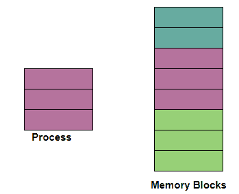
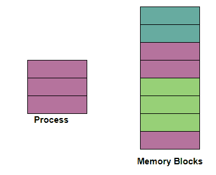

> 原文：<https://www.studytonight.com/operating-system/difference-between-contiguous-and-noncontiguous-memory-allocation>

# 连续和非连续内存分配的区别

在本教程中，我们将介绍连续内存分配和非连续内存分配的区别。

在操作系统中，内存分配有两种技术，如下所示:

*   连续内存分配

*   非连续内存分配

### 连续内存分配

在**连续内存分配**中，每当任何用户进程请求内存时，就会根据进程的要求将连续内存块的单个部分分配给该进程。连续内存分配只需通过**将内存**划分到**固定大小分区**即可实现。

在这种情况下，所有可用的内存空间**一起保留在一个地方**并且自由可用的**内存分区不在整个内存空间中到处分布**。

****

### 非连续内存分配

在非连续内存分配的帮助下，一个进程可以根据需要在内存的不同位置获取多个内存块。在**非连续内存分配中，**可用的空闲内存空间分布在各处，这意味着所有的空闲内存空间不在一个地方。

在这种技术中，进程获取的内存空间不在一个地方，而是根据进程的要求在不同的位置。

现在是时候看看连续和非连续内存分配之间的区别了。

| 连续内存分配 | 非连续内存分配 |
| --- | --- |
| 连续内存分配技术将一个连续的内存块分配给进程，内存以连续的方式分配给进程。 | 非连续内存分配技术将**进程分成几个块**，然后将它们放在内存的**不同地址空间中，即内存以非连续方式分配给进程。** |
| 在这个分配方案中，在进程执行时，地址转换中没有**开销**。 | 而在该方案中，进程执行时的地址转换存在**开销**。 |
| 在连续内存分配中，进程**执行得更快**，因为整个进程都在一个顺序块中。 | 在非连续内存分配中**进程的执行缓慢**，因为进程位于内存的不同位置。 |
| 连续内存分配**更容易被操作系统**控制。 | 非连续内存分配方案**操作系统**难以控制。 |
| 在这种情况下，内存空间被划分为**个固定大小的分区**，每个分区只分配给一个进程。 | 在该方案中，进程被分成几个块，然后这些块根据内存空间的可用性被放置在内存的不同部分。 |
| 连续内存分配包括**单分区分配**和**多分区分配。** | 非连续内存分配包括**分页和**分段。 |
| 在这种类型的**内存分配**中，通常由操作系统维护一个表，该表维护内存空间中所有**可用和占用分区**的列表。 | 在这种类型的内存分配**中，通常必须为每个进程**维护一个表，该表主要携带由内存中的进程获取的每个块的**基址。** |
| 连续内存分配会浪费内存。 | 非连续内存分配不会浪费内存。 |
| 在这种类型的分配中，换入的进程被安排在最初分配的空间中。 | 在这种类型的分配中，换入进程可以安排在内存中的任何位置。 |

* * *

* * *