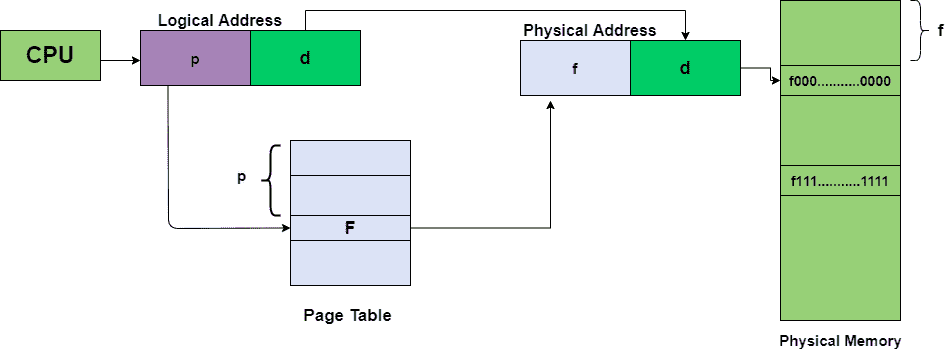
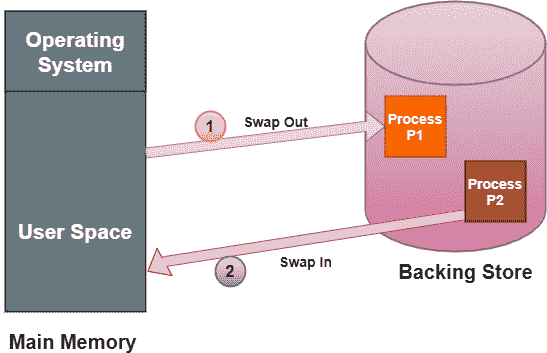

# 分页和交换的区别

> 原文：<https://www.studytonight.com/operating-system/difference-between-paging-and-swapping>

在本教程中，我们将介绍操作系统中分页和交换的区别。

### 操作系统中的分页

**分页**基本上是操作系统内存管理的一种技术。在这种技术中，操作系统将进程从辅助存储器检索到主存储器中，并且该存储器是页面形式的。分页是一个逻辑概念。

在这种技术的帮助下，主内存被分割成物理内存的小块，通常称为帧。在分页中，帧的大小是固定的。为了防止外部碎片并最大限度地利用主内存，帧大小必须与页面大小相同。这项技术有助于更快地访问数据。

### 换入操作系统

交换是一种内存管理技术，用于从计算机系统的主内存中暂时删除不活动的程序。任何进程都必须在内存中才能执行，但可以暂时从内存中交换到后备存储中，然后再放回内存中完成执行。进行交换是为了让其他进程获得执行所需的内存。

由于交换技术，性能通常会受到影响，但它也有助于并行运行多个大型进程。**交换**过程也称为**记忆压缩技术。**基本上，低优先级进程可以被换出，使得具有较高优先级的进程可以被加载和执行。

上图显示了磁盘用作后备存储的两个进程的交换。

## 分页和交换的区别

让我们讨论一下操作系统中分页和交换的区别。

| 分页 | 交换 |
| --- | --- |
| 分页是一种内存管理技术，在这种技术中，计算机从辅助存储器中存储和检索数据，以便在主存储器中使用。 | 交换是一种用于从计算机系统的主存储器中暂时删除非活动程序的技术 |
| 这种技术允许更多的进程驻留在主内存中 | 交换允许较少的进程驻留在主内存中。 |
| 分页遵循非连续内存管理。 | 交换无需任何内存管理技术即可完成。 |
| 分页更灵活，因为在这种情况下，进程的页面会移动。 | 交换不太灵活，因为整个过程在主内存和后台存储中来回移动。 |
| 当进程的某些部分转移到磁盘时，就会发生分页。 | 而交换发生在整个过程转移到磁盘时。 |
| 对于中等工作负载，分页技术是合适的。 | 对于繁重的工作负载，交换技术是合适的。 |
| 这种技术允许进程的内存地址空间不连续。 | 借助交换，多个进程可以在操作系统中并行运行 |
| 这项技术有助于实现虚拟内存。 | 交换有助于CPU更快地访问进程。 |

* * *

* * *