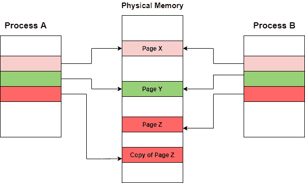

# 操作系统中的写入时复制

> 原文：<https://www.studytonight.com/operating-system/copyonwrite-in-operating-system>

在本教程中，我们将介绍写时复制，这是资源管理技术之一。

**写时复制(CoW)** 主要是一种资源管理技术，允许**父进程和子进程**最初共享相同的内存页面。如果任何父进程或子进程修改了共享页面，则仅复制该页面。

**coW**基本上是一种高效复制计算机系统中数据资源的技术。在这种情况下，如果一个数据单元被复制但没有被修改，那么**“复制”**可以主要作为对原始数据的**引用而存在。**

但是当**复制的数据被修改**时，这时它的副本被创建(新字节被实际写入的地方)，正如技术名称所建议的那样。

这种技术的主要用途是实现分叉系统调用，其中它共享操作系统的虚拟内存/页面。

回想一下在 **UNIX(OS)** 中，`fork()`系统调用用于创建父进程的**复制进程，该进程被称为子进程。**

*   像 Linux、Solaris 和 Windows XP 这样的几个操作系统都使用了 **CoW** 技术。

*   **CoW** 技术是一种高效的流程创建技术，因为只有被修改的页面才会被复制。

这种技术中的空闲页面是从**清零页面池中分配的。**

## 写时复制技术

**CoW** 技术背后的主要意图是，每当父进程创建子进程时，父进程和子进程最初将在内存中共享相同的页面。

*   父进程和子进程之间的这些共享页面将被标记为写入时复制，这意味着如果父进程或子进程将尝试修改共享页面，则将创建这些页面的副本，并且修改将仅在该进程的页面副本上进行，并且不会影响其他进程。

现在是时候来看看这个技术的基本例子了:

让我们举一个例子，进程 A 创建了一个新的进程，即进程 B，最初这两个进程将共享相同的内存页面。

**图:**上图表示共享同一页面的父进程和子进程

现在，让我们假设进程 A 想要修改内存中的一个页面。当使用**写时复制(CoW)** 技术时，只复制那些被任一进程修改的页面；父进程和子进程可以轻松共享所有未修改的页面。

**图:**流程 A 修改 Z 页后

无论何时确定要使用写时复制技术复制页面，都需要注意分配空闲页面的位置。对于此类请求，有一个免费页面池；由许多操作系统提供。

这些空闲页面通常是在进程的堆栈/堆必须扩展或者有写时复制页面需要管理时分配的。

这些页面通常使用称为**按需零填充**的技术来分配。并且**按需零填充**页面在被分配之前被清零，从而擦除先前的内容。

* * *

* * *