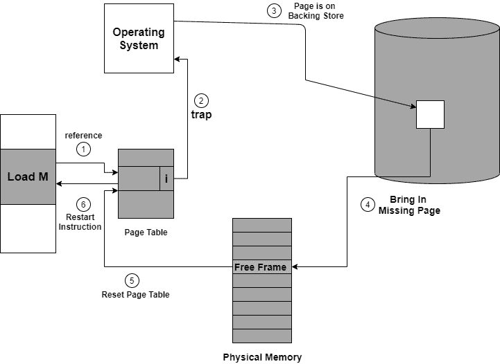

> 原文：<https://www.studytonight.com/operating-system/page-fault-in-operating-system>

[← Prev](/operating-system/copyonwrite-in-operating-system "Copy on Write in OS")[Next →](/operating-system/page-replacement-algorithms-in-operating-system "Page Replacement Algorithm")

<nav aria-label="breadcrumb">

1.  [家](/)
2.  [操作系统](/operating-system)
3.  操作系统中的页面错误

</nav>

<article>

# 操作系统中的页面错误

在本教程中，我们将介绍页面错误的概念以及如何在操作系统中处理页面错误。

## 操作系统中的页面错误

页面错误更像是一个错误。它主要发生在任何程序试图访问程序地址空间中的数据或代码，但该数据当前不在系统的内存中时。

*   所以基本上，当中央处理器引用的页面在主内存中找不到时，这种情况被称为页面错误。

*   无论何时发生任何页面错误，都必须将所需页面从辅助存储器提取到主存储器中。

如果所需页面没有加载到内存中，则会出现页面错误陷阱

页面错误主要产生异常，用于通知操作系统必须从虚拟内存中检索“页面”才能继续执行。一旦所有数据被移动到物理内存中，程序就继续正常执行。页面错误过程发生在后台，因此不会被用户注意到。

*   计算机的硬件跟踪到内核，程序计数器(PC)通常保存在堆栈上。中央处理器寄存器存储指令当前状态的信息。

*   启动一个汇编程序，通常保存通用寄存器，也保存其他易失性信息，以防止操作系统破坏它。

## 处理页面错误

下面给出了处理页面错误的简单步骤:

**图:处理页面故障的步骤**

如果您将访问标记为无效的页面，那么它也会导致页面错误。然后，在通过页表转换地址的过程中，分页硬件会注意到设置了无效位，这会给操作系统造成陷阱。

此陷阱主要是操作系统无法将所需页面带入内存的结果。

借助上图，让我们了解处理页面错误的过程:

1.  首先，这个进程的内部表(通常是进程控制块)，以便确定引用是有效的还是无效的内存访问。
2.  如果引用无效，我们将终止该过程。如果引用是有效的，但是我们没有在那一页购买，所以现在我们只是把它页进去。
3.  然后我们**定位自由帧列表** t，以便找到自由帧。
4.  现在安排磁盘操作，以便将**所需页面读入新分配的 fram** e。
5.  当磁盘被完全读取后，随进程保存的**内部表被修改**，主要表示该页的页表现在在内存中。
6.  现在我们将重新启动由于陷阱而中断的指令。现在，进程可以访问页面，就像它一直在内存中一样。

</article>

* * *

* * *