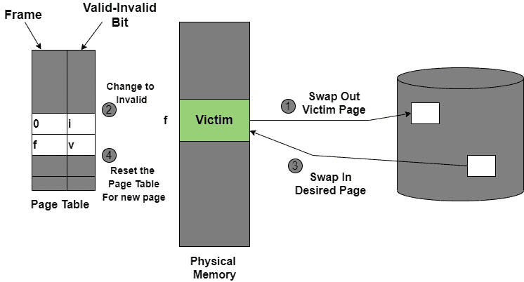
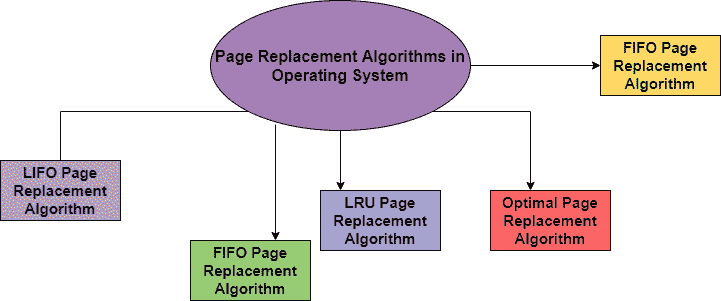

> 原文：<https://www.studytonight.com/operating-system/page-replacement-algorithms-in-operating-system>

# 操作系统中的页面替换算法

在本教程中，我们将介绍操作系统中页面替换的概念及其算法。

正如在需求分页中所研究的，只有进程的某些页面最初被加载到内存中。这允许我们同时将更多的进程放入内存。但是，当一个进程请求更多的页面，而没有可用的空闲内存来容纳它们时，会发生什么呢？可以采取以下步骤来解决这个问题:

1.  将进程放入等待队列，直到任何其他进程完成其执行，从而释放帧。

2.  或者，从内存中完全移除一些其他进程来释放帧。

3.  或者，找到一些目前没有使用的页面，将它们移动到磁盘上以获取空闲帧。这种技术被称为**页面替换**，是最常用的。

在这种情况下，如果一个进程请求一个新的页面，并且假设没有空闲的框架，那么操作系统需要决定替换哪个页面。操作系统必须使用任何页面替换算法来选择受害框架。然后，操作系统必须将受害者框架写入磁盘，然后将所需页面读入框架，然后更新页面表。所有这些都需要双倍的磁盘访问时间。

*   页面替换通过修改页面错误服务例程来防止内存的过度分配。

*   为了减少页面替换的开销，使用了一个**修改位(脏位)**来指示每个页面是否被修改。

*   这种技术提供了逻辑内存和物理内存之间的完全分离。

## 操作系统中的页面替换

在虚拟内存管理中，页面替换算法起着重要的作用。所有**页面替换策略**的主要目标是减少**页面错误**的最大数量。

**页面错误**–基本上是内存错误，当当前程序试图访问内存页面映射到虚拟地址空间，但无法加载到物理内存中时，就会出现这种情况，这就是所谓的页面错误。

## 操作系统中的基本页面替换算法

页面替换技术使用以下方法。如果没有空闲帧，那么我们会找到当前没有使用的帧，然后释放它。通过将其内容写入交换空间，然后更改页表以指示该页已不在内存中，可以释放-frame。

1.  首先，在磁盘上找到所需页面的位置。

2.  找到一个空闲帧:
    a)如果有空闲帧，那就使用它。
    b)如果没有空闲帧，则使用页面替换算法来选择受害帧。
    c)然后在此之后将受害者帧写入磁盘，然后相应地对页表和帧表进行更改。

3.  之后，将所需页面读入新释放的框架，然后更改页面和框架表。

4.  重新启动进程。

图:页面替换

## 操作系统中的页面替换算法

这个算法有助于决定哪些页面必须从主内存中换出，以便为传入的页面创建一个空间。该算法需要最低的页面错误率。

操作系统中使用的各种页面替换算法如下；

让我们在接下来的章节中逐一讨论所有算法:

### 1.先进先出页面替换算法

这是一种非常简单的页面替换方式，被称为先进先出。该算法主要替换主存储器中存在时间最长的最老页面。

*   该算法通过跟踪队列中的所有页面来实现。

*   随着新页面被请求和交换，它们被添加到队列的尾部，位于头部的页面成为受害者。

*   这不是一种有效的页面替换方式，但它可以用于小型系统。

### 优势

*   该算法简单易用。

*   先进先出不会导致更多的开销。

### 不足之处

*   该算法不使用**最后使用时间的频率，而是**它只是替换最旧的页面。

*   随着页面框架的增加，**页面错误**会增加。

*   这个算法的性能是最差的。

### 2.后进先出页面替换算法

该页面替换算法代表“后进先出”。该算法的工作方式类似于后进先出法原理。

*   在这种情况下，最后到达主存储器的最新页面被替换

*   该算法利用堆栈来监控所有页面。

### 3.操作系统中的 LRU 页面替换算法

该算法代表“最近最少使用”，并且该算法帮助操作系统搜索那些在短时间内使用的页面。

*   将选择主存储器中最长时间未使用的页面进行替换。

*   该算法易于实现。

*   该算法利用计数器和偶数页。

### **LRU 优势**

*   这是一种有效的技术。

*   有了这个算法，很容易识别出长时间不需要的错误页面。

*   这有助于全面分析。

### **LRU 的劣势**

*   它很贵，而且更复杂。

*   需要一个额外的数据结构。

### 4.最优页面替换算法

这个算法主要是替换未来最长时间不会使用的页面。该算法的实际实现是不可能的。

*   实际实现是不可能的，因为我们无法提前预测那些在未来最长时间内不会被使用的页面。

*   该算法导致较少的页面错误，因此是最著名的算法

此外，该算法可以用来衡量其他算法的性能。

### **OPR 的优势**

*   这个算法很容易使用。

*   这种算法效率很高，而且不太复杂。

*   为了获得最佳结果，数据结构的实现非常容易

### **OPR 的缺点**

*   在这种算法中，需要对程序有进一步的了解。

*   实际实现是不可能的，因为操作系统无法跟踪未来的请求

### 5.随机页面替换算法

如名字所示，该算法随机替换页面。该算法可以像任何其他页面替换算法一样工作，即后进先出、先进先出、最优和 LRU。

* * *

* * *