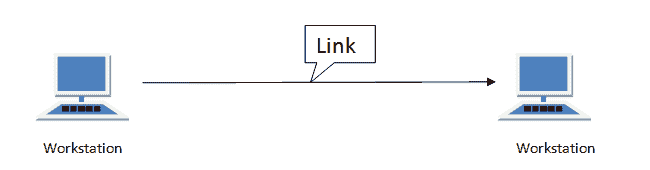
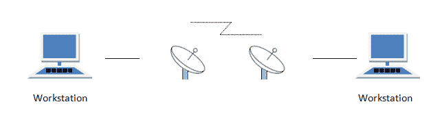
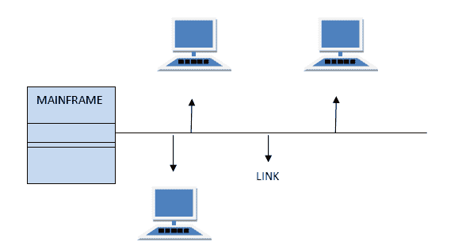

# 计算机网络中的线路配置

> 原文：<https://www.studytonight.com/computer-networks/line-configuration>

网络只不过是通过两个或多个设备之间的连接链路建立的连接。设备可以是计算机、打印机或任何其他能够发送和接收数据的设备。连接设备有两种方式:

1.  点对点连接
2.  多点连接

* * *

## 点对点连接

这是一种用作两个设备之间的通信链路的协议。建立起来很简单。点对点连接最常见的例子是通过电话线连接的计算机。我们可以通过一对电线或使用微波或卫星连接来连接这两个设备。

**示例:**遥控器和电视之间的点对点连接，用于更改频道。

* * *

## 多点连接

也称为多点配置。在这种连接中，两个或多个设备共享一条链路。

有两种多点连接:

*   如果在许多设备之间同时使用链路，则是空间共享线路配置。
*   如果用户在使用链接时轮流使用，则是分时(临时)线路配置。

* * *

* * *